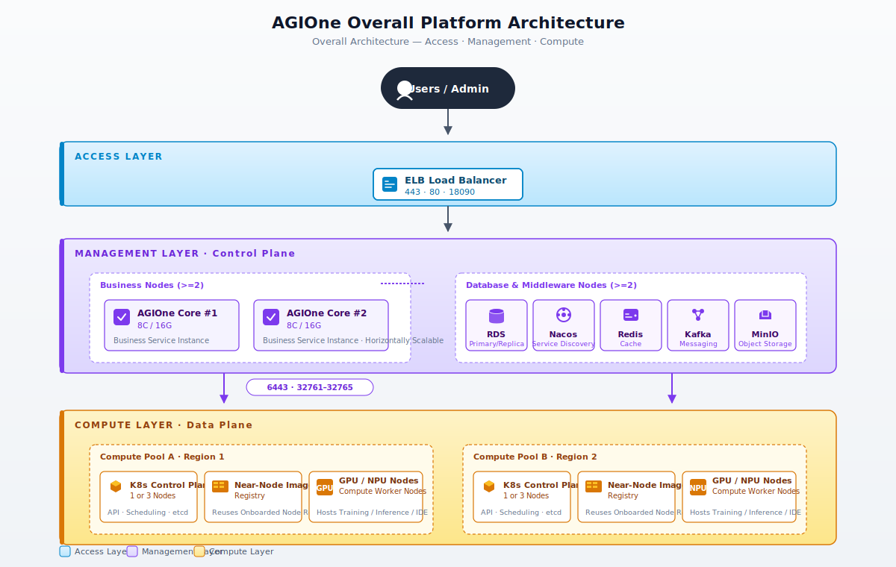
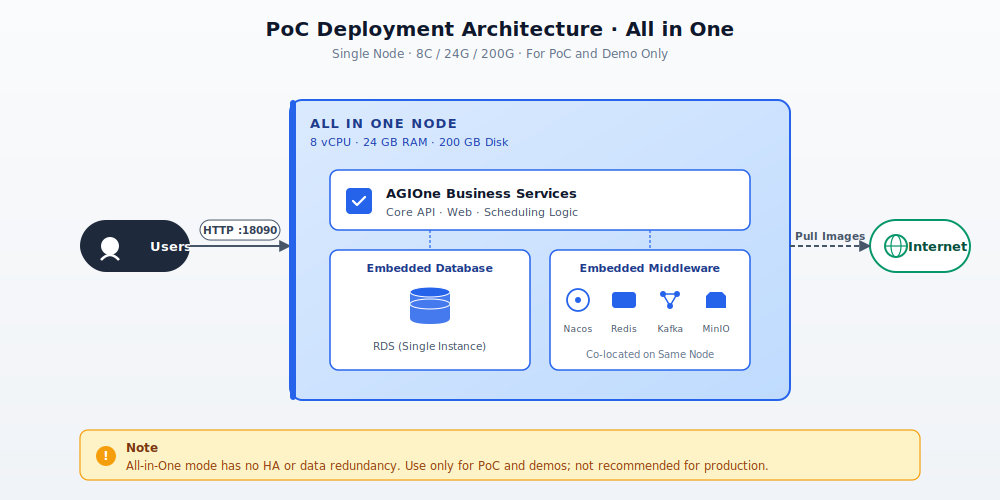
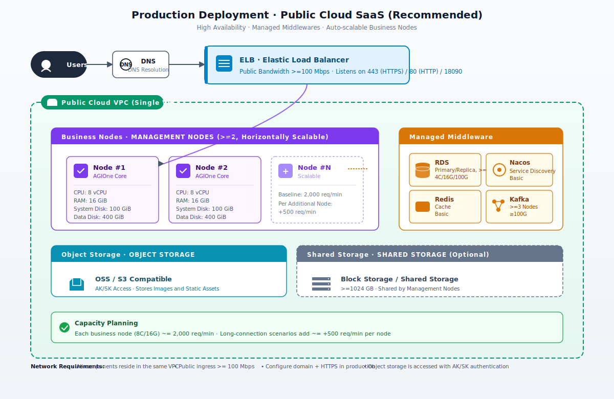
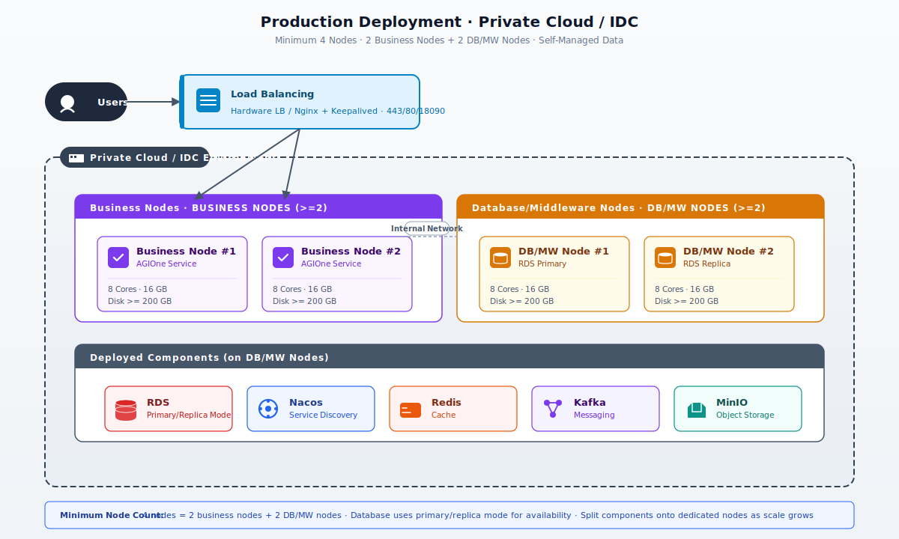
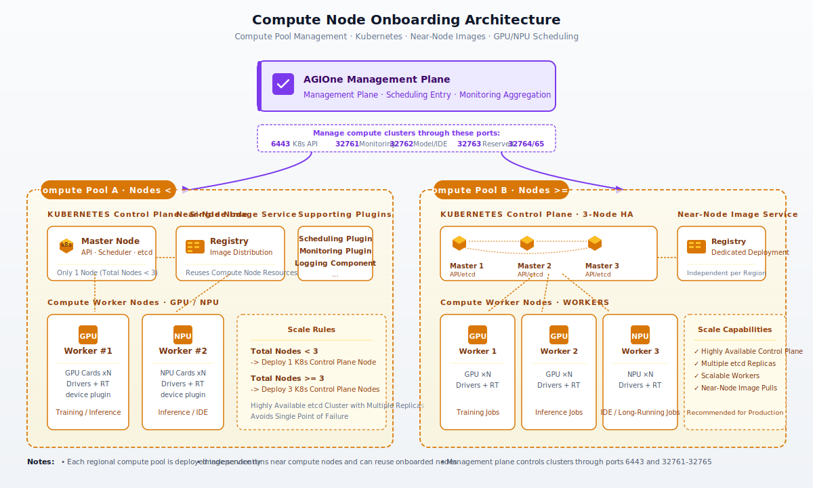
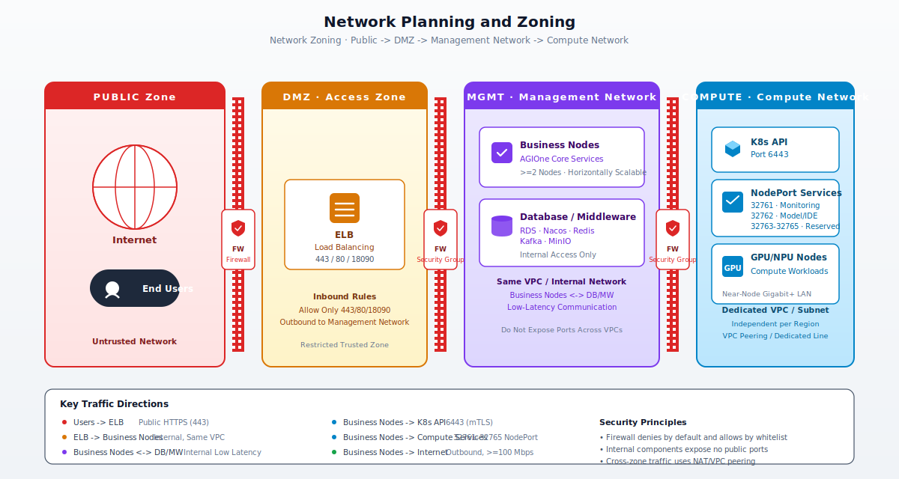

# Deployment Guide

## 1. Overview

An AGIOne platform deployment is logically divided into two relatively independent parts:

- **Management plane**: Hosts the AGIOne control plane, business services, databases, and middleware, and serves as the entry point for users and the platform.
- **Compute node onboarding**: Integrates accelerator nodes such as GPU / NPU nodes into unified scheduling and hosts compute workloads such as training, inference, and IDE sessions.

The two parts communicate over the internal network. The management plane manages compute clusters and collects observability data through the Kubernetes API and monitoring interfaces.

## 2. Overall Architecture

The following diagram shows the overall logical architecture of the AGIOne platform, including the relationship between the user access entry point, the management plane, and the compute node onboarding layer.



**Architecture highlights:**

- The access layer exposes management-plane services externally through ELB. In production, a domain name + HTTPS (443) is recommended.
- The management plane consists of at least 2 business nodes + 2 database/middleware nodes, and business nodes can scale horizontally.
- Compute clusters are deployed independently by regional compute pool. Each region deploys a near-node image service to improve image pull performance.
- The management plane schedules and accesses compute clusters through the Kubernetes API (6443) and extended ports (32761-32765).

---

## 3. Deployment Mode Selection

| Deployment Mode | Applicable Scenario | Nodes | High Availability | Recommended Environment |
|---|---|---|---|---|
| PoC Deployment (All in One) | Proof of concept, demo, internal testing | 1 | No | Single virtual machine |
| Production Deployment - Public Cloud | Formal production and external service delivery | Multi-node | Yes | Public cloud (**Recommended**) |
| Production Deployment - Private Cloud / IDC | Data compliance and internal network isolation | >= 4 | Yes | Customer-owned private cloud or IDC |

| Item | Description |
| ---- | ----------- |
| Scope | AGIOne full-stack deployment solution design, pre-sales support, PoC assessment, and production delivery |
| Constraint Level | This document serves as a planning reference. Official delivery shall be governed by the Release Note and compatibility matrix distributed with `agione-release-v1.0-20260527.tar.gz` |

> **Selection recommendation**: If there are no mandatory data compliance or network isolation requirements, prioritize public cloud deployment to benefit from cloud-provider managed middleware and operational convenience.

The currently supported public cloud managed middleware providers are listed below. Providers not listed here require separate assessment based on customer region, available product specifications, network connectivity, and installer endpoint configuration support.

| Cloud Provider | Support Status | Covered Managed Middleware | Applicable Installer Mode | Notes |
|---|---|---|---|---|
| Alibaba Cloud | Supported | ApsaraDB RDS for MariaDB, Tair / Redis, MSE Nacos, ApsaraMQ for Kafka, OSS, ALB | `managed-middleware` / `hybrid` | Suitable when the customer already uses Alibaba Cloud resources or wants to use MSE Nacos. Confirm RAM permissions, service-linked roles, VPC connectivity, and whitelist policies before delivery. |
| Huawei Cloud | Supported | RDS for MariaDB, DCS for Redis, CSE Nacos, DMS for Kafka, OBS, ELB | `managed-middleware` / `hybrid` | Suitable when the customer already uses Huawei Cloud resources or needs a domestic-cloud delivery path. App / Edge nodes access managed middleware endpoints through private networking. |

---

## 4. Management Plane - PoC Deployment (All in One)

### 4.1 Resource Requirements

| Item | Minimum Requirement |
|---|---|
| Number of nodes | 1 |
| CPU | >= 8 cores |
| Memory | >= 24 GB |
| Disk | >= 200 GB |
| Network | Internet access required |
| Operating system | Linux (Ubuntu 22.04 / CentOS 7+ recommended) |

### 4.2 Architecture Diagram



### 4.3 Deployment Notes

- Business services, databases, and middleware are all deployed on the same node.
- Services are exposed externally through HTTP port `18090` by default.
- Because images and dependencies need to be pulled, the deployment node must be able to access the Internet.
- **Not recommended** for production because it has no high availability or data redundancy.

---

## 5. Management Plane - Production Deployment (Public Cloud)

Public cloud is the recommended production deployment mode. It fully leverages cloud-provider managed capabilities such as RDS, ELB, and object storage.

### 5.1 Resource Requirements

#### 5.1.1 Management Nodes (Business Nodes)

| Item            | Requirement                                      |
|-----------------|--------------------------------------------------|
| Number of nodes | **>= 2**                                         |
| CPU             | >= 8 vCPU                                        |
| Memory          | >= 16 GiB                                        |
| Disk            | >= 200 GiB                                       |
| Private network | All management nodes are in the same VPC         |
| Public network  | Internet access available, bandwidth >= 100 Mbps |

> **Optional**: Shared storage, such as block storage, of >= 1024 GB can be mounted for shared use by management nodes.

#### 5.1.2 Databases and Middleware

Generic managed middleware baseline requirements:

| Component | Purpose | CPU | Memory | Disk | Nodes | Network Requirement |
|---|---|---|---|---|---|---|
| **RDS (relational database)** | Stores primary AGIOne platform data | >= 4 vCPU | >= 16 GiB | >= 100 GiB | >= 3 | Same VPC as management nodes |
| **Nacos** | Service registration and discovery | Basic specification | - | - | 1 | Same VPC as management nodes |
| **Redis (cache)** | Caches data | Basic specification | - | - | 1 | Same VPC as management nodes |
| **Kafka (messaging)** | Core service message bus | Cluster node specification | - | >= 100 GiB | >= 3 | Same VPC as management nodes |
| **Object storage** | Stores images and other static resources | - | - | - | - | Network access via AK/SK |
| **ELB (load balancing)** | AGIOne API load balancing | - | - | >= 100 GiB | 1 | Internal same VPC; public access, >= 100 Mbps |

The supported cloud-provider product list is shown below. Before formal purchase, confirm available specifications, availability zones, billing mode, and account permissions in the customer's target region.

**Alibaba Cloud Managed Middleware List**

| AGIOne Component | Alibaba Cloud Product | Purpose | Creation / Sizing Guidance | Network and Permission Requirements |
|---|---|---|---|---|
| Database | ApsaraDB RDS for MariaDB | Stores AGIOne platform primary data and business schemas | Create a high-availability MariaDB instance, select VPC internal endpoint, ESSD / SSD storage, automatic backup, and required parameter groups; keep business schemas and Nacos schemas logically isolated where possible | Same VPC as management nodes or private network connectivity; security group / whitelist should allow only business node access; initialization account needs permissions to create databases, create tables, change schemas, and read/write data |
| Redis | Tair / ApsaraDB for Redis | Cache, sessions, tokens, and short-lived state | Use primary/standby standard edition for small and medium environments; use cluster edition for high concurrency or large capacity; plan shards and enable password and monitoring | Same VPC as management nodes; configure instance whitelist; if cluster mode is enabled, confirm client support for MOVED / ASK; RAM identity needs permissions to create, query, whitelist, and manage Redis accounts |
| Nacos | Microservices Engine (MSE) Nacos Registry | Service registry, service discovery, and configuration center | Enable MSE and create a Nacos engine, select specification, network, and namespace; import required AGIOne namespace, service, and config data | Initial MSE enablement and resource creation usually require service-linked role authorization; when the installer publishes configs, the Nacos runtime account must have namespace, config publish, and service management permissions |
| Kafka | ApsaraMQ for Kafka | Asynchronous messages, metering, audit, and event streams | Create a VPC internal instance, start from 3 brokers for production, use topic replication factor 3, and size by throughput, storage, and retention period | Pre-create Topic, Group, ACL, and authentication settings; when SASL / ACL is enabled, synchronize client protocol, username, and password; RAM identity needs permissions to create and query instances, topics, groups, and ACLs |
| Object storage | Object Storage Service (OSS) | Stores knowledge-base files, attachments, images, model assets, and log archives | Create private buckets, configure storage class, server-side encryption, and lifecycle; use CDN in front of OSS when download traffic is high | Do not allow public write access; application access should use least-privilege RAM users or STS temporary credentials; authorization should be limited to the target bucket and prefix with only required upload, download, list, and delete permissions |
| Entry load balancing | Application Load Balancer (ALB) or MSE Cloud-native Gateway | Exposes the AGIOne API and Web entry externally | Use ALB for public entry, configure HTTPS listener, certificate, backend server group, or ACK Ingress; evaluate MSE Cloud-native Gateway when gateway governance is required later | Authorize ALB / ACK Ingress related service-linked roles before creation; expose only 80 / 443 on the public side; backends should point only to App / Edge nodes or ACK Ingress, with health checks configured |

> **Alibaba Cloud permission focus**: The Alibaba Cloud account / RAM role used to create cloud resources must be managed separately from the runtime accounts and keys consumed by the AGIOne installer. The AGIOne installer should not require cloud account AK/SK. It only consumes the final middleware endpoints, ports, runtime accounts, and access keys.

**Huawei Cloud Managed Middleware List**

| AGIOne Component | Huawei Cloud Product | Purpose | Creation / Sizing Guidance | Network and Permission Requirements |
|---|---|---|---|---|
| Database | RDS for MariaDB | Stores AGIOne platform primary data and business schemas | Purchase a primary/standby instance, select the appropriate specification, storage, VPC, security group, and backup policy; reserve at least 40% extra capacity for production | Same VPC as management nodes or private network connectivity; security groups should allow only business node access; prepare an account with schema initialization permissions |
| Redis | Distributed Cache Service (DCS) for Redis | Cache, sessions, tokens, and short-lived state | Avoid single-node instances in production; use primary/standby for small and medium environments, or Cluster for high write volume or large capacity; deploy across availability zones when possible | Same VPC as management nodes; configure password and access whitelist; confirm expiration and eviction policies before go-live |
| Nacos | Cloud Service Engine (CSE) Nacos | Service registry, service discovery, and configuration center | Create a Nacos engine and configure specification, VPC, and permissions; migrate namespace, service, and config data | CSE Nacos is compatible with open-source Nacos / Eureka clients; when the installer publishes configs, the Nacos account must have namespace and config publish permissions |
| Kafka | Distributed Message Service (DMS) for Kafka | Asynchronous messages, metering, audit, and event streams | Start from 3 brokers in production, enable multiple replicas, and size the instance by throughput, storage, and retention period | Private connectivity with management nodes; if authentication is enabled, synchronize client protocol, username, password, and ACL configuration |
| Object storage | Object Storage Service (OBS) | Stores knowledge-base files, attachments, images, model assets, and log archives | Create private buckets and configure storage class, server-side encryption, lifecycle, and cross-region replication as needed | Access through AK/SK or temporary authorization; isolate workloads by bucket or prefix and avoid public read/write |
| Entry load balancing | Elastic Load Balance (ELB) | Exposes the AGIOne API and Web entry externally | Prefer dedicated ELB for public entry, configure HTTPS listener, certificate, and backend server group; private ELB can be used for internal service entry | Expose only 80 / 443 on the public side; backends should point only to App / Edge nodes or CCE Ingress, with health checks configured |

#### 5.1.3 Capacity and Scalability

- AGIOne management nodes can scale horizontally.
- Baseline capacity per node (8 vCPU / 16 GB RAM) is approximately **2,000 requests/minute**.
- In scenarios with many long-lived connections or time-consuming requests, each additional node can add approximately **500 requests/minute**. Actual values vary by business scenario.

### 5.2 Architecture Diagram



### 5.3 Deployment Notes

- Strongly recommend using cloud-provider **managed RDS, Redis, Kafka, and object storage** to reduce operational complexity.
- Business nodes expose services through ELB. After a domain name is configured, use 443 (HTTPS) and 80 (HTTP redirect).
- All internal components are located in the same VPC. Do not expose internal ports across VPCs.
- Recommended public bandwidth is >= 100 Mbps, adjustable according to business volume.

---

## 6. Management Plane - Production Deployment (Private Cloud / IDC)

Applicable to scenarios where public cloud cannot be used and data must be fully self-managed.

### 6.1 Resource Requirements

| Role | Nodes | CPU | Memory | Disk       | Network                                      | Description |
|---|---|---|---|------------|----------------------------------------------|---|
| Business nodes | >= 2 | >= 8 cores | >= 16 GB | >= 200 GB | LAN; Need access Internet, bandwidth >= 100M | Deploy AGIOne business services                              |
| Database / middleware nodes | >= 2 | >= 8 cores | >= 16 GB | >= 200 GB | LAN                                          | Deploy RDS (primary/replica), Nacos, Redis, Kafka, and MinIO |
| **Total** | **>= 4** | - | - | -       | -                                            | -                                            |

### 6.2 Architecture Diagram



### 6.3 Deployment Notes

- Start with at least 4 nodes: 2 business nodes + 2 database/middleware nodes.
- The database uses primary/replica mode. It is recommended to deploy databases and middleware separately, and split them into more nodes as business scale grows.
- MinIO provides object storage capabilities as an alternative to public cloud OSS.
- Load balancing can use hardware LB, such as F5, or software LB, such as Nginx / HAProxy + Keepalived.

---

## 7. Compute Node Onboarding

### 7.1 Design Principles

- Each independent **regional compute pool** is deployed as a logical unit to avoid network jitter caused by cross-region scheduling.
- Each regional compute pool deploys an **image service** close to compute nodes and can reuse already-onboarded node resources.
- Deploy a Kubernetes cluster and supporting plugins for scheduling, monitoring, and related capabilities.

### 7.2 Kubernetes Control Plane Scale

| Total Compute Pool Nodes | Kubernetes Control Plane Nodes | Description |
|---|---|---|
| < 3 nodes | **1 node** | Single control plane, suitable for small compute pools |
| >= 3 nodes | **3 nodes** | Highly available control plane with multiple etcd replicas |

### 7.3 Architecture Diagram



### 7.4 Externally Exposed Ports

Each compute cluster exposes the following ports to the management plane through NodePort:

| Port | Purpose |
|---|---|
| 6443 | Kubernetes API Server |
| 32761 | Monitoring interface |
| 32762 | Model and IDE invocation port |
| 32763 | Reserved extension port |
| 32764 | Reserved extension port |
| 32765 | Reserved extension port |

### 7.5 Deployment Notes

- Compute nodes should have GPU / NPU drivers, container runtime such as containerd, and the corresponding device plugin installed and validated in advance.
- The image service should be located in the same Layer 2 or low-latency network as the compute nodes to accelerate pulling large model images.
- For multi-region deployment, each region should maintain an independent near-node image service to avoid cross-region image pulls.

---

## 8. Network Planning

### 8.1 Network Zoning



### 8.2 Network Requirements Overview

| Traffic Direction | Requirement |
|---|---|
| Users -> ELB | Public network; 443/HTTPS is recommended in production, with DNS resolving the domain name |
| ELB -> business nodes | Internal network, same VPC |
| Business nodes <-> DB / middleware | Internal network, same VPC, low latency |
| Business nodes -> object storage | AK/SK authentication; VPC internal endpoint can be used |
| Business nodes -> compute cluster | Through ports 6443 and 32761-32765 |
| Compute nodes -> near-node image service | Compute-pool local LAN, gigabit or higher recommended |
| Management nodes -> Internet | Required for PoC; outbound access is recommended in production for pulling images and upgrades, bandwidth >= 100 Mbps |

### 8.3 VPC / Subnet Recommendations

- **Management VPC**: All management nodes, RDS, Nacos, Redis, Kafka, and MinIO are located in the same VPC. Subnets can be divided into business-node subnets and data-node subnets.
- **Compute VPC**: Each regional compute pool uses an independent VPC or subnet and connects to the management VPC through VPC peering or a dedicated line.
- **Security groups**: Deny by default and allow only the ports listed in the following "Port List" section.

---

## 9. Port List

### 9.1 Management Plane Ports

| Port | Protocol | Source | Purpose |
|---|---|---|---|
| 18090 | TCP / HTTP | Users / internal | Default HTTP service port (used by default in PoC) |
| 80 | TCP / HTTP | Public users | Production environment HTTP after domain configuration, usually redirects to 443 with 301 |
| 443 | TCP / HTTPS | Public users | Production environment HTTPS after domain configuration |

### 9.2 Compute Cluster Ports

| Port | Protocol | Source | Purpose |
|---|---|---|---|
| 6443 | TCP | Management plane | Kubernetes API Server |
| 32761 | TCP | Management plane | Monitoring interface |
| 32762 | TCP | Management plane | Model and IDE invocation |
| 32763 | TCP | Management plane | Reserved extension port |
| 32764 | TCP | Management plane | Reserved extension port |
| 32765 | TCP | Management plane | Reserved extension port |

### 9.3 Internal Middleware Ports (Reference)

Databases and middleware should be exposed only within the VPC and not externally:

| Component | Default Port (Reference) |
|---|---|
| RDS (MySQL family) | 3306 |
| Nacos | 8848 / 9848 / 9849 |
| Redis | 6379 |
| Kafka | 9092 |
| MinIO | 9000 / 9001 |

> Actual ports depend on the version and configuration used during deployment.

---

## 10. Pre-Deployment Checklist

Before deployment, confirm each item to ensure a smooth rollout:

**Base Environment**

- [ ] Deployment mode has been selected according to the scenario (PoC / public cloud / private cloud IDC)
- [ ] Node quantity and specifications meet resource requirements
- [ ] Operating system and kernel version meet requirements
- [ ] Time is synchronized (NTP), and all nodes use a consistent time zone

**Download URL:** [https://onepro-agione.oss-ap-southeast-1.aliyuncs.com/modelone/release/agione-release-v1.0-20260527.tar.gz](https://onepro-agione.oss-ap-southeast-1.aliyuncs.com/modelone/release/agione-release-v1.0-20260527.tar.gz)

```bash
# 1. Download and extract the bundle
ssh root@<target>
mkdir -p /opt/hyperone && \
cd /opt/hyperone && \
curl -fL -O https://onepro-agione.oss-ap-southeast-1.aliyuncs.com/modelone/release/agione-release-v1.0-20260527.tar.gz && \
tar -zxvf agione-release-v1.0-20260527.tar.gz && \
cd /opt/hyperone/agione-release-v1.0-20260527
```

---
**Network**

- [ ] Management nodes are located in the same VPC
- [ ] Management nodes can access the Internet, or offline images have been prepared
- [ ] Security group / firewall rules have opened the ports in the port list
- [ ] The compute cluster and management plane have network connectivity

**Domain Name and Certificate (Production)**

- [ ] Domain name has been applied for and resolved
- [ ] HTTPS certificate has been prepared
- [ ] ELB listeners for 443 / 80 have been planned

**Compute Cluster**

- [ ] The number of nodes in each regional compute pool has been confirmed, and the K8s control plane scale has been determined (1 or 3)
- [ ] GPU / NPU drivers have been installed and validated
- [ ] Near-node image service nodes have been planned
- [ ] NodePort ports 6443 and 32761-32765 have been allowed for the management plane

---

## 11. Appendix

### 11.1 Resource Specification Quick Reference

| Deployment Mode | Minimum Nodes | Minimum Per-Node Specification | Total Resource Reference |
|---|---|--------------------------------|---|
| PoC All in One | 1 | 8C / 24G / 200G                | 8C / 24G / 200G |
| Public Cloud (business nodes) | 2 | 8C / 16G / 200G                | 16C / 32G / 1 TB+ |
| Private Cloud IDC | 4 | 8C / 16G / 200G                | 32C / 64G / 800G+ |

### 11.2 Capacity Estimation Reference

- Baseline: each business node (8C / 16G) supports approximately **2,000 requests/minute**
- Scaling: each additional business node adds approximately **+500 requests/minute** in long-lived connection / complex request scenarios
- Actual capacity should be evaluated based on request complexity, model inference duration, number of concurrent sessions, and other factors.

### 11.3 Glossary

| Term | Description |
|---|---|
| AGIOne | Name of this platform |
| All in One | Simplified mode that deploys all components on a single node |
| VPC | Virtual Private Cloud |
| ELB | Elastic Load Balancer |
| RDS | Relational Database Service |
| AK/SK | Access Key / Secret Key |
| NodePort | One of the Kubernetes service port exposure methods |
| Regional compute pool | A group of compute nodes physically located in the same geographic region and connected over the network |
