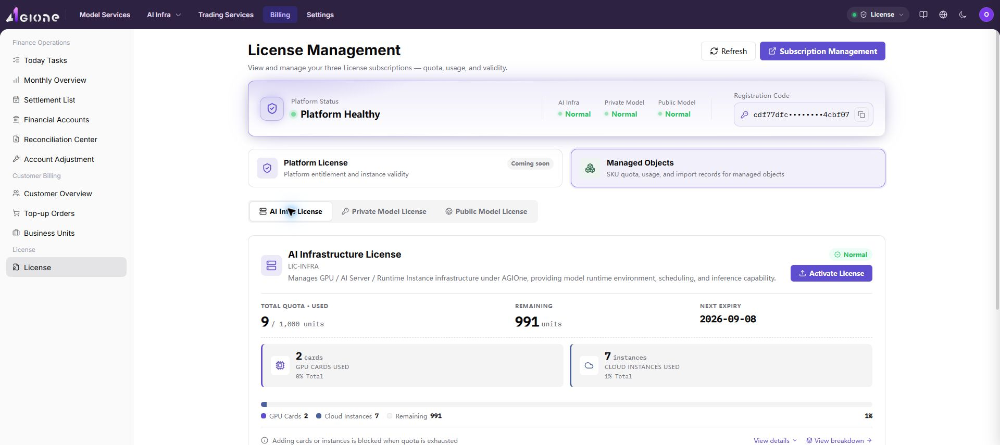
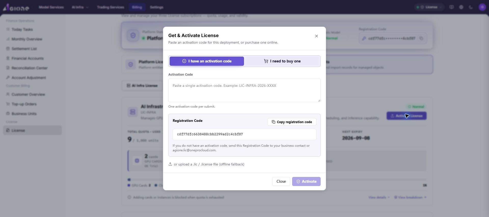

# License Activation

::: info Document Information
Version: v1.0
Updated: 2026-07-15
:::

## Overview

This document describes how to obtain an `Activation Code` from a `Registration Code` and activate the `AI Infra License` on the `License Management` page.

This workflow applies when a License needs to be activated after an Activation Code is obtained offline or by email. The document describes operating locations, field meanings, and validation methods only. It does not expose any specific Registration Code, Activation Code, or login credential.

## When To Use

- You are activating the `AI Infra License` for the first time.
- You need to obtain an `Activation Code` offline or by email.
- Online License activation is unavailable and activation by code is required.
- A License has expired, capacity has been expanded, or the deployment needs to be authorized again.

## Prerequisites

1. The current account has access to `Billing` and the `Billing > License` page.
2. The current platform deployment has generated a `Registration Code` that can be used to request an Activation Code.
3. The target authorization area has been confirmed as `AI Infra License`.
4. An offline communication channel or email address is available to receive the Activation Code.
5. Complete Registration Codes and Activation Codes will not be exposed in documents, screenshots, tickets, or chats.

::: warning Security Reminder
Do not expose complete Registration Codes or Activation Codes in documents, screenshots, tickets, or chats. An Activation Code is usually bound to the Registration Code of the current deployment and cannot be reused across environments. Clicking `Activate` affects the authorization status of the current deployment, so confirm the target environment and deployment before proceeding.
:::

## Workflow Overview

| Step | Role | Action | Expected result |
| --- | --- | --- | --- |
| 1 | Platform administrator | Open the License Management page | License information is visible. |
| 2 | Platform administrator | Copy the Registration Code | The complete Registration Code is obtained. |
| 3 | Platform administrator / support staff | Send the Registration Code and obtain the Activation Code | The Activation Code is received. |
| 4 | Platform administrator | Activate the License in the AI Infra License area | The authorization status is updated. |
| 5 | Platform administrator | Check the authorization status, validity, and quota | The activation result can be verified. |

## 1. Obtain the Registration Code

1. Sign in as a platform administrator.
2. Go to `Billing > License`.
3. Confirm that `License Management`, platform status, License categories, and managed-object authorization information are visible.
4. On the `License Management` page, find `Registration Code`.
5. Copy the complete Registration Code.
6. Check that the copied content is complete and does not contain missing characters, extra line breaks, or extra spaces.
7. Do not write the Registration Code in public documents or screenshots.

Screenshot:



## 2. Send the Registration Code and Obtain the Activation Code

Send the Registration Code to License support staff offline or by email.

If sending by email, use:

```text
Ecosys@oneprocloud.com
```

The email should include the following information:

| Information | Description |
| --- | --- |
| Registration Code | The complete Registration Code copied from the `License Management` page. |
| Company or organization name | The organization that requests the Activation Code. |
| Contact person | The person who will receive the Activation Code from support staff. |
| Contact method | Email, phone, or another reachable channel. |
| Activation scenario | State that the target is `AI Infra License` activation. |

After receiving the reply, obtain the `Activation Code`. Do not write the Activation Code in public documents or screenshots.

## 3. Activate the AI Infra License

1. Return to `Billing > License`.
2. On the `License Management` page, open the `Managed Objects` tab.
3. Select `AI Infra License`.
4. Click `Activate License`.
5. In the `Get & Activate License` window, select `I have an activation code`.
6. Find the `Activation Code` input area.
7. Paste the received Activation Code.
8. Check that the Activation Code is complete.
9. Click `Activate`.
10. Wait for the page to return the activation result.

Screenshot:



## 4. Verify the Activation Result

After activation is complete, check the status, validity, and quota of `AI Infra License` on the `License Management` page.

Check the following items:

1. Whether `AI Infra License` shows `Normal`, active, valid, or another available status defined by the platform.
2. Whether the page shows `NEXT EXPIRY` or other validity information.
3. Whether the page shows `TOTAL QUOTA · USED`, `REMAINING`, and used quota details.
4. Whether the page shows no error message after activation.
5. If the page status is not updated immediately, refresh the page and check again.

## Parameter Reference

| Parameter | Description |
| --- | --- |
| Registration Code | Deployment identifier generated on the `License Management` page and used to request an Activation Code. |
| Activation Code | Authorization code returned by support staff based on the Registration Code. |
| AI Infra License | Authorization area on the `License Management` page. Click `Activate License` and enter the Activation Code to activate it. |
| Validity | Expiry date or authorized validity range after the License takes effect. |
| Quota | Total quota, used quota, and remaining quota available under the License. |

## Result Validation

| Check item | Success indicator | Handling if abnormal |
| --- | --- | --- |
| Registration Code | The Registration Code is visible and can be copied on the License Management page. | Confirm platform-administrator permissions and page loading status. |
| Activation Code | An Activation Code has been obtained offline or by email. | Check whether the sent Registration Code is complete. |
| Activation action | No error message appears after clicking `Activate`. | Check whether the Activation Code is complete and matches the current Registration Code. |
| Authorization status | `AI Infra License` shows active, valid, `Normal`, or another available status defined by the platform. | Refresh the page and check again. Contact support staff if needed. |
| Validity | The page shows the License expiry date or validity information. | Confirm whether the Activation Code corresponds to the target deployment and authorization type. |
| Total quota | The page shows the total authorized quota. | Contact support staff to confirm the authorization scope of the Activation Code. |
| Used quota | The page shows the currently used quota. | Check the number of currently managed resources. |
| Remaining quota | The page shows the remaining available quota. | If the remaining quota is insufficient, confirm whether expansion or reauthorization is required. |

## FAQ

### Registration Code Is Not Visible

**Symptom:**

After entering the `License Management` page, `Registration Code` is not visible.

**Possible causes:**

- The current account does not have License management permission.
- The page has not finished loading.
- The current deployment has not generated a Registration Code.

**Handling:**

1. Confirm that the current account has platform-administrator permissions.
2. Refresh the `Billing > License` page.
3. If it is still not visible, contact the platform administrator or License support staff to confirm the deployment status.

### Activation Code Has Not Been Received

**Symptom:**

The Registration Code has been sent, but no Activation Code reply has been received.

**Possible causes:**

- The Registration Code was not sent completely.
- The email is missing organization, contact person, or activation scenario information.
- The email was blocked or moved to spam.

**Handling:**

1. Check whether the email was sent to `Ecosys@oneprocloud.com`.
2. Confirm that the email contains the complete Registration Code and contact method.
3. Check spam or blocking records.
4. Resend the application email if necessary.

### Activation Code Is Invalid

**Symptom:**

After clicking `Activate`, the page reports that the Activation Code is invalid or activation failed.

**Possible causes:**

- The Activation Code does not match the current Registration Code.
- The Activation Code was copied incompletely.
- The Activation Code has expired or has already been used.
- The current activation area is not `AI Infra License`.

**Handling:**

1. Copy the complete Activation Code again and avoid extra spaces or line breaks.
2. Confirm that the Registration Code sent when requesting the Activation Code is the one from the current page.
3. Confirm that the current activation area is `AI Infra License`.
4. Contact License support staff again to verify the Activation Code.

### Status Does Not Update After Activation

**Symptom:**

After activation is complete, the page still shows the old status or the quota has not changed.

**Possible causes:**

- The page cache has not refreshed.
- Activation-result synchronization is delayed.
- The current authorization area is not `AI Infra License`.

**Handling:**

1. Refresh the `License Management` page.
2. Confirm that you are checking the `AI Infra License` area.
3. Wait briefly and reopen the page to check again.
4. If the issue persists, contact License support staff to verify the activation result.

### What If the License Is Activated in the Wrong Environment

**Symptom:**

After clicking `Activate`, you find that the current page is not the target environment or target deployment.

**Possible causes:**

- The current deployment was not confirmed before activation.
- Another browser page from a different environment was used.
- The binding between the Activation Code and Registration Code was misunderstood.

**Handling:**

1. Immediately record the current License status and operation time.
2. Do not repeatedly submit another Activation Code.
3. Contact License support staff and provide masked environment, deployment, and operation-time information.
4. Obtain a new Registration Code in the target environment and request a matching Activation Code again.

## Notes

- The Registration Code must be sent completely. Missing characters may make the returned Activation Code unusable.
- The Activation Code is usually bound to a specified deployment or Registration Code and should not be reused in other environments.
- Do not show complete Registration Codes or Activation Codes in public documents, screenshots, tickets, or communication groups.
- Before clicking `Activate`, confirm that the current page belongs to the target environment and deployment.
- After activation is complete, check authorization status, validity, total quota, used quota, and remaining quota.
