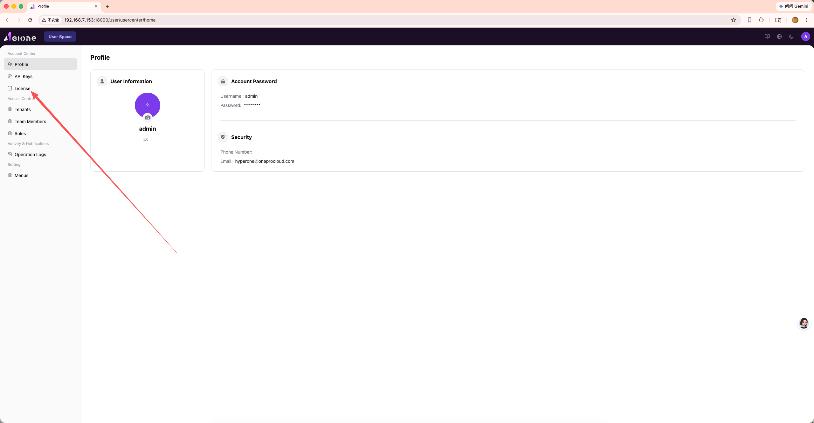
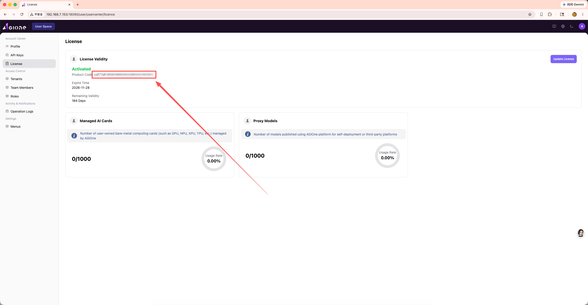
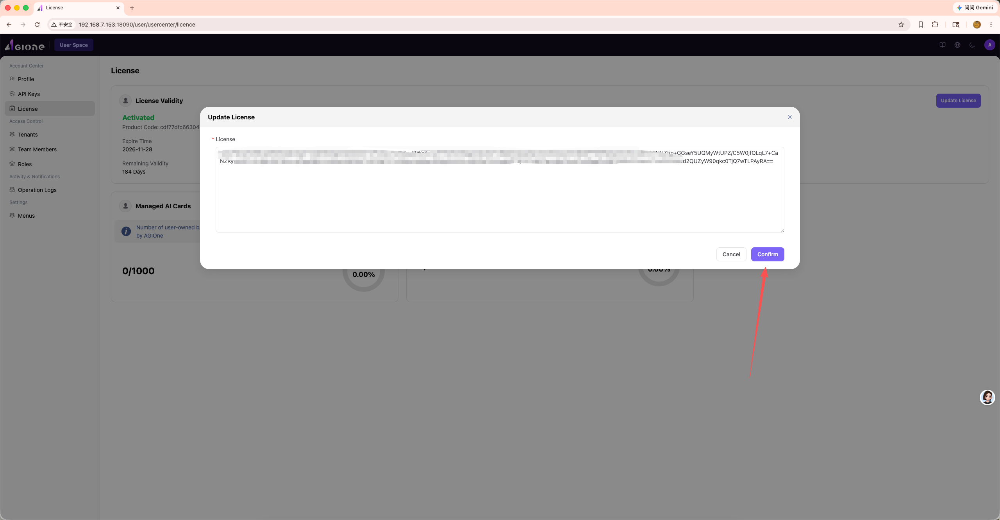

# Activation Code & Activation

## Document Purpose

This document describes the complete steps and validation items for activating an AGIOne platform license using an activation code.

## Prerequisites

- Access to the AGIOne platform
- Access to the platform license management page
- Instance information ready (host ID, organization, contact)

## Procedure

### 1. Log In to the AGIOne Platform

Open a browser, navigate to the AGIOne platform URL, and log in with an Admin account.

### 2. Navigate to the License Page

After logging in, click **Account Center > License** in the left navigation bar to enter the license management page.

### 3. Obtain the Product Code

On the License page, locate and copy the **Product Code** (machine code) of the current instance. This code is the unique identifier required to request an activation code.

### 4. Send an Activation Request Email

Send the Product Code via email to **ecosys@oneprocloud.com**. The email should include the following information:

- **Product Code**: The complete string copied from the License page
- **Organization/Company Name**: The organization to which the activation code belongs
- **Contact Person & Contact Information**: For follow-up communication
- **Purpose of Request** (optional): Brief description of the activation scenario

> **Note**: Ensure the Product Code in the email is complete and accurate. An incomplete code will result in activation failure.

### 5. Receive the Activation Code

Wait for a reply email. You will typically receive an email containing the activation code within 1–2 business days. Keep the activation code safe once received.

### 6. Enter the Activation Code

Return to the AGIOne platform License page, click the **Update License** button in the upper-right corner, paste the received activation code in the dialog box, and click **Confirm**.

### 7. Verify Activation Status

After successful activation, the page will display detailed license information, including:

- **License Validity**: Shows `Activated`
- **Expire Time**: License expiration date
- **Remaining Validity**: Number of remaining valid days
- **Managed AI Cards**: Number of managed/total available AI cards
- **Proxy Models**: Number of published/total available proxy models

## Validation Checklist

- [ ] Product Code has been successfully copied and sent to ecosys@oneprocloud.com
- [ ] A valid activation code has been received via reply email
- [ ] The page shows `Activated` status after entering the activation code
- [ ] License expiry date and capacity are displayed correctly
- [ ] Managed AI Cards and Proxy Models quotas are displayed normally
- [ ] No license-related blocking errors in system logs

## FAQ

| Issue | Possible Cause | Solution |
|-------|----------------|----------|
| Activation code is invalid | Product Code and activation code do not match | Verify the submitted Product Code is complete and correct, then reapply |
| Status not updated after activation | Page cache | Refresh the page or log in again |
| Reply email not received | Email intercepted | Check the spam folder, or resend from a different email address |
| Activation code expired | Past the validity period | Contact ecosys@oneprocloud.com to reapply |
