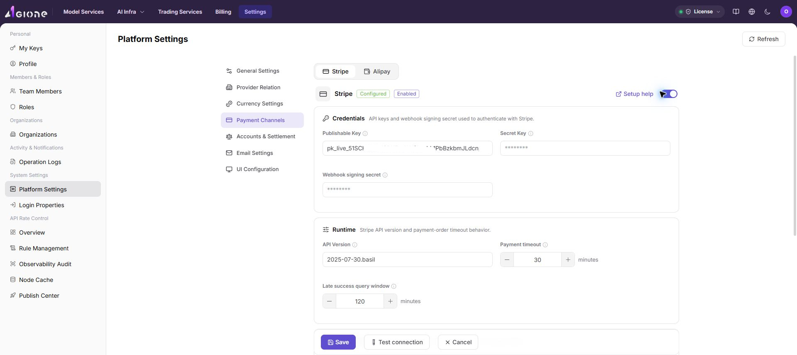
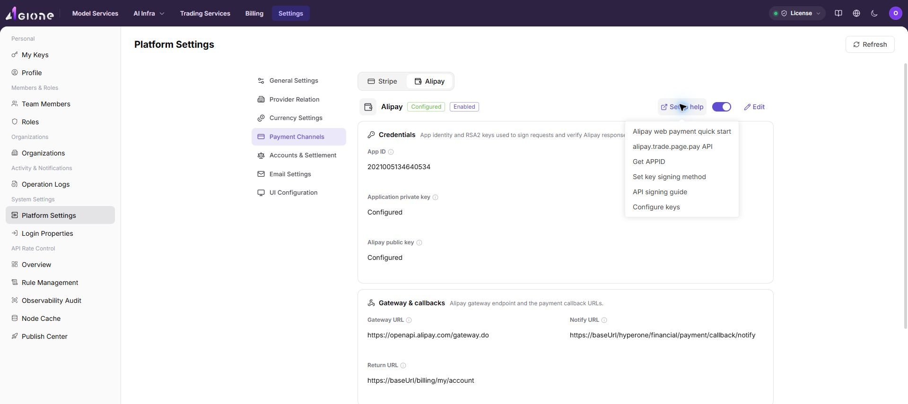
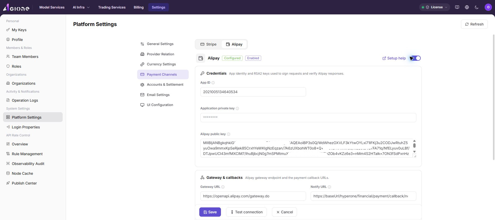
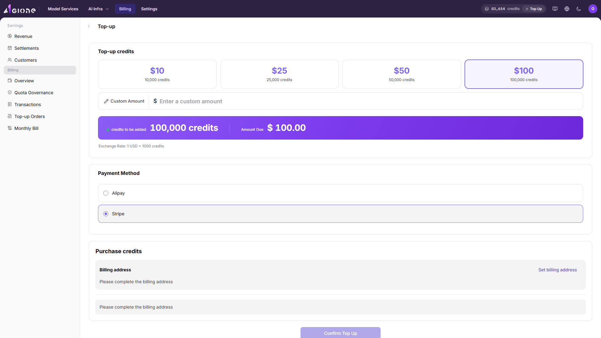
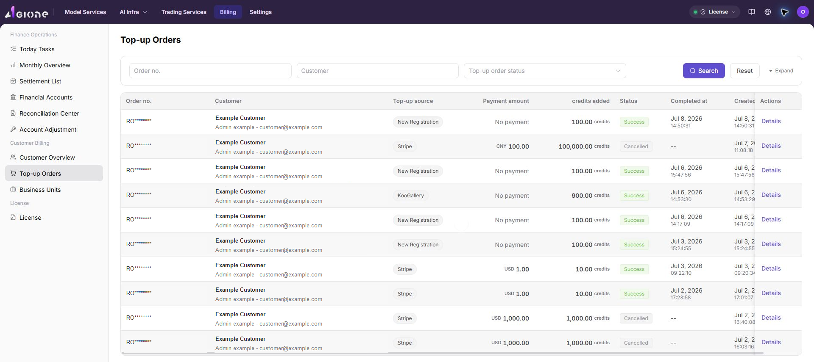

# Online Payment Activation

::: info Document Information
Version: v1.0
Updated: 2026-07-15
:::

## Overview

Online payment activation is used to validate the full loop from payment-channel configuration to end-user credits recharge and customer top-up record review. This document covers two payment methods: `Stripe` and `Alipay`. A platform administrator first configures the payment channel and tests the connection, an end user then recharges credits, and the platform administrator finally reviews the recharge record in `Top-up Orders`.

This document describes configuration locations, field meanings, and operating steps only. It does not contain real accounts, login credentials, internal login parameters, validation-account information, real payment credentials, or real secrets.

## When To Use

- You are enabling Stripe or Alipay online recharge for the first time.
- You need to validate whether the end-user credits recharge workflow is available.
- You are troubleshooting cases where payment was completed but credits, recharge orders, or customer top-up records were not updated correctly.
- You need to validate the payment workflow before go-live by using non-production payment configuration, account, and amount.

## Prerequisites

1. The platform administrator has permissions for `Settings`, payment-channel configuration, and `Top-up Orders`.
2. Stripe or Alipay validation configuration is ready. Do not use production payment configuration for the first validation.
3. The end user has been registered or created and has permission to sign in, access billing pages, and start a credits recharge.
4. The recharge amount, payment method, and credits conversion rule have been confirmed for validation and are not intended for real charging.
5. Real secrets, login credentials, verification codes, or payment credentials will not be written in documents, screenshots, tickets, or chats.

::: warning Security Reminder
`Test connection`, `Save`, and `Recharge` affect the configuration or billing workflow. Before performing these actions, confirm that non-production configuration, account, and amount are being used to avoid triggering production payment or real billing changes.
:::

## Workflow Overview

| Step | Role | Action | Expected result |
| --- | --- | --- | --- |
| 1 | Platform administrator | Configure the Stripe payment channel | The Stripe channel can be tested and saved. |
| 2 | Platform administrator | Configure the Alipay payment channel | The Alipay channel can be tested and saved. |
| 3 | End user | Register or sign in | The user can access the recharge entry. |
| 4 | End user | Recharge credits through Stripe or Alipay | A recharge order is created and payment is completed. |
| 5 | Platform administrator | Review the record in `Top-up Orders` | The recharge record can be located and verified. |

## 1. Configure the Stripe Payment Channel

### Obtain Stripe Configuration

1. Sign in to the Stripe dashboard and switch to the mode used for validation.
2. In the developer or API keys area, obtain:
   - `Publishable Key`
   - `Secret Key`
3. In the Webhook configuration area, create or select the Endpoint used to receive payment-result callbacks.
4. Obtain the `Webhook signing secret` for that Endpoint.
5. Map the values to the placeholders below. Fill them only on the platform configuration page and do not write real values in this document.

| Configuration item | Placeholder |
| --- | --- |
| Publishable Key | `<stripe_publishable_key>` |
| Secret Key | `<stripe_secret_key>` |
| Webhook signing secret | `<stripe_webhook_signing_secret>` |

Screenshot:

### Edit Stripe Configuration

1. Sign in as a platform administrator.
2. Go to `Settings > System Settings > Platform Settings > Payment Channels`.
3. Select `Stripe`.
4. Click `Setup help` and follow the help menu to confirm where the Stripe API keys and Webhook configuration come from.
5. Click `Edit` to enter Stripe configuration edit mode.
6. Fill in the Stripe configuration:
   - `Publishable Key`: enter `<stripe_publishable_key>`.
   - `Secret Key`: enter `<stripe_secret_key>`.
   - `Webhook signing secret`: enter `<stripe_webhook_signing_secret>`.
7. Continue to confirm runtime parameters, pricing and fees, and limits according to the actual page fields.
8. Confirm that `Minimum amount` and `Maximum amount` will not block the later validation recharge.

Screenshot:

### Test the Connection

1. Confirm that all required Stripe fields are filled in.
2. Click `Test connection`.
3. Wait for the platform to return the connection test result.
4. If the test fails, check `Secret Key`, `Webhook signing secret`, `API Version`, network connectivity, and whether the Stripe mode is consistent.
5. Do not save the configuration as available before the connection test passes.

Screenshot:

### Save Configuration

1. Confirm that `Test connection` has passed.
2. Confirm again that the current configuration is not a production payment secret.
3. Click `Save`.
4. After saving, confirm that `Stripe` is shown as configured, enabled, or in the available status defined by the platform.

## 2. Configure the Alipay Payment Channel

### Obtain Alipay Configuration

1. Sign in to the Alipay open platform or the corresponding payment configuration console.
2. Open the application configuration page and confirm that the application is used for validation.
3. Obtain and prepare:
   - `App ID`
   - `Application private key`
   - `Alipay public key`
4. Map the values to the placeholders below. Fill them only on the platform configuration page and do not write real values in this document.

| Configuration item | Placeholder |
| --- | --- |
| App ID | `<alipay_app_id>` |
| Application private key | `<alipay_app_private_key>` |
| Alipay public key | `<alipay_public_key>` |

::: tip
If you use a sandbox or validation application, make sure the Alipay console, platform payment channel, and end-user recharge workflow all point to the same non-production configuration.
:::

Screenshot:

### Edit Alipay Configuration

1. Sign in as a platform administrator.
2. Go to `Settings > System Settings > Platform Settings > Payment Channels`.
3. Select `Alipay`.
4. Click `Setup help` and follow the help menu to confirm where to obtain the `App ID`, `Application private key`, and `Alipay public key`.
5. Click `Edit` to enter Alipay configuration edit mode.
6. Fill in the Alipay configuration:
   - `App ID`: enter `<alipay_app_id>`.
   - `Application private key`: enter `<alipay_app_private_key>`.
   - `Alipay public key`: enter `<alipay_public_key>`.
7. Continue to confirm gateway and callback settings, transaction limits, and other fields according to the actual page.
8. Confirm that `Minimum amount` and `Maximum amount` will not block the later validation recharge.

Screenshot:

### Test the Connection

1. Confirm that all required Alipay fields are filled in.
2. Click `Test connection`.
3. Wait for the platform to return the connection test result.
4. If the test fails, check `App ID`, `Application private key`, `Alipay public key`, application environment, and network connectivity.
5. Do not save the configuration as available before the connection test passes.

Screenshot:

### Save Configuration

1. Confirm that `Test connection` has passed.
2. Confirm again that the current configuration does not contain production payment secrets or real payment credentials.
3. Click `Save`.
4. After saving, confirm that `Alipay` is shown as configured, enabled, or in the available status defined by the platform.

## 3. Register an End User

1. Create an end-user account through the platform-supported self-registration process, or have a platform administrator create it through the existing process.
2. Do not record real account names, login credentials, phone numbers, email addresses, or one-time verification codes in documents, screenshots, or tickets.
3. Confirm that the end user can sign in.
4. Confirm that the end user has permission to access billing pages and start a credits recharge.
5. If the recharge entry is not visible after registration, check the organization, role, billing permission, business unit, and payment-channel configuration.

## 4. End User Recharges Credits

1. The end user signs in to the platform.
2. Go to the billing account overview entry.
3. Click `Recharge` to start the recharge workflow.
4. Enter the recharge amount or credits quantity used for validation.
5. Select `Stripe` or `Alipay` as the payment method.
6. Follow the page prompts to complete the payment.
7. Return to the platform after payment is completed.
8. Check whether credits have arrived in the account overview, recharge order, or transaction details.
9. If you record the recharge order number, payment method, payment status, or completion time, mask sensitive information and do not expose real payment information.

Screenshot:

### Select Stripe Payment

1. Select `Stripe` as the payment method.
2. Confirm the recharge amount and credits to be credited.
3. After being redirected to or entering the Stripe payment page, complete the payment using a non-production payment method.
4. Return to the platform and check the recharge order status and credits balance.

### Select Alipay Payment

1. Select `Alipay` as the payment method.
2. Confirm the recharge amount and credits to be credited.
3. After being redirected to or entering the Alipay payment page, complete the payment using a non-production payment method.
4. Return to the platform and check the recharge order status and credits balance.

::: warning
Recharge operations create payment and billing records. Use only validation amounts, validation accounts, and non-production payment channels. Do not use real customer funds.
:::

## 5. Review Customer Top-up Orders

1. Sign in as a platform administrator.
2. Go to `Billing > Customer Billing > Top-up Orders`.
3. Filter by end user, order number, payment method, payment status, or time range.
4. Confirm that the corresponding recharge record is visible.
5. Review the following information:
   - Customer information.
   - Payment method.
   - Recharge amount.
   - Credits credited.
   - Payment status.
   - Payment time.
   - Order number.
6. If the recharge record is not found, expand the time range or search again by order number.
7. If the recharge record exists but credits have not arrived, continue checking the user-side recharge order, transaction details, and payment callback status.

## Parameter Reference

| Parameter | Payment method | Description |
| --- | --- | --- |
| Publishable Key | Stripe | Stripe public key used to initialize the payment page. |
| Secret Key | Stripe | Stripe server-side key used for server authentication. |
| Webhook signing secret | Stripe | Stripe Webhook signing secret used to verify callback sources. |
| App ID | Alipay | Alipay application identifier. |
| Application private key | Alipay | Application private key used by the platform to call Alipay APIs. |
| Alipay public key | Alipay | Public key used to verify Alipay return results and notification signatures. |
| credits | General | Platform quota credited to the end-user account after recharge. |

Screenshot:

## Result Validation

| Check item | Success indicator | Handling if abnormal |
| --- | --- | --- |
| Stripe payment channel | `Stripe` is shown as configured, enabled, or in the available status defined by the platform. | Check Stripe keys, Webhook signing secret, mode, and save result. |
| Alipay payment channel | `Alipay` is shown as configured, enabled, or in the available status defined by the platform. | Check `App ID`, `Application private key`, `Alipay public key`, application environment, and save result. |
| Connection test | `Test connection` returns success. | Check secrets, network, and application environment for each payment method. |
| End-user recharge | The end user can complete a recharge through Stripe or Alipay. | Check recharge-entry permission, business unit, payment channel, and per-transaction amount limits. |
| Credits arrival | The user-side account credits increase, or the recharge order is shown as successful. | Check payment callback, recharge order status, and transaction details. |
| Customer top-up record | The platform administrator can find the corresponding record in `Top-up Orders`. | Search again by order number, payment method, and time range. |
| Recharge record status | The status is successful, paid, or the success status defined by the platform. | Compare the payment-channel result, platform callback record, and billing transaction. |

## FAQ

### Connection Test Fails

**Symptom:**

The page returns a failure after clicking `Test connection`.

**Possible causes:**

- Payment-channel configuration fields are incorrect.
- The Stripe secrets or Alipay application configuration do not match the current environment.
- Callback signature configuration is inconsistent.
- The current environment cannot access the payment channel.

**Handling:**

1. Return to the corresponding payment console and confirm the configuration source.
2. Confirm that non-production configuration is being used.
3. Check whether the platform page fields match the payment console fields one by one.
4. Correct the configuration and click `Test connection` again.

### The End User Cannot See the Recharge Entry

**Symptom:**

After signing in, the end user cannot open the recharge page or cannot see the `Recharge` button.

**Possible causes:**

- The account has not completed registration or has not joined the correct organization.
- The current role has no billing or recharge permission.
- The business unit or payment channel is not enabled.

**Handling:**

1. Check the end-user account status.
2. Check organization, role, and billing permissions.
3. Check whether the Stripe or Alipay payment channel is available.
4. Check whether the business unit allows the selected payment method.

### Payment Completes but Credits Do Not Increase

**Symptom:**

After the end user completes payment, the account credits do not change.

**Possible causes:**

- The payment result has not been returned to the platform.
- Platform callback verification failed.
- The recharge order is still processing.
- The user is viewing the wrong account, organization, or business unit.

**Handling:**

1. Check the recharge order status on the user side.
2. Search by order number in `Top-up Orders` on the platform-administrator side.
3. Check payment-channel callback configuration and signing configuration.
4. Wait for a short synchronization period, refresh the page, and then check credits and transaction details again.

### Customer Top-up Order Cannot Be Found

**Symptom:**

The platform administrator cannot find the end user's recharge record in `Top-up Orders`.

**Possible causes:**

- The filter conditions are too narrow.
- The wrong customer, organization, or business unit is selected.
- The payment-method filter is incorrect.
- The recharge order was not created successfully.
- Payment was not completed or was canceled.

**Handling:**

1. Search precisely by order number.
2. Expand the time range and search again.
3. Check records by Stripe or Alipay payment method.
4. Confirm the customer, organization, and business unit of the end user.
5. Compare the user-side recharge order with the payment-channel result.

## Notes

- Do not write real secrets, login credentials, verification codes, or payment credentials in documents, screenshots, tickets, or chats.
- Stripe and Alipay configuration fields should follow the actual UI. If payment-console field names change, update the document according to the actual page.
- Production payment configuration should be used only after authorized personnel confirm it before go-live. Use non-production configuration and amount first for validation.
- `Save` changes the platform payment-channel configuration. Confirm the impact scope before saving.
- End-user recharge creates payment and billing records. Confirm that the account, amount, and payment method match the validation purpose before proceeding.
- `Top-up Orders` contains sensitive billing data such as customer, amount, order number, and status. Mask sensitive information before external communication or screenshots.
- If the payment result, credits arrival, and top-up record are inconsistent, use the order number to connect the user-side order, platform-side top-up order, and payment-channel result.
