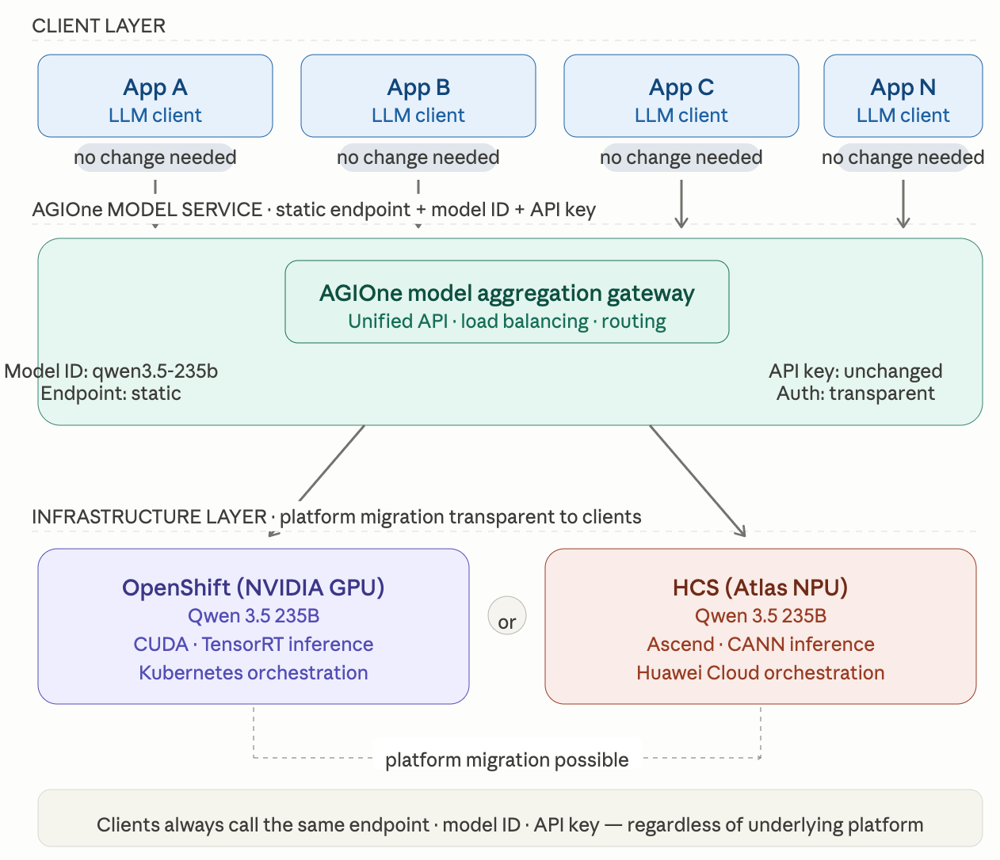

# Inference Services and Integration

## VLLM Inference Server

### Q: We directly manage VLLM properties for tuning purposes. How is this handled on HCS ModelArts?

**Answer:** For vLLM properties: 1. Operator users can manage vLLM properties when creating inference templates. 2. Customers can define vLLM properties in the startup command when deploying without inference templates.

### Q: How do we collect inference server metrics?

**Answer:** When inference is started with the vLLM framework, the metrics exporter is enabled and metrics can be accessed through an API.

## Alternative Inference Servers

### Q: Which inference servers are available besides VLLM?

**Answer:** Inference base images with AI frameworks can be customized beyond vLLM, including frameworks such as SGLang and MindIE.

Reference inference servers include:

- VLLM
- Llama-server (llama.cpp)

### Q: What is the status of VLLM support in HCS base images?

**Answer:** Inference base images can be based on vLLM, and can also be customized with other AI frameworks such as SGLang and MindIE. Startup properties can be managed for each framework. Operator users can also assign different tags to images with different AI framework environments for specific purposes, such as inference, training, or development IDEs.

## Platform Migration

### Q: How much effort is required for code conversion?

**Answer:** Existing OpenShift AI deployments are not directly compatible with HCS ModelArts and must be redeployed.

### Q: What is required to migrate existing deployments from OpenShift AI to HCS ModelArts?

**Answer:** Existing OpenShift AI deployments are not directly compatible and must be redeployed. However, models deployed on OpenShift AI can be published here by configuring the endpoint, API key, and model ID.

## Client - LLM Integrations

### Q: Is any change or additional effort required for client-side integrations?

**Answer:** A model service is provided. If a static model ID, endpoint, and API key are used, no client-side changes are required.

### Q: If the Qwen 3.5 235B model runs on OpenShift (NVIDIA) or HCS (Atlas), would a platform migration require any client-side changes?

**Answer:** A model service is provided. If the Qwen 3.5 235B model is deployed on OpenShift (NVIDIA) or HCS (Atlas), the deployments can be aggregated as a single model service with a static model ID, endpoint, and API key. In that case, no client-side changes are required.

**Client layer** — All applications (App A, B, C … N) integrate with the model service using a fixed set of credentials: a static endpoint URL, a static model ID (qwen3.5-235b), and a single API key. These never change, regardless of what happens below.

**AGIOne model service (aggregation gateway)** — This is the key abstraction layer. It acts as a unified API surface that handles request routing, load balancing, and failover across backend deployments. From a client's perspective, this is the only thing that exists — the underlying infrastructure is invisible.

**Infrastructure layer** — Qwen 3.5 235B can be deployed on either or both platforms simultaneously:

- **OpenShift (NVIDIA GPU)** — running CUDA/TensorRT inference under Kubernetes orchestration
- **HCS (Atlas NPU)** — running Ascend/CANN inference on Huawei Cloud

**Key insight for platform migration:** Because the aggregation gateway decouples the API contract from the physical deployment, the two backends can be run in parallel, switched between, or migrated without any notification to client teams. The gateway absorbs all routing complexity internally. Zero client-side changes are required.

## LLM as a Service / SLA

### Q: What availability mechanisms does AGIOne provide for LLM as a Service / SLA?

**Answer for SLA:** AGIOne supports aggregation of multiple model sources of the same type, with built-in fallback and circuit breaker mechanisms.

1. If one model fails repeatedly, it will be temporarily circuit-broken until it is detected as available again.

2. If a request fails, AGIOne automatically falls back and routes the request to the next candidate model.

These mechanisms help ensure model availability for on-prem deployments.

## Multi-Tenant Model Solutions

### Q: When serving multiple tenants with the same model and shared GPUs, what capabilities does the HCS inference server provide?

**Answer:** KV cache and prefix caching are supported. Calls from different customers are not distinguished for these cache capabilities.

Related capabilities include:

- KV cache isolation
- Automatic prefix caching
