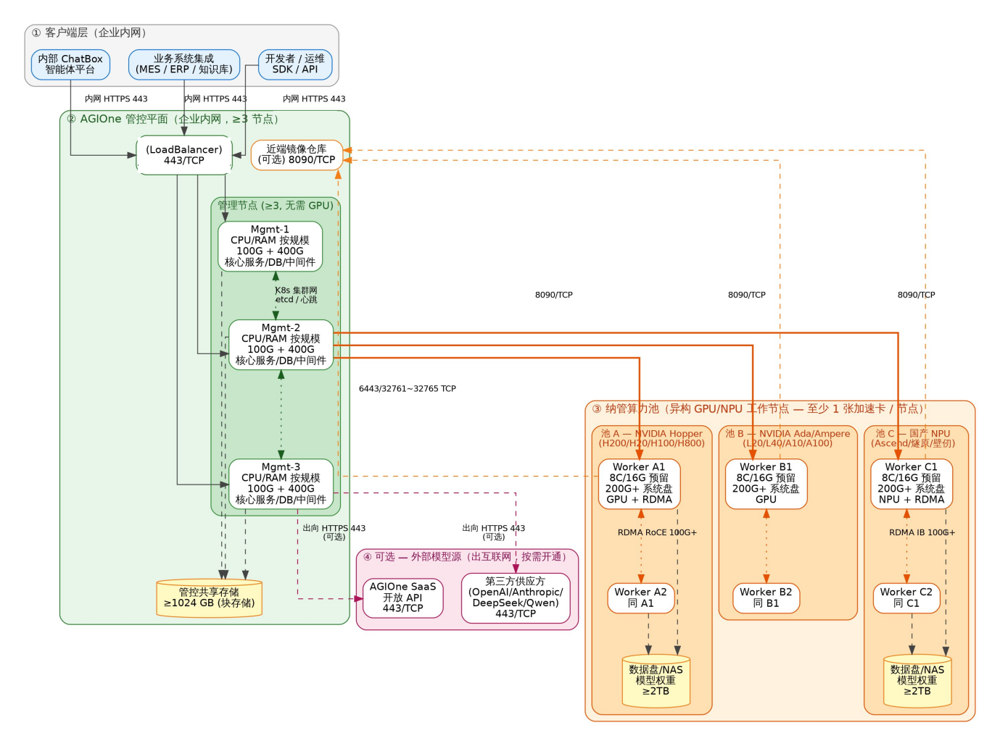

# AGIOne Platform Capabilities

## Overall Solution

### Q: What is your overall solution for AI resource management and scheduling?

**Answer:** AGIOne is a one-stop intelligent computing and model management platform for enterprise-level large model production and operations. It builds end-to-end capabilities across computing resources, models, services, and operations. Core platform capabilities include heterogeneous computing resource management, model templates, fast deployment, model publishing, model aggregation, metering and billing, and end-to-end call observability. The solution first unifies GPU / NPU resources from different data centers, vendors, and hardware generations into logical resource pools. It then uses model templates to capture deployment experience, creates standard endpoints through fast deployment and model publishing, and supports production operations through model aggregation, rate limiting, metering, and monitoring.

## Architecture and Containerization

### Q: Is the scheduling architecture centralized or distributed? How is containerization implemented?

**Answer:** AGIOne uses a "central control + edge execution" architecture and can manage resources across data centers and network domains in one unified control view. The AGIOne control plane is deployed in the customer's internal network, with at least three core service and middleware nodes. Managed GPU / NPU worker nodes are connected through heterogeneous computing resource pools. The containerization solution is based on Kubernetes. During node initialization, the container runtime, Kubernetes components, and AGIOne plugin are installed automatically. During deployment, the platform handles Kubernetes pod creation, scheduling policy matching, resource quota checks, image pulling, model loading, and health checks. Managed nodes do not expose ports directly to external users. Calls are proxied through the control gateway. The network architecture is shown below.

## Platform Compatibility

### Q: Are objects such as ServingRuntime (KServe) used?

**Answer:** No.

### Q: OpenShift AI supports the RAY framework. Is there a similar capability on HCS?

**Answer:** Customers can create multi-node clusters connected through the RAY framework. An RDMA network is required.

## Regional Support

### Q: Are there end-to-end solutions and implementation cases in the Asia-Pacific region? What local technical support is available?

**Answer:** Yes.
