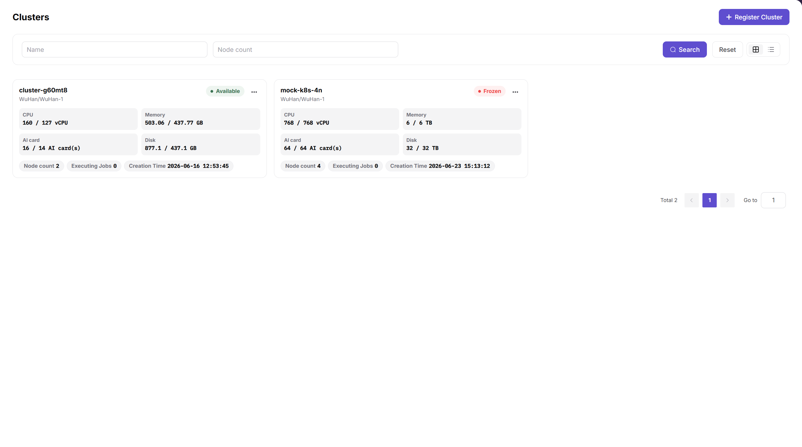
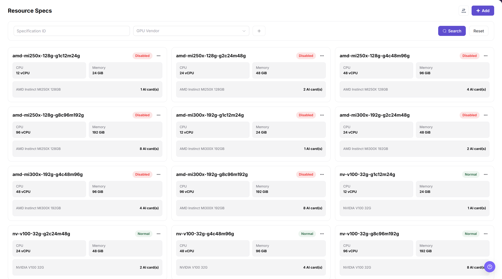
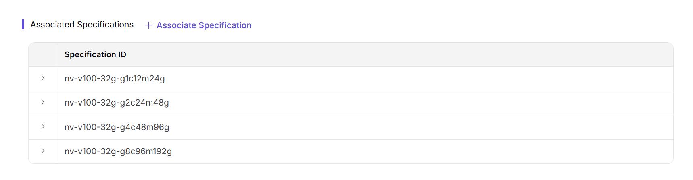
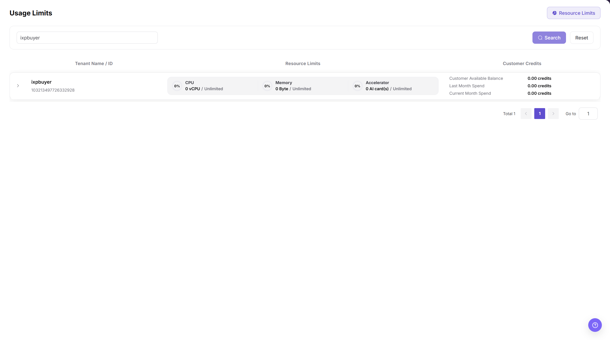
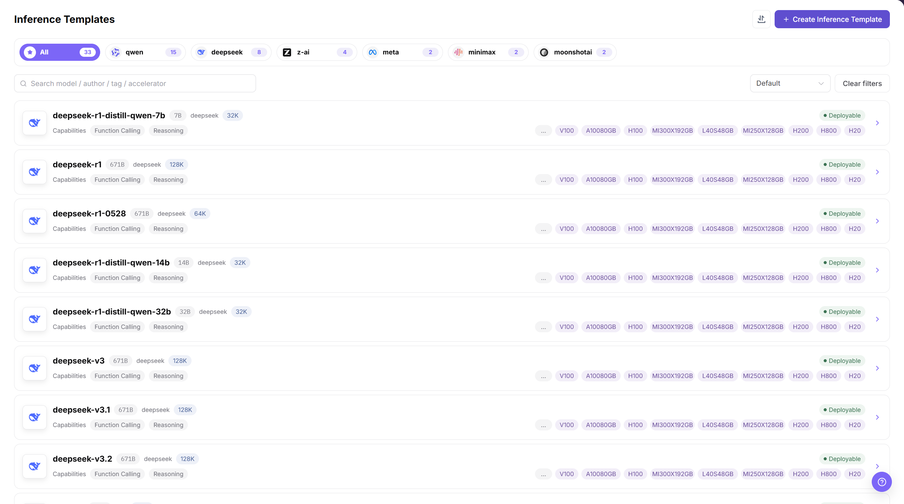
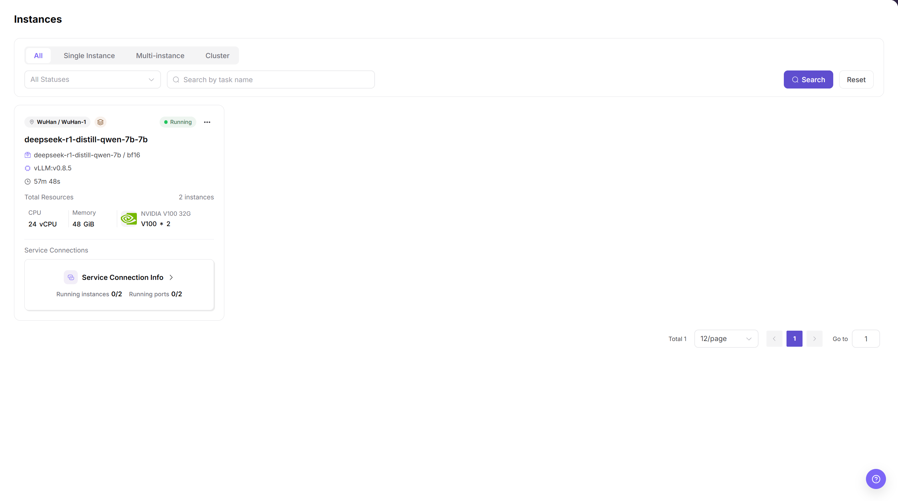
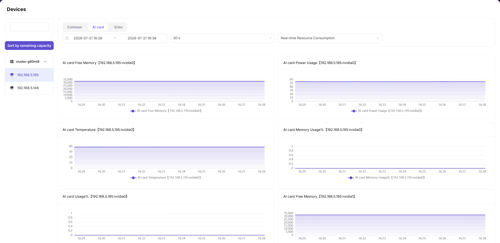

# Single-Node Multi-Card Multi-Model Deployment Best Practice

::: info Document Information
Version: v1.0
Updated: 2026-07-15
:::

This guide is intended for POC, private deployment delivery, and on-premises compute consolidation scenarios. It explains how to onboard a multi-card NPU/GPU node into AGIOne as schedulable capacity, then use resource specs, tenant credits, inference templates, and model instances to validate multi-model deployment.

## Applicable Scenarios

When a customer has only one or a few multi-card servers, the goal is usually more than starting a single model. The customer also needs to verify that the platform can divide limited compute into reusable resource packages so that different models, workloads, or tenants can share the hardware within explicit boundaries.

| Scenario | Description |
| --- | --- |
| Multiple models on one node | Run multiple model instances on one multi-card NPU/GPU node. |
| POC capability validation | Validate resource onboarding, spec configuration, limit enforcement, model deployment, and resource isolation. |
| On-premises compute platform | Bring bare-metal or Kubernetes clusters under unified AGIOne scheduling and monitoring. |
| Standardized delivery | Capture models, frameworks, images, specs, and default parameters in inference templates. |
| New model trial | Validate a model that has not yet been templated by using a model instance or custom deployment. |

This guide uses one eight-card NPU node hosting multiple models as an example. The same approach applies to GPU environments, but hardware, drivers, device plugins, and monitoring collection must be adjusted for the actual environment.

## Capability Mapping

This practice primarily belongs to `AI Infra On-Prem`. It is separate from the main flows for model publishing, the model marketplace, and invocation billing. Define the resource supply and model runtime first, then connect the deployed service to the model invocation flow.

| Goal | AGIOne Capability | Reference |
| --- | --- | --- |
| Onboard Kubernetes clusters and nodes | Clusters, cluster nodes, and device monitoring | [Clusters](/usermanual/ai-infra-on-prem/operator/resource-pools/clusters/) |
| Define selectable compute packages | Spec metrics, resource specs, and cluster-spec association | [Resource Specs](/usermanual/ai-infra-on-prem/operator/resource-pools/resource-specs/) |
| Control resources available to an organization or tenant | Tenant credits, quotas, and metering | [Metering Details](/usermanual/ai-infra-on-prem/operator/quotas-metering/metering-details/) |
| Standardize model deployment | Inference templates, model configuration, frameworks, images, resource specs, and VRAM configuration | [Inference Templates](/usermanual/ai-infra-on-prem/operator/templates/inference-templates/) |
| Deploy and inspect model services | Model instances, instance status, logs, and access troubleshooting | [Model Instances](/usermanual/ai-infra-on-prem/user/model-deployment/instances/) |
| Monitor resource health and capacity | Overview, cluster, node, device, and job monitoring | [Monitoring Overview](/usermanual/ai-infra-on-prem/operator/monitoring/overview/) |

## Roles and Responsibilities

A single-node multi-card deployment mainly involves the Operator and End User roles. A Provider enters the main workflow only for model publishing, aggregated models, or model services offered externally. Do not assign all model deployment work to the Provider by default.

| Role | Responsibilities | Out of Scope |
| --- | --- | --- |
| Operator | Onboard clusters, maintain accelerators, create resource specs, associate specs with clusters, configure tenant credits, maintain inference templates, and troubleshoot resource or scheduling issues. | Long-term management of application invocation logic on behalf of business users. |
| End User | Select templates, specs, and parameters within the authorized scope; create model instances; and view deployment status, logs, and invocation information. | Management of the underlying Kubernetes environment, physical nodes, resource specs, or platform-level tenant credits. |
| Provider | Publish and maintain model assets, submit them for review, and inspect customer invocations and revenue in model publishing scenarios. | Management of platform resource pools, clusters, or tenant credits. |
| Admin | Manage organizations, users, roles, and basic platform access settings. | Day-to-day compute operations and model deployment. |

A simple way to distinguish the roles is: the Operator prepares usable resources and templates, the End User creates runnable model instances, and the Provider maintains publishable and commercial model services.

## Recommended Resource Plan

### Resource Spec Design

A resource spec is more than a card count. In AGIOne, it should define CPU, memory, the AI accelerator metric, accelerator count, status, and available cluster associations. For an eight-card node, prepare at least one-card, two-card, and four-card options.

| Example Spec | Accelerator Count | Suggested CPU / Memory | Typical Use |
| --- | ---: | --- | --- |
| `npu-1c-small` | 1 card | Reserve at least the model's minimum requirement. | Small models, functional tests, lightweight inference, and Notebook validation. |
| `npu-2c-standard` | 2 cards | Size for a medium model and expected concurrency. | Medium models and regular inference services. |
| `npu-4c-large` | 4 cards | Size for a larger model and its context length. | Large-model validation and core inference services. |

Do not create only one eight-card spec during a POC. That setup can prove that one large model starts, but it cannot validate resource partitioning, multi-model coexistence, tenant-limit boundaries, or scheduling failure boundaries.

### Example Deployment Combinations

| Deployment Combination | Resource Use | Validation Goal |
| --- | ---: | --- |
| One four-card model + one two-card model + two one-card instances | 8 cards | Validate that large, medium, and small specs coexist. |
| Two four-card models | 8 cards | Validate two large models running in parallel. |
| Four two-card models | 8 cards | Validate multiple medium models sharing one resource pool. |
| One four-card model + two two-card models | 8 cards | Validate mixed-spec deployment and capacity exhaustion. |

### Tenant Credit Design

Tenant credits define the amount of resource that an organization or tenant can consume from the resource pool. Sufficient credits do not guarantee that an instance can be created. The selected spec, cluster capacity, template constraints, and scheduling policy must also be satisfied.

| Example Tenant | Limit | Validation Goal |
| --- | ---: | --- |
| Tenant A | 4 cards | Validate one four-card model or two two-card models. |
| Tenant B | 2 cards | Validate a medium credit boundary. |
| Tenant C | 1 card | Validate deployment with a small spec. |

Retain both insufficient-limit and exhausted-pool failure scenarios in the POC. The first proves that limit enforcement works; the second proves that AGIOne does not continue creating instances when the underlying capacity is unavailable.

## Implementation Workflow

### 1. Operator Onboards the Cluster and Devices

Resource onboarding is the start of the workflow. Resource specs, tenant credits, and model instances have no scheduling foundation until the Kubernetes cluster and its NPU/GPU nodes are connected.

The Clusters page above lets the Operator verify the target cluster status, CPU, memory, AI card capacity, and node count before continuing.

| Item | Details |
| --- | --- |
| Role | Operator |
| Navigation | `Resource Pools > Clusters` |
| Input | Kubernetes connection information, node resources, device plugins, and monitoring collection capability |
| Output | An on-premises compute cluster that AGIOne can schedule and monitor |

Key checks:

1. The cluster appears in the list and its status matches the expected state.
2. Cluster nodes are visible and their status is `Ready` or matches the delivery expectation.
3. Device monitoring shows the GPU/NPU model, count, memory, utilization, and health state.
4. The target cluster is associated with usable resource specs before it hosts workloads.

### 2. Operator Creates Resource Specs and Associates Them with the Cluster

A resource spec defines the package that a model instance, Online IDE, or runtime instance can request. After creating a spec, associate it with the target cluster. Otherwise, End Users may not be able to select it when creating an instance.

The Resource Specs page above helps verify that one-card, two-card, and four-card combinations have been created with the correct accelerator type, CPU, and memory.

| Item | Details |
| --- | --- |
| Role | Operator |
| Navigation | `Resource Pools > Resource Specs`; `Resource Pools > Clusters > Cluster Details` |
| Input | CPU, memory, AI accelerator metric, accelerator count, and spec name |
| Output | Resource specs that End Users can select when creating model instances |

Key checks:

1. The accelerator metric in the spec matches the resource key reported by the cluster.
2. The spec name identifies the accelerator type, count, and purpose for easier troubleshooting.
3. The spec appears under Associated Specifications in the target cluster details.
4. End Users can select the spec in the intended region, availability zone, or cluster scope.

The Associated Specifications section above confirms which specs the cluster can schedule. If a spec exists but is unavailable to an End User, check this association first.

### 3. Operator Configures Usage Limits

Tenant credits control the CPU, GPU/NPU, memory, and other resources available to an organization or tenant. A resource spec controls the resource used by one instance; tenant credits control the tenant's aggregate resource use. Both conditions must be satisfied.

The tenant-credit list, labeled `Usage Limits` in the current English UI, shows whether the target tenant has sufficient CPU, accelerator, and memory credits for the POC plan.

| Concept | Purpose |
| --- | --- |
| Resource spec | Controls how much resource one model instance uses. |
| Tenant credits | Control how much resource a tenant can use from the resource pool in total. |
| Cluster capacity | Determines whether schedulable physical capacity is still available. |

Validation examples:

| Action | Expected Result | Explanation |
| --- | --- | --- |
| Tenant A uses a four-card limit to create one four-card instance. | Success | Total use remains within the limit. |
| Tenant A uses a four-card limit to create two two-card instances. | Success | Aggregate use is four cards. |
| Tenant A creates another one-card instance after using all four cards. | Failure | The tenant's accelerator credits are exceeded. |
| Create another instance after all eight cards in the pool are allocated. | Failure | The underlying capacity is exhausted. |

### 4. Operator Creates Reusable Inference Templates

For standard models, use inference templates to package the model, framework, runtime image, resource specs, VRAM sizing, ports, environment variables, and default parameters. An End User then selects only the template, spec, and required parameters instead of managing the underlying startup command.

The Inference Templates page above shows the deployable model templates and supported accelerator options. Before publishing, verify that each template's model, framework, image, spec range, and visibility match the target tenant.

| Item | Details |
| --- | --- |
| Role | Operator |
| Navigation | `Templates > Inference Templates` |
| Input | Model configuration, framework, runtime image, resource specs, VRAM configuration, and parameter form |
| Output | A model deployment template available to End Users |

Checks before publishing:

1. The model, framework, image, and specs referenced by the template are available.
2. The template's spec range supports the one-card, two-card, and four-card deployment goals.
3. Default parameters do not contain real secrets, internal paths, or temporary test endpoints.
4. The visibility scope includes the target tenant or users.

### 5. End User Creates a Model Instance

After the Operator prepares the resources and templates, an End User can create a model instance within the authorized scope. AGIOne evaluates the template, spec, tenant credits, cluster capacity, and scheduling conditions together.

The Instances page above shows the instance type, runtime state, requested resources, and entry points for service connection information or subsequent troubleshooting.

| Item | Details |
| --- | --- |
| Role | End User |
| Navigation | `Model Deployment > Model Instances` |
| Input | Inference template, resource spec, instance parameters, and access configuration |
| Output | A runnable, inspectable, and callable model service instance |

Checks after deployment:

1. The model instance is created and reaches `Running` or another expected state.
2. Instance events and logs contain no image-pull, model-load, port, or health-check errors.
3. Device and job monitoring show resource use consistent with the selected spec.
4. The service access method works, and no credential or endpoint is exposed in plain text in the guide or screenshots.

### 6. Validate Instance Resource Isolation

A successfully created instance does not by itself prove that resource isolation is correct. During the POC, verify that the resources visible inside the instance match the selected spec.

The Devices page above shows accelerator memory, power, temperature, and utilization. Compare these metrics with the commands run inside the instance to verify GPU/NPU allocation and health.

| Resource Spec | Expected Resources Visible in the Instance |
| --- | --- |
| One-card spec | 1 NPU/GPU card |
| Two-card spec | 2 NPU/GPU cards |
| Four-card spec | 4 NPU/GPU cards |

Validation methods:

1. In a GPU environment, use `nvidia-smi` to inspect GPUs visible inside the instance.
2. In an NPU environment, use the hardware vendor's command to inspect NPUs visible inside the instance.
3. Retain the page state, device monitoring, job monitoring, and command output from inside the instance as POC evidence.

Do not present one hardware command as universal. Available tools differ by NPU vendor, driver, and container image; use the commands supported by the customer's actual environment.

## POC Acceptance Checklist

| Category | Acceptance Item | Expected Result |
| --- | --- | --- |
| Cluster onboarding | Cluster registration and status synchronization | Success |
| Device discovery | NPU/GPU model, count, and status are visible | Success |
| Resource specs | One-card, two-card, and four-card specs are created and associated with the target cluster | Success |
| Tenant credits | The target tenant's credit configuration takes effect | Success |
| Template capability | The target End User can select the inference template | Success |
| Model deployment | Create a one-card model instance | Success |
| Model deployment | Create a two-card model instance | Success |
| Model deployment | Create a four-card model instance | Success |
| Credit boundary | Create another instance after exceeding the tenant's credits | Failure with an explainable message |
| Capacity boundary | Create another instance after the resource pool is exhausted | Failure with an explainable message |
| Resource isolation | Resources visible in the instance match the selected spec | Success |
| Invocation validation | An authorized user can invoke the model service | Success |

## FAQ

### Why not create only one eight-card spec?

An eight-card-only configuration proves only that one large model can start. It does not validate multi-model coexistence, multi-spec scheduling, tenant-limit boundaries, or failure behavior after the resource pool is exhausted. Prepare at least one-card, two-card, and four-card options during a POC.

### What is the difference between a resource spec and tenant credits?

A resource spec controls the resources used by one instance. Tenant credits control the total resources that the tenant can use. Even if a spec is selectable, instance creation should fail when the tenant has insufficient remaining credits.

### The tenant has sufficient capacity, but the spec is not selectable. What should I check?

Check these locations first:

1. Confirm that the resource spec is enabled.
2. Confirm that the target cluster is associated with the resource spec.
3. Confirm that the inference template does not exclude the spec from its selectable range.

### Where should I look first when deployment fails?

Troubleshoot in this order:

1. Model instance events and logs.
2. The model, framework, image, and parameters referenced by the inference template.
3. The association between the resource spec and the target cluster.
4. Tenant credits and remaining resource-pool capacity.
5. Cluster, node, and device monitoring.

### What if a new model does not have an inference template yet?

First validate the model weights, image, and startup command by using a custom deployment or runtime instance. After the configuration is stable, have the Operator create an inference template to reduce repeated setup work.

## Customer-Facing Explanation

You can explain the single-node multi-card deployment approach as follows:

AGIOne does not expose an entire multi-card server directly to one user. The Operator first onboards the Kubernetes cluster and its NPU/GPU nodes, then abstracts the underlying resources into one-card, two-card, and four-card resource specs. Tenant credits define the aggregate usage boundary.

On one eight-card node, users can select different specs based on model size. For example, one model can use four cards, another can use two cards, and two test instances can use one card each. AGIOne evaluates resource specs, tenant credits, cluster capacity, and template constraints together so that resources are explicitly allocated, reliably scheduled, and observable during troubleshooting.

For standard models, the Operator captures deployment experience in inference templates. New models can be validated with a custom deployment first and templated after they become stable. This approach improves utilization and makes POC evidence easier to review and deliver.

## Related Documentation

- [Clusters](/usermanual/ai-infra-on-prem/operator/resource-pools/clusters/)
- [Resource Specs](/usermanual/ai-infra-on-prem/operator/resource-pools/resource-specs/)
- [Metering Details](/usermanual/ai-infra-on-prem/operator/quotas-metering/metering-details/)
- [Inference Templates](/usermanual/ai-infra-on-prem/operator/templates/inference-templates/)
- [Model Instances](/usermanual/ai-infra-on-prem/user/model-deployment/instances/)
- [Multi-Compute Pool Heterogeneous Inference Scheduling Best Practice](./multi-compute-pool-heterogeneous-inference-scheduling)
