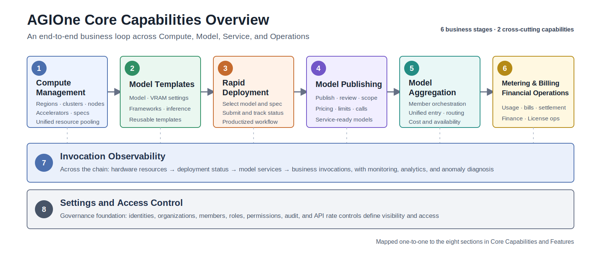
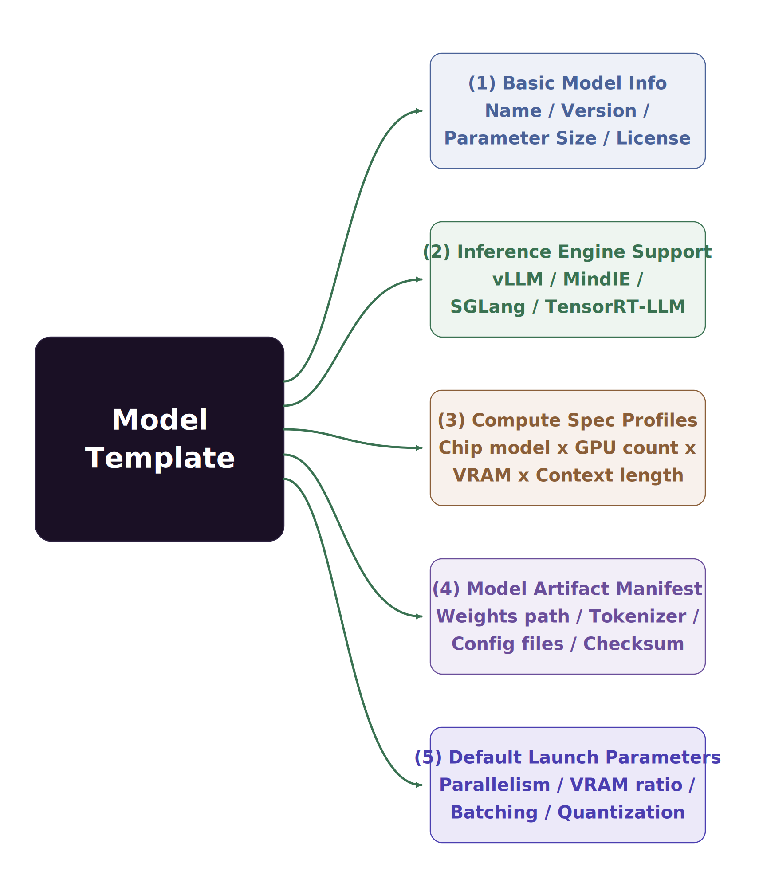
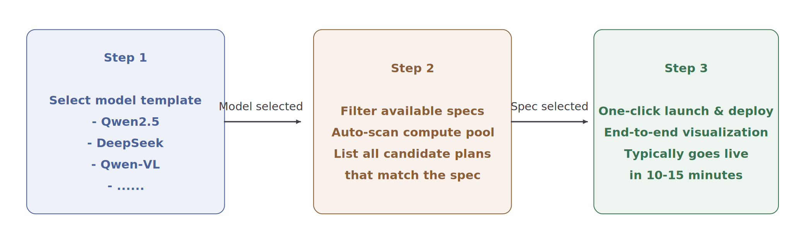
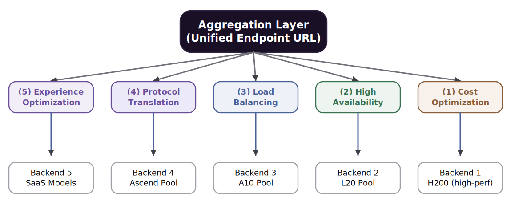
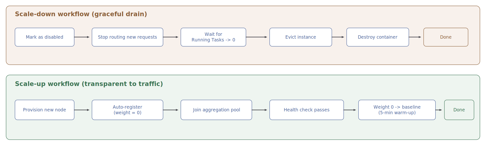
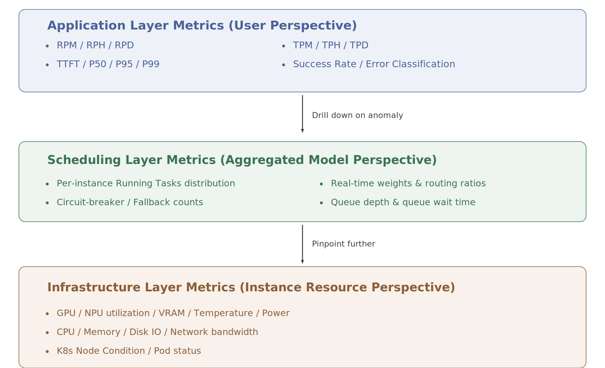
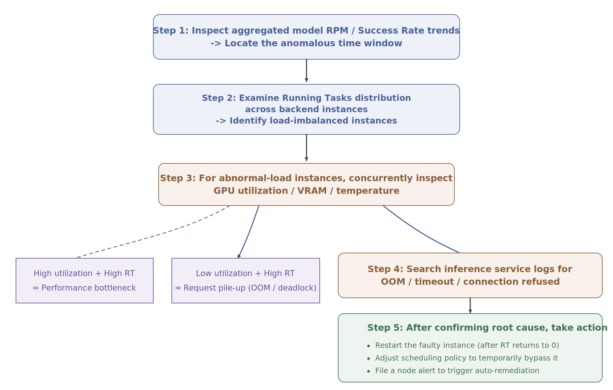
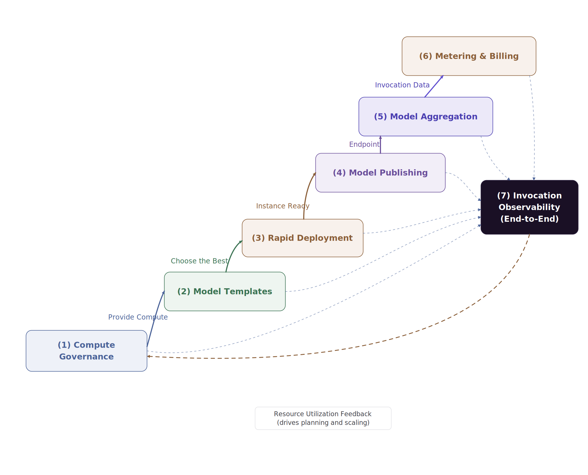

# Core Capabilities and Features

:::: info Document Information
Version: v1.1
Updated: 2026-07-13
Functional baseline: User Manual updated on 2026-07-10
::::

## Overview

AGIOne is a **one-stop intelligent compute and model management platform** purpose-built for enterprise-grade large model productionization. Centered on the end-to-end closed loop of **"Compute → Model → Service → Operations"**, it delivers six core capabilities:

<i>Figure 1   Overview of AGIOne's Six Core Capabilities (with end-to-end Invocation Observability)</i>

> The seventh capability, **Invocation Observability**, runs horizontally across all six capabilities, providing visibility and analysis from hardware resources to business-level invocations.

::: warning Reading Note
This page retains the original capability framework and conceptual diagrams. Times, strategies, performance figures, and pricing values in the diagrams and examples explain design considerations and are not current-version commitments. The current user manual also documents **Billing** and **Settings** as product modules for finance, License, identity, audit, and API rate-control operations. Use the [User Manual](../../usermanual/), [Support Matrix](../limitations/support-matrix), and target environment as the source of truth. Current status: Huawei Cloud access is temporarily unsupported; RAG and Function Calling are planned.
:::

## 1. Compute Management — Unified Pooling of Heterogeneous Accelerators

### 1.1 Capability Overview

Through AI Infra On-Prem, AGIOne manages regions, availability zones, clusters, nodes, and accelerator resources. Specifications, templates, quotas, and authorization provide selectable compute for workloads. Onboarding and model runtime still require validation of the accelerator, driver, runtime, image, inference engine, and model combination.

### 1.2 Supported Heterogeneous Accelerators

| Vendor | Architecture / Series | Representative Models | Adaptation Note |
|---|---|---|---|
| **NVIDIA** | Hopper | H800 / H200 / H100 / H20 | Validate driver, CUDA, image, and inference engine by project |
| **NVIDIA** | Ampere | A100 / A800 / A40 / A30 / A10 / RTX A Series / RTX 30 Series | Confirm device memory and data-center deployment conditions by model |
| **NVIDIA** | Ada | L40 / L40S / L20 / L20S / L4 / L2 / RTX 4090, etc. | Workstation or consumer models require additional stability and delivery validation |
| **Huawei Ascend** | Ascend 910 | Ascend 910B / Ascend 910C | Validate CANN, MindIE, driver, image, and model by project |
| **Enflame** | Enflame | 106 | Validate vendor driver, runtime, inference framework, and model |
| **Biren** | Biren | S60 | Validate vendor driver, runtime, inference framework, and model |
| **Hygon** | BW | BW200 | Validate vendor driver, runtime, inference framework, and model |

### 1.3 Core Sub-capabilities

#### 1.3.1 Node Onboarding and Lifecycle Management

- **Cluster and node onboarding**: Operators maintain regions, availability zones, clusters, nodes, and accelerator objects. The actual onboarding scope depends on network and installation conditions.
- **Node initialization**: Follow the [Compute Node Onboarding and Installation Guide](../../installation/quick-install-for-managing-compute-nodes) to prepare Kubernetes, the container runtime, drivers, and device plugins.
- **Images and runtime environments**: Use images, image services, and templates to maintain the environments required by workloads.
- **Exception handling**: Use node, device, workload monitoring, and event records to locate issues. Recovery behavior depends on the Kubernetes configuration and delivery solution.

#### 1.3.2 Resource Scheduling and Allocation Strategies

| Scheduling Dimension | Strategy | Use Case |
|---|---|---|
| **Hardware-label-based scheduling** | Uses node and device labels to distinguish accelerator types | Select the corresponding accelerator for different runtime environments |
| **Compute-spec-based scheduling** | Selects an available specification that meets accelerator type, card count, and memory requirements | Model deployment and training workloads |
| **Authorization-scope-based scheduling** | Uses only regions, resource pools, and specifications visible to the current tenant, business scope, or user | Multi-tenant resource use |
| **Multi-card workload configuration** | Configures card count and parallelism parameters according to the template, model, and cluster conditions | Single-node or multi-node multi-card workloads |

#### 1.3.3 Hardware Monitoring Metrics

The platform can display collected accelerator metrics on device and monitoring pages. The collectors, metric set, and refresh interval depend on the accelerator type, monitoring configuration, and deployed version. Examples include:

- **GPU/NPU compute utilization** & SM occupancy
- **VRAM usage** & memory bandwidth
- **Core temperature** & memory temperature
- **Real-time power draw** & TDP utilization
- **NVLink / InfiniBand bandwidth** & link health

## 2. Model Templates — Codifying Best Practices

### 2.1 Capability Overview

AGIOne uses model configurations, memory configurations, frameworks, and inference templates to preserve reusable deployment parameters. Template availability depends on the operator's configuration and validation of the target model, compute specification, image, and inference engine.

### 2.2 What's Inside a Model Template

Each model template encapsulates the following five categories of information, forming a complete deployment knowledge asset:

<i>Figure 2   The Five Components of a Model Template</i>

### 2.3 Built-in Model Template Examples

#### 2.3.1 Pre-built Templates for Mainstream Large Models

> The table below is retained as a capacity-planning example. It does not mean that the current environment includes these models, nor does it commit to compatibility for any model, card count, context length, or inference engine. Use the current template list and actual test results during delivery.

| Model Family    | Representative Versions                 | Parameter Scale     | Recommended Compute Spec | Inference Engine | Context Length      |
|--------------|-----------------------------------------|:------------------:|------------------------|:---:|:-------------------:|
| **DeepSeek** | V3.1 / R1                               | 671B MoE / 14B–70B | H200×8 / H20×2         | vLLM         |    32K / 64K / 128K     |
| **Qwen**     | QwQ-32B                                 |        32B         | H20×1 / L20×4          | vLLM         |       32K / 64K       |
| **Qwen-VL**  | 2 / 3                                   |     14B / 72B      | L20×1 / L20×4          | vLLM         |     Multimodal      |
| **Llama3**   | 8B                                      |         8B         | L20S×1 / Ascend 910B×1 | vLLM / MindIE |        32K          |
| **GLM**      | 5.1                                     |        744B        | H20×16                 | vLLM         | 32K / 64K / 128K        |
| **Embedding / Reranker** | bge-m3 / bge-reranker / qwen3-embedding |     —          | L20×1 / L4×2           | vLLM         |          —          |

### 2.4 Template Version Management

- **Platform templates**: Operators maintain the model configurations, memory configurations, frameworks, and inference templates available in the current environment.
- **Project templates**: A project can preserve dedicated templates based on validated combinations of models, images, compute, and parameters. Confirm versions and resource conditions before reuse.

## 3. Rapid Deployment — A "One-Click" Experience That Hides Technical Complexity

### 3.1 Capability Overview

With prepared models, frameworks, images, specifications, and authorized resources, AGIOne provides a productized workflow of **"Select a model → Select a specification → Submit the deployment."** Operators prepare the underlying resources and deployment assets, while general users start rapid deployment from their currently visible scope and review the result.

### 3.2 Three-Step Rapid Deployment Workflow

<i>Figure 3   Three-Step Rapid Deployment Workflow</i>

### 3.3 Intelligent Spec Filtering

After a user selects a model, the page displays available deployment combinations based on the currently configured and authorized cloud platform, region, model, and compute solution. The following checks illustrate resource relationships to confirm before deployment:

| Filter Criterion | Automated Decision Logic |
|---|---|
| **Sufficient VRAM**    | Computes model weights × quantization factor + KV cache reservation + system overhead |
| **Sufficient cards**   | Verifies free cards in the target compute pool ≥ `tensor_parallel_size` |
| **Sufficient network** | For multi-node deployments, validates RDMA bandwidth and latency |

### 3.4 Visualized Deployment Process

After deployment starts, use the UI and status pages to follow each phase and confirm the current deployment state:

| Phase | UI or Status-page Focus | Timing Note |
|:----------:|-------------------------------------------|:-----------:|
| **① Resource allocation** | Confirm that the selected region, resource pool, specification, and quota are available | Depends on resource state |
| **② Container scheduling** | Check workload scheduling, node matching, and quota results | Depends on cluster state |
| **③ Image pull** | Check image service, authentication, and network status | Depends on image size and network |
| **④ Model loading** | Check model storage, mount, accelerator memory, and startup status | Depends on the model and storage |
| **⑤ Health check** | Check deployment status, monitoring, and event records | Depends on startup and probe configuration |

Deployment time depends on compute availability, images, model weights, storage, network, and cluster state. This document does not promise a fixed completion time.

### 3.5 Failure Rollback and Diagnostics

- **When deployment fails**, first review deployment status, monitoring, events, and related logs to identify the failed phase.
- **Common causes** include insufficient quota or capacity, unavailable images, storage mount failures, incompatible model assets, and network errors.
- **Resource cleanup and retry** should follow the capabilities available on the current page and the delivery solution; automatic rollback is not assumed.

## 4. Model Publishing — Exposing Models as Services

### 4.1 Capability Overview

Model Services allows model providers to publish single models, BYOK Endpoints, or aggregate models; configure the visibility, pricing, and rate-limit fields available on the current page; and submit them for review. After operator approval, general users can discover, experience, and call authorized models.

### 4.2 Standardized Endpoint Encapsulation

| Encapsulation Dimension | Details |
|---|---|
| **Protocols and fields** | Use the invocation example on the target model detail or quick-start page, and confirm behavior against the deployed version |
| **Endpoint URL** | Use the actual Endpoint and model identifier shown on the target model page; do not reuse documentation example addresses |
| **Request / response capabilities** | Depend on the target model and current version; Function Calling is currently planned |

### 4.3 Authentication and Authorization

- **Invocation credentials**: Use the access credentials provided on the model page or assigned in the current environment, and store and rotate them according to security policy.
- **Role responsibilities**: Model providers publish models, operators review them, and general users experience and call authorized models.
- **Authorization scope**: The tenant, role, model visibility, and resource authorization jointly determine which operations an account can perform.

### 4.4 Pricing Configuration

Model providers can configure the price fields available on the current publishing page. The following table illustrates pricing requirements only; actual dimensions, currency, and prices depend on environment configuration and commercial rules:

| Pricing Model | Use Case | Example Configuration |
|---|---|---|
| **Per-Token (separate input / output rates)** | General dialogue, document generation | DeepSeek-V3: input $0.12 / 1K tokens, output $0.48 / 1K tokens |
| **Per-call** | Fixed-structure requests (OCR, embeddings) | Embedding: $0.001 / call |
| **Per-duration** | Streaming output, long-running tasks | Speech synthesis: $0.05 / second |

### 4.5 Multi-dimensional Rate Limiting

The model publishing page can configure invocation-limit fields available in the current version. The exact dimensions and enforcement behavior depend on the page and invocation results:

| Rate-limit Dimension | Configuration Granularity | Typical Scenario |
|---|---|---|
| **Per-tenant RPM / TPM** | Independent quota per tenant | Smart Manufacturing Division: RPM = 500, TPM = 2,000,000 |

Verify the response status, queuing behavior, or rejection behavior after a limit is exceeded in the target version; this document does not define a fixed outcome.

## 5. Model Aggregation — Multi-objective Intelligent Orchestration

### 5.1 Capability Overview

An **Aggregated Model** is created by a model provider from eligible published member models and presents a unified model entry point. Member-model selection, available routing strategies, prices, and limit fields depend on the current creation page. General users do not create aggregate models.

### 5.2 Five Optimization Objectives of the Aggregated Model

<i>Figure 4   Five Optimization Objectives of the Aggregated Model</i>

> Figure 4 is retained as a solution-design view. It does not indicate that every objective is an available built-in strategy in the current version. Protocol translation is not a currently confirmed aggregation capability in this document.

### 5.3 Five Aggregation Strategies in Detail

#### 5.3.1 Cost-optimized Aggregation

- **Goal**: Consider invocation cost when member models meet business requirements.
- **Strategy**: Select a cost-related strategy only when the current version provides it, then verify price fields and routing results.
- **Typical scenarios**: Cost-sensitive internal invocations.

#### 5.3.2 High-Availability (HA) Aggregation

- **Goal**: Reduce the effect of a single member-model failure on the unified entry point.
- **Strategy**: Availability- or success-rate-related routing depends on the strategy options in the current version and actual test results.
- **Typical scenarios**: Services that use multiple backends through one entry point.

#### 5.3.3 Load-Balancing Aggregation

- **Goal**: Distribute requests across multiple member models.
- **Strategy**: Round-robin, success-rate, cost, and other options are available only when shown on the current creation page.
- **Validation**: Use call logs and analytics to confirm that requests are distributed as expected; this document does not define a fixed weight formula or refresh interval.

#### 5.3.4 Protocol Consistency Validation

- **Goal**: Confirm that member-model request, response, and capability boundaries satisfy the unified entry point.
- **Strategy**: Validate member-model protocols and fields before creation. The aggregation layer is not currently claimed to automatically translate OpenAI, Anthropic, MindIE, or streaming/non-streaming protocols.
- **Handling**: Move protocol differences into project-specific adaptation assessment.

#### 5.3.5 Experience-optimized Aggregation

- **Goal**: Consider response experience across multiple available member models.
- **Strategy**: Compare actual call logs and analytics; latency-related routing depends on current-version support.
- **Typical scenarios**: Interactive model invocation.

### 5.4 Multi-scenario Aggregation Configurations

> The following table is a capacity and strategy design example, not a platform preset. Instance counts, timeouts, and active windows must be revalidated against actual load and version capabilities.

| Aggregation Scenario | Backend Instances | Load Strategy | Timeout | Active Window |
|---|:---:|---|:---:|---|
| **Light load (daytime API support)** | 3 – 5  | Experience + round-robin | 3000s | Weekdays 08:00–20:00 |
| **Heavy load (daytime batch reporting)** | 10 – 30 | Experience + round-robin | 3000s | Weekdays 09:00–20:00 |
| **Full load (overnight batch processing)** | All instances | Experience + round-robin + batching | 3000s | Daily 20:00 – 08:00 next day |

### 5.5 Transparent Scaling of Aggregated Models

<i>Figure 5   Transparent Scaling Workflow for Aggregated Models</i>

Before changing member models, verify the aggregate-model entry point, review status, and invocation continuity. Whether the Endpoint can remain unchanged and scaling can be transparent depends on the current version and change method.

## 6. Metering, Billing, and Financial Operations — Fine-grained Operational Control

### 6.1 Capability Overview

AGIOne provides operational pages for call logs, usage, metering details, credits, revenue, user billing, customer finance, finance operations, settlement, reconciliation, and License status so users can review data recorded in the current environment. Billing dimensions, precision, currency, credit rules, settlement methods, License quotas, and financial-account workflows depend on commercial configuration, model-returned fields, synchronization status, and the deployed version.

### 6.2 Multi-dimensional Metering Data Collection

The platform can record or aggregate the following metering dimensions. Availability, precision, and completeness depend on fields returned by the target model, metering configuration, and synchronization status:

| Metering Dimension | Captured Content | Precision |
|---|---|:---:|
| **Input token count** | Computed input tokens (including system prompts and conversation history) | 1 token |
| **Output token count** | Tokens actually generated by the model (precisely captured even when streaming is interrupted) | 1 token |
| **Call count** | Number of API calls (success / failure recorded separately) | 1 call |
| **Inference duration** | End-to-end processing time (used for duration-based billing) | 1 ms |
| **Multimodal metering** | Image count / audio duration / video frame count (varies by modality) | Per modality |

### 6.3 Credit-based Pricing System

The platform can use quotas or credits to record resource and invocation consumption. The exact unit and conversion relationship are configured for the current environment:

- **Unified records**: Review consumption within the current account scope on usage and metering pages.
- **Configuration relationship**: Currency, prices, and credit relationships follow the current configuration maintained by operators.
- **Role scope**: Operators, model providers, and general users see different data scopes.
- **Result reconciliation**: Cross-check invocation, usage, metering, and revenue data using the same time range.

#### Billing Rule Examples

> The following values illustrate calculation methods only. They are not current model prices, conversion ratios, or settlement rules.

| Model Spec | Input Pricing | Output Pricing | Use Case |
|---|:---:|:---:|---|
| **DeepSeek-V3 / 128K** | 12 credits / 1K tokens | 48 credits / 1K tokens | High-value, complex reasoning |
| **Qwen2.5-72B / 64K**  | 8 credits / 1K tokens  | 32 credits / 1K tokens | Standard document processing |
| **DeepSeek-7B / 32K**  | 2 credits / 1K tokens  | 8 credits / 1K tokens  | High-concurrency, lightweight workloads |
| **Embedding models**     | 1 credit / 1K tokens  | —                  | Knowledge base indexing and retrieval |
| **OCR service**           | 5 credits / call        | —                  | Image recognition |

> **💡 Credit ⇄ Currency Example**
>
> Assume a conversion ratio of `$1 = 100 credits`:
> - A single DeepSeek-V3 call with 1,000 input tokens + 500 output tokens = 12 + 24 = **36 credits** = $0.36
> - The Smart Manufacturing Division receives **10,000,000 credits** at the start of the month (equivalent to $100,000), to be consumed freely throughout the month.

### 6.4 Metering Logs and Deduction Logs

The platform provides metering details, usage, call logs, revenue, and related record entry points for reconciliation. Actual fields, data scope, and synchronization timing depend on the current page.

#### 6.4.1 Metering Log (per-invocation)

Captures the complete metering record of **every individual API call**:

| Field | Example |
|---|---|
| Call ID | `req_2026042701000123` |
| Timestamp | `2026-04-27 10:23:45.123` |
| Tenant / User | Smart Manufacturing Division / zhangsan |
| Model / Endpoint | `deepseek-v3-128k-aggregated` |
| Input tokens | 1,243 |
| Output tokens | 587 |
| Inference duration (ms) | 8,234 |
| Result | Success |
| Credits charged | 1243 × 0.012 + 587 × 0.048 = **42.7 credits** |

#### 6.4.2 Deduction Log (per-account)

Aggregates credit deductions by tenant / user / period:

| Dimension | Example | Period | Opening Credits | Cumulative Deduction | Balance |
|---|---|:---:|---:|---:|---:|
| Smart Manufacturing Division | (Department-level) | 2026-04 | 10,000,000 | 6,234,891 | 3,765,109 |
| Smart Manufacturing Division / Zhang San | (User-level) | 2026-04 | — | 432,156 | — |
| Smart Manufacturing Division / Example Application | (Application-level) | 2026-04 | — | 1,892,344 | — |

### 6.5 Finance and License Operations

The Billing module extends metering into finance-oriented workflows. It separates user-side billing views, provider revenue views, customer finance, operation finance, reconciliation, settlement, and License management.

| Area | Typical Scope | Manual Entry |
| --- | --- | --- |
| User billing | Balance, quota, transactions, top-up orders, and monthly bills visible to the current account | [Billing Overview](../../usermanual/billing/user/billing/overview/) |
| Provider earnings | Customer list, revenue, and settlement records in the permitted provider scope | [Earnings](../../usermanual/billing/user/earnings/revenue/) |
| Customer finance | Customer profiles, business units, top-up orders, and customer financial state | [Customer Billing](../../usermanual/billing/operator/customer-billing/customer-overview/) |
| Finance operations | Today's tasks, monthly overview, settlement list, financial accounts, reconciliation, and adjustments | [Finance Operations](../../usermanual/billing/operator/finance-operations/monthly-overview/) |
| License | License quota, validity, activation state, and module authorization | [License](../../usermanual/billing/operator/license/license/) |

Financial conclusions should be made from the concrete Billing pages with the same billing cycle, organization, customer, account, and synchronization status. Do not infer settlement results from model-call metering alone.

## 7. Invocation Observability — End-to-End Monitoring and Analysis

### 7.1 Capability Overview

Invocation observability connects business calls and resource status through invocation overview, analytics, logs, and On-Prem monitoring pages. The correlatable path and available metrics depend on role permissions, collection configuration, fields returned by the target model, and the deployed version.

### 7.2 Three-Tier Monitoring Metric Framework

<i>Figure 6   Three-Tier Monitoring Metric Framework for Invocation Observability</i>

### 7.3 Multi-dimensional Invocation Analytics

#### 7.3.1 By Model

- **Invocation volume trends** per model / aggregated model (hourly / daily / weekly).
- **Average TTFT, P95 latency, token-per-second throughput** per model.
- **Error rate distribution and Top-N error types** per model.
- **Cost efficiency** per model (credits per token, cost per instance).

#### 7.3.2 By Customer / Tenant

- **Invocation volume, token consumption, and credit deduction** per tenant / API key.
- **Rate-limit trigger count and over-limit request distribution** per tenant.
- **Usage heatmap by time of day** per tenant (informing capacity planning).
- **Top invoked endpoints and top users** per tenant.

#### 7.3.3 By Time Period

- Identification of business peak patterns (intra-week, intra-month, seasonal).
- Capacity forecasting: extrapolating RPM / TPM over the next 30 days from historical trends.

### 7.4 Coordinated Anomaly Diagnostic Workflow

When users report invocation issues, troubleshoot in the order **application call → model and review status → Endpoint and quota → deployment and resource monitoring**:

<i>Figure 7   Coordinated Anomaly Diagnostic Workflow</i>

## 8. Settings and Access Control — Platform Governance Workspace

### 8.1 Capability Overview

Settings centralizes identity, organization, audit, login security, platform configuration, and API rate-control operations. It is used to maintain the control plane around the model and compute workflows rather than to publish or call models directly.

| Area | Typical Scope | Manual Entry |
| --- | --- | --- |
| Personal settings | Keys, profile, projects, and personal dashboard | [My Keys](../../usermanual/settings/user/personal/my-keys/) |
| Members and roles | Team members, roles, member quotas, and quota requests | [Team Members](../../usermanual/settings/operator/members-roles/team-members/) |
| Organizations | Organization records and user-side organization settings | [Organizations](../../usermanual/settings/operator/organizations/organizations/) |
| Activity and audit | Operation logs and change traceability | [Operation Logs](../../usermanual/settings/operator/activity-notifications/operation-logs/) |
| System settings | Platform settings and login properties | [Platform Settings](../../usermanual/settings/operator/system-settings/platform-settings/) |
| API rate control | Rule management, observability audit, node cache, and publish center | [API Rate Control Overview](../../usermanual/settings/operator/api-rate-control/overview/) |

Settings changes can affect real users, access credentials, login behavior, audit visibility, and API traffic. Confirm role scope, organization scope, and rollback method before changing members, roles, login policies, Keys, or rate-control rules.

## 9. Closed-loop Synergy Across Capabilities

AGIOne's six core capabilities can be used together in the sequence of resource preparation, model configuration, deployment, publishing, invocation, and operations:

<i>Figure 8   Closed-loop Synergy Across AGIOne's Six Core Capabilities</i>

**A representative business loop**:

1. ① **Compute Management** provides the resource foundation →
2. ② **Model Templates** codify deployment expertise →
3. ③ **Rapid Deployment** brings models online →
4. ④ **Model Publishing** turns them into commercial services →
5. ⑤ **Model Aggregation** optimizes user experience →
6. ⑥ **Metering and Billing** drives financial accounting →
7. ⑦ **Invocation Observability** feeds back into resource planning and template refinement → returning to ①
