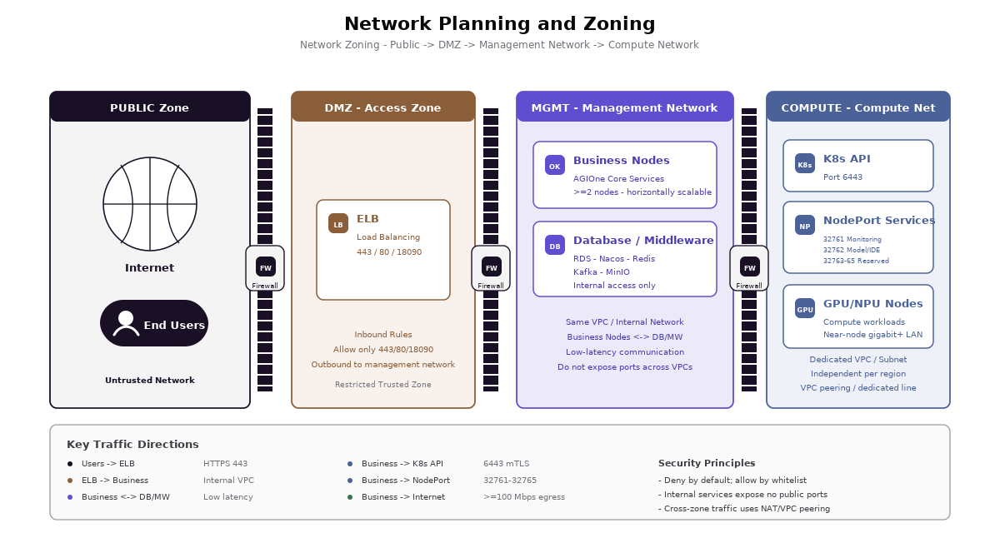
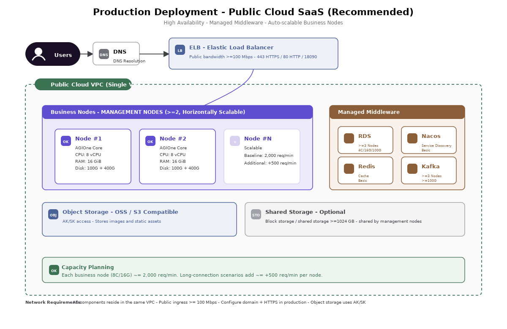
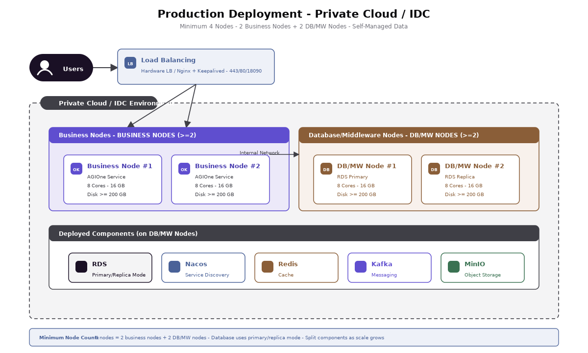
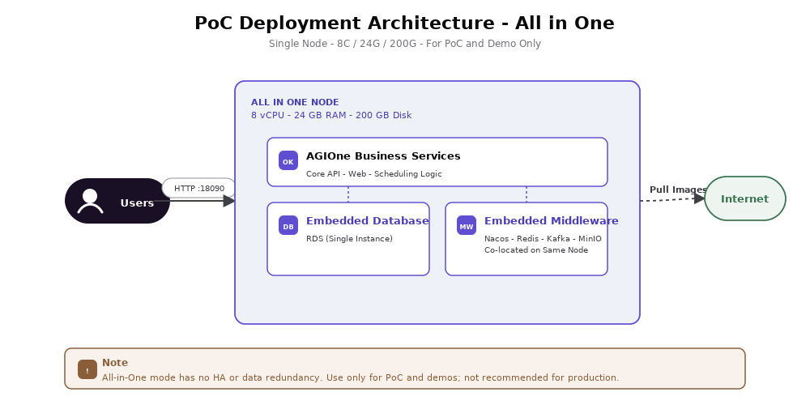
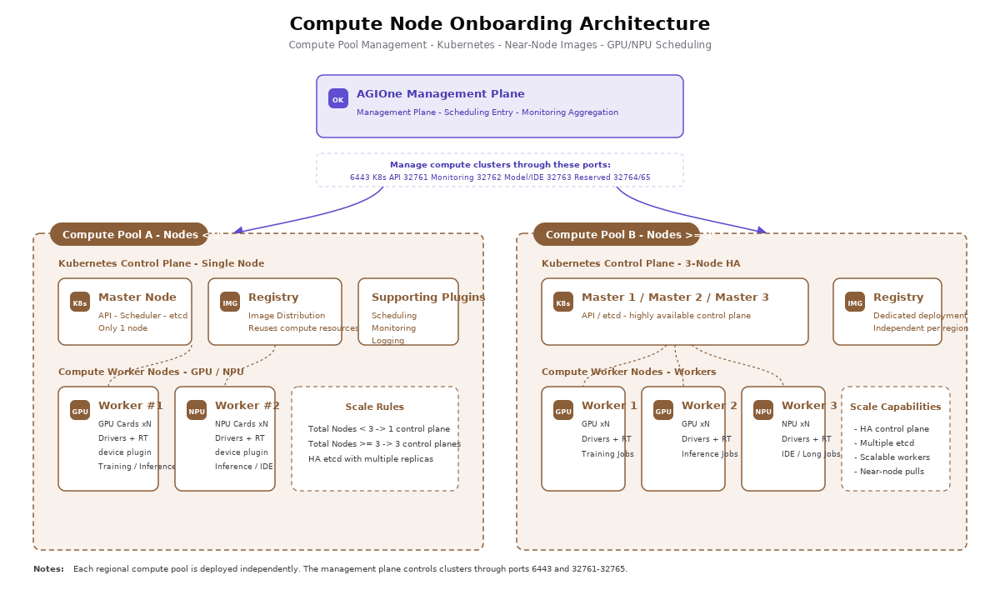

# Deployment Network Planning Guide

:::: info Document Information
Version: v1.0
Updated: 2026-07-13
Port baseline: Current installation guide
::::

## 1. Document Purpose

This document provides guidance for network planning, network zoning, access paths, security group / firewall allow policies, and port checklist confirmation for the AGIOne platform in PoC, public cloud SaaS, private cloud / IDC, and similar deployment scenarios.

AGIOne is logically divided into two relatively independent network domains:

- Platform management domain: hosts the AGIOne control plane, application services, databases, middleware, object storage, and external access ingress.
- Compute node domain: hosts GPU / NPU compute nodes, Kubernetes clusters, monitoring interfaces, model / IDE access capabilities, and near-edge image services.

The two network domains must be connected through an internal network, VPC peering, dedicated line, or equivalent connectivity method. The platform management side manages and accesses compute clusters through the Kubernetes API and extended NodePort ports.

## 2. Deployment Modes and Network Principles

| Deployment Mode | Applicable Scenarios | External Ingress | Internal Network Requirements | Internet Requirements |
| --- | --- | --- | --- | --- |
| PoC All in One | Proof of concept, feature demo, internal testing | HTTP `18090` | Primarily local access on a single node | Internet access, or a complete offline bundle with required images and runtime assets |
| Public Cloud SaaS Production | Formal production and external service delivery | ELB + domain name + HTTPS `443` | Management nodes and middleware are in the same VPC; compute pools are connected through VPC peering / dedicated lines | Outbound access is recommended, with bandwidth >= 100 Mbps |
| Private Cloud / IDC Production | Data compliance, internal network isolation, customer-owned environments | LB / DNS round-robin + HTTPS `443` | Application nodes and data / middleware nodes communicate over the internal network; compute pools are connected through the internal network / dedicated lines | Controlled outbound access is recommended; offline environments must prepare offline images |

The following principles are recommended for production environments:

- Consolidate user ingress through ELB / LB, and do not directly expose application nodes.
- Use domain names and HTTPS for production access. Port `80` is used only for HTTP-to-HTTPS redirection.
- Databases and middleware are exposed only inside the VPC / internal network, and are not exposed to the public internet.
- Security groups / firewalls deny by default, and allow only necessary sources according to the port checklist.
- Plan compute clusters as independent regional compute pools to avoid network jitter caused by cross-region scheduling.
- Deploy a near-edge image service in each regional compute pool to reduce cross-region pulls of large images.

## 3. Logical Network Zones

| Network Zone | Main Components | Access Characteristics | Planning Recommendations |
| --- | --- | --- | --- |
| Public access zone | Users, domain names, ELB / LB | Users access the AGIOne platform through the public internet | Open `443` in production; `80` may be opened for redirection |
| Platform application zone | AGIOne application nodes | Receives traffic forwarded by ELB / LB, and accesses databases, middleware, object storage, and compute clusters | Keep in the same VPC or internal network as data / middleware; >= 2 nodes recommended |
| Data and middleware zone | RDS / MySQL, Nacos, Redis, Kafka, MinIO | Accessible only by platform application nodes over the internal network | Do not expose to the public internet; split into independent nodes based on production scale |
| Object storage zone | Cloud OSS / S3 / MinIO | Stores images, static assets, and similar files | Public cloud deployments may use AK/SK access; VPC Endpoint is preferred |
| Compute control zone | Kubernetes API Server, control-plane nodes | The platform management layer calls the Kubernetes API | Open `6443` to the platform management layer |
| Compute service zone | Monitoring, model services, IDE, extended NodePort | The platform management layer calls compute-side capabilities | Open `32761-32765` to the platform management layer |
| Image service zone | Near-edge image registry | Compute nodes pull images | Recommended to be in the same Layer 2 or low-latency network as compute nodes, with bandwidth >= 1 Gbps |

## 4. Recommended Network Topology

### 4.1 Overall Logical Architecture

AGIOne consists of a user access ingress, platform management layer, and compute node onboarding layer. The platform management layer schedules and accesses compute clusters through Kubernetes API `6443` and extended ports `32761-32765`.

### 4.2 Public Cloud SaaS Production Topology

### 4.3 Private Cloud / IDC Production Topology

### 4.4 PoC All in One Topology

The PoC node must either reach the required registries and dependency sources or use a complete offline bundle. PoC mode does not provide high availability or data redundancy, and is not recommended for production use.

### 4.5 Compute Node Onboarding Architecture

Each independent regional compute pool is deployed as an independent logical unit. The compute node side must complete GPU / NPU driver, container runtime, and device plugin validation in advance, and deploy a near-edge image service to improve image pull speed.

## 5. Resource Configuration Requirements

### 5.1 PoC All in One Resource Requirements

| Item | Minimum Requirement | Description |
| --- | --- | --- |
| Node count | 1 | A single node hosts application services, databases, and middleware |
| CPU | >= 8 cores | Used for proof of concept, feature demo, and internal testing |
| Memory | >= 24 GB | Services are co-located on a single node, so memory must cover both application and middleware workloads |
| Disk | >= 200 GB | Used for applications, images, logs, and base data |
| Network | Internet or offline delivery path | Must be able to obtain all required images, dependencies, and runtime assets |
| Operating system | Linux | Ubuntu 22.04 / CentOS 7+ recommended |
| External port | `18090` | Default HTTP service port |

### 5.2 Public Cloud SaaS Production Resource Requirements

#### 5.2.1 Management Nodes

| Item | Requirement | Description |
| --- | --- | --- |
| Node count | >= 2 | Application nodes can be horizontally scaled |
| Per-node CPU | >= 8 vCPU | Baseline specification |
| Per-node memory | >= 16 GiB | Baseline specification |
| Per-node disk | >= 200 GiB | Applications, logs, and local cache |
| Internal network | All management nodes are in the same VPC | Low-latency connectivity with databases and middleware |
| Public network / outbound | Internet access, bandwidth >= 100 Mbps | Used for image pulls, upgrades, and dependency downloads |
| Shared storage | Optional, >= 1024 GB | Shared by management nodes |

#### 5.2.2 Databases and Middleware

| Component | Purpose | CPU | Memory | Disk | Node Count | Network Requirements |
| --- | --- | --- | --- | --- | --- | --- |
| RDS (relational database) | Stores AGIOne platform master data | >= 4 vCPU | >= 16 GiB | >= 100 GiB | >= 3 | Same VPC as management nodes |
| Nacos | Service registration and discovery | Basic spec | - | - | 1 | Same VPC as management nodes |
| Redis | Cache data | Basic spec | - | - | 1 | Same VPC as management nodes |
| Kafka | Core service message bus | Cluster node spec | - | >= 100 GiB | >= 3 | Same VPC as management nodes |
| Object storage | Stores images and other static assets | - | - | - | - | Access through AK/SK; VPC Endpoint preferred |
| ELB | AGIOne API load balancing | - | - | >= 100 GiB | 1 | Same VPC internally; public access available, bandwidth >= 100 Mbps |

#### 5.2.3 Capacity and Scaling Reference

| Item | Reference Value |
| --- | --- |
| Baseline capacity of a single application node | 8 vCPU / 16 GiB supports approximately `2000 requests/minute` |
| Scaling reference | When there are many long-lived connections or time-consuming requests, each additional application node adds approximately `500 requests/minute` |
| Evaluation factors | Request complexity, model inference duration, concurrent session count, and long-connection ratio |

### 5.3 Private Cloud / IDC Production Resource Requirements

#### 5.3.1 Required Resources

| Role | Node Count | Per-Node CPU | Per-Node Memory | Per-Node Disk | Network | Description |
| --- | --- | --- | --- | --- | --- | --- |
| Application node | >= 2 | >= 8 cores | >= 16 GB | >= 200 GB | Internal network; can access external networks, recommended bandwidth >= 100 Mbps | Deploys AGIOne application services |
| Database / middleware node | >= 2 | >= 8 cores | >= 16 GB | >= 200 GB | Internal network | Deploys MySQL / RDS-equivalent components, Nacos, Redis, Kafka, and MinIO |
| Total | >= 4 | - | - | - | - | Minimum scale for production private deployment |

#### 5.3.2 Optional Resources

| Resource | Required / Optional | Recommended Configuration | Purpose |
| --- | --- | --- | --- |
| Load balancer LB | Optional, recommended for production | Hardware LB (such as F5) or software LB (Nginx / HAProxy + Keepalived) | Unified ingress, traffic distribution, and health checks. If not deployed, DNS round-robin can be used to directly connect to application nodes |
| NAS shared storage | Optional | Capacity >= 1024 GB; mounted to all nodes through NFS / CIFS | Stores public logs, service configurations, shared files / temporary data, and other cross-node access content |
| Log collection service | Optional | Filebeat / Fluent Bit, etc. | Used to aggregate local logs when NAS is not deployed |
| Outbound proxy / offline repository | Depends on the environment | NAT / proxy / offline image repository | Software package and image source for controlled outbound or fully offline environments |

### 5.4 Compute Node Onboarding Resource Requirements

| Item | Requirement | Description |
| --- | --- | --- |
| Regional compute pool | Independently deployed for each region | Avoid network jitter caused by cross-region scheduling |
| Kubernetes control plane | 1 node is acceptable when the compute pool has < 3 nodes; 3 nodes are recommended when it has >= 3 nodes | 3 control-plane nodes provide etcd multi-replica storage and high availability |
| Compute nodes | Planned according to GPU / NPU resource pools | Drivers, container runtimes such as containerd, and device plugins must be installed and validated in advance |
| Near-edge image service | Recommended for each regional compute pool | Can reuse already onboarded node resources; low-latency connectivity with compute nodes is recommended |
| Image network | >= 1 Gbps recommended | Improves pull speed for large model images |
| Ports opened to the platform | `6443`, `32761-32765` | Used by the platform management layer for scheduling, monitoring, and model / IDE calls |

### 5.5 Resource Specification Quick Reference

| Deployment Mode | Minimum Nodes | Minimum Per-Node Specification | Total Resource Reference |
| --- | --- | --- | --- |
| PoC All in One | 1 | 8C / 24G / 200G | 8C / 24G / 200G |
| Public Cloud SaaS (application nodes) | 2 | 8C / 16G / 200G | 16C / 32G / 400G+, plus managed databases and middleware |
| Private Cloud / IDC | 4 | 8C / 16G / 200G | 32C / 64G / 800G+ |

## 6. VPC / Subnet Planning

### 6.1 Recommended Public Cloud Planning

| Item | Planning Item | Example / Input |
| --- | --- | --- |
| Platform management VPC | VPC name | `vpc-agione-mgmt-prod` |
| Platform management VPC | CIDR | `10.10.0.0/16` |
| Application node subnet | CIDR | `10.10.10.0/24` |
| Data and middleware subnet | CIDR | `10.10.20.0/24` |
| LB subnet | CIDR | `10.10.30.0/24` |
| Compute pool VPC | VPC name | `vpc-agione-compute-region-a` |
| Compute pool VPC | CIDR | `10.20.0.0/16` |
| Compute control-plane subnet | CIDR | `10.20.10.0/24` |
| Compute node subnet | CIDR | `10.20.20.0/22` |
| Near-edge image subnet | CIDR | `10.20.30.0/24` |
| Management VPC and compute VPC | Connectivity method | VPC peering / cloud enterprise network / dedicated line |

### 6.2 Recommended Private Cloud / IDC Planning

| Item | Planning Item | Example / Input |
| --- | --- | --- |
| Platform management network segment | CIDR | `172.16.10.0/24` |
| Data and middleware network segment | CIDR | `172.16.20.0/24` |
| LB / ingress network segment | CIDR | `172.16.30.0/24` |
| Compute control-plane network segment | CIDR | `172.16.40.0/24` |
| Compute node network segment | CIDR | `172.16.50.0/22` |
| Near-edge image network segment | CIDR | `172.16.60.0/24` |
| Cross-segment routing | Connectivity method | Static routing / dynamic routing / dedicated line |
| Outbound internet | Access method | NAT / proxy / offline images |

> Actual CIDR ranges should be planned together with the customer's existing network to avoid conflicts with office networks, production networks, cloud VPCs, container Pod CIDR, and Service CIDR.

## 7. IP Address Planning Template

### 7.1 Platform Management Nodes

| Role | Hostname | IP Address | Subnet | Specification | Notes |
| --- | --- | --- | --- | --- | --- |
| Application node 1 |  |  |  | >= 8C / 16G / 200G | Required for production |
| Application node 2 |  |  |  | >= 8C / 16G / 200G | Required for production |
| Data / middleware node 1 |  |  |  | >= 8C / 16G / 200G | Required for private cloud / IDC |
| Data / middleware node 2 |  |  |  | >= 8C / 16G / 200G | Required for private cloud / IDC |
| LB / ELB |  |  |  | Cloud service or equivalent LB | Recommended for production |
| NAS / shared storage |  |  |  | >= 1024 GB | Optional |

### 7.2 Compute Cluster Nodes

| Role | Hostname | IP Address | Subnet | Specification | Notes |
| --- | --- | --- | --- | --- | --- |
| K8s control plane 1 |  |  |  |  | A compute pool with < 3 nodes can use a single control plane |
| K8s control plane 2 |  |  |  |  | A compute pool with >= 3 nodes is recommended to use 3 control-plane nodes |
| K8s control plane 3 |  |  |  |  | A compute pool with >= 3 nodes is recommended to use 3 control-plane nodes |
| Compute node 1 |  |  |  | GPU / NPU | Driver and device plugin validation must be completed |
| Compute node 2 |  |  |  | GPU / NPU | Driver and device plugin validation must be completed |
| Near-edge image service |  |  |  |  | Recommended to have low-latency connectivity with compute nodes |

## 8. Network Access Matrix

| Access Direction | Source | Destination | Protocol / Port | Network Requirement | Description |
| --- | --- | --- | --- | --- | --- |
| User access to platform | Public users / internal users | ELB / LB | TCP `443` | Reachable from the public internet or user intranet | Production HTTPS ingress |
| HTTP redirection | Public users / internal users | ELB / LB | TCP `80` | Optional | Usually used for 301 redirection to `443` |
| PoC access | Users | PoC node | TCP `18090` | Users can reach the PoC node | Default HTTP service port for PoC |
| Ingress forwarding | ELB / LB | Application nodes | TCP / HTTP(S) | Same VPC / internal network | Allow only LB-to-application-node traffic |
| Application access to database | Application nodes | RDS / MySQL | TCP `3306` | Same VPC / low-latency internal network | Do not expose to the public internet |
| Application access to Nacos | Application nodes | Nacos | TCP `8848`, `9848`, `9849` | Same VPC / internal network | Ports depend on the actual deployment configuration |
| Application access to Redis | Application nodes | Redis | TCP `6379` | Same VPC / internal network | Do not expose to the public internet |
| Application access to Kafka | Application nodes | Kafka | TCP `9092` | Same VPC / internal network | Do not expose to the public internet |
| Application access to object storage | Application nodes | OSS / S3 / MinIO | HTTPS or TCP `9000`, `9001` | VPC Endpoint / internal network preferred | Public cloud uses AK/SK authentication |
| Platform management of compute cluster | Application nodes / platform management layer | Kubernetes API Server | TCP `6443` | Management domain can reach compute domain | Scheduling and cluster management |
| Platform monitoring collection | Application nodes / platform management layer | Compute cluster NodePort | TCP `32761` | Management domain can reach compute domain | Monitoring interface |
| Platform access to model / IDE | Application nodes / platform management layer | Compute cluster NodePort | TCP `32762` | Management domain can reach compute domain | Model and IDE calls |
| Extension reserve | Application nodes / platform management layer | Compute cluster NodePort | TCP `32763-32765` | Management domain can reach compute domain | Reserved extension ports |
| Compute image pulls | Compute nodes | Near-edge image service | Depends on image service configuration | Near-edge network for the compute pool, recommended >= 1 Gbps | Avoid cross-region pulls of large images |
| Management node outbound | Management nodes | Internet / image registry | HTTPS / as needed | Required when online assets are used; optional with a complete offline bundle | Used for image pulls, upgrades, and dependency downloads |

## 9. Port Allowlist

### 9.1 Platform Management Ingress Ports

| Port | Protocol | Source | Destination | Purpose | Publicly Exposed |
| --- | --- | --- | --- | --- | --- |
| `18090` | TCP / HTTP | Users / internal | PoC node or application node | Default HTTP service port, used by default in PoC | Open as needed for PoC |
| `80` | TCP / HTTP | Public users / internal users | ELB / LB | Production HTTP, usually redirects to HTTPS | Optional |
| `443` | TCP / HTTPS | Public users / internal users | ELB / LB | Production HTTPS ingress | Yes |

### 9.2 Ports Opened from Compute Clusters to the Platform Management Layer

| Port | Protocol | Source | Destination | Purpose |
| --- | --- | --- | --- | --- |
| `6443` | TCP | Platform management layer | Kubernetes API Server | Kubernetes API |
| `32761` | TCP | Platform management layer | Compute cluster NodePort | Monitoring interface |
| `32762` | TCP | Platform management layer | Compute cluster NodePort | Model and IDE calls |
| `32763` | TCP | Platform management layer | Compute cluster NodePort | Reserved extension port |
| `32764` | TCP | Platform management layer | Compute cluster NodePort | Reserved extension port |
| `32765` | TCP | Platform management layer | Compute cluster NodePort | Reserved extension port |

### 9.3 Internal Middleware Reference Ports

| Component | Default Port | Source | Exposure Scope | Description |
| --- | --- | --- | --- | --- |
| RDS / MySQL | `3306` | Application nodes | VPC / internal network | Stores AGIOne platform master data |
| Nacos | `8848`, `9848`, `9849` | Application nodes | VPC / internal network | Service registration and discovery |
| Redis | `6379` | Application nodes | VPC / internal network | Cache data |
| Kafka | `9092` | Application nodes | VPC / internal network | Core service message bus |
| MinIO | `9000`, `9001` | Application nodes | VPC / internal network | Private deployment object storage |

Actual ports depend on the version and configuration used during deployment.

## 10. Security Group / Firewall Policies

### 10.1 Public Ingress Security Group

| Rule | Direction | Source | Destination Port | Action | Description |
| --- | --- | --- | --- | --- | --- |
| Allow HTTPS | Inbound | `0.0.0.0/0` or specified user network segment | `443` | Allow | Main production ingress |
| Allow HTTP redirection | Inbound | `0.0.0.0/0` or specified user network segment | `80` | Allow | Optional, redirection only |
| Restrict PoC HTTP | Inbound | Specified office network / test network segment | `18090` | Allow | Used in PoC scenarios |
| Deny by default | Inbound | Any | Any | Deny | Do not open other ports |

### 10.2 Platform Application Security Group

| Rule | Direction | Source | Destination Port | Action | Description |
| --- | --- | --- | --- | --- | --- |
| LB to application nodes | Inbound | ELB / LB security group | Application service port | Allow | Allow only ingress-layer forwarding |
| Application to middleware | Outbound | Application nodes | `3306`, `6379`, `8848`, `9848`, `9849`, `9092`, `9000`, `9001` | Allow | Access internal data and middleware |
| Application to compute cluster | Outbound | Application nodes | `6443`, `32761-32765` | Allow | Manage and access compute clusters |
| Application to internet | Outbound | Application nodes | `443` and others as needed | Allow | Image pulls, upgrades, and dependency downloads |

### 10.3 Data and Middleware Security Group

| Rule | Direction | Source | Destination Port | Action | Description |
| --- | --- | --- | --- | --- | --- |
| Application access to RDS / MySQL | Inbound | Application node security group / application subnet | `3306` | Allow | Public internet access is prohibited |
| Application access to Redis | Inbound | Application node security group / application subnet | `6379` | Allow | Public internet access is prohibited |
| Application access to Nacos | Inbound | Application node security group / application subnet | `8848`, `9848`, `9849` | Allow | Public internet access is prohibited |
| Application access to Kafka | Inbound | Application node security group / application subnet | `9092` | Allow | Public internet access is prohibited |
| Application access to MinIO | Inbound | Application node security group / application subnet | `9000`, `9001` | Allow | Private deployment scenario |
| Deny by default | Inbound | Any | Any | Deny | Data components must not be exposed to the public internet |

### 10.4 Compute Cluster Security Group

| Rule | Direction | Source | Destination Port | Action | Description |
| --- | --- | --- | --- | --- | --- |
| Platform management to K8s API | Inbound | Platform application subnet / application node security group | `6443` | Allow | Kubernetes API Server |
| Platform management to monitoring interface | Inbound | Platform application subnet / application node security group | `32761` | Allow | Monitoring interface |
| Platform management to model / IDE | Inbound | Platform application subnet / application node security group | `32762` | Allow | Model and IDE calls |
| Platform management to extension ports | Inbound | Platform application subnet / application node security group | `32763-32765` | Allow | Reserved extensions |
| Compute nodes to near-edge image service | Outbound | Compute nodes | Image service port | Allow | Image pulls |
| Deny by default | Inbound | Any | Any | Deny | Direct public access to compute nodes is not allowed |

## 11. Domain Name and Certificate Planning

| Item | Planning Content | Example / Input |
| --- | --- | --- |
| Platform access domain name | AGIOne console access ingress | `agione.example.com` |
| DNS resolution | Domain name resolution target | ELB / LB public address or internal address |
| HTTPS certificate | Certificate source | Public CA / enterprise CA |
| HTTP access policy | Port `80` handling method | 301 redirection to `443` |
| Certificate renewal mechanism | Owner / method | Manual update / automatic renewal |

In production, HTTPS certificates must be configured on ELB / LB or the ingress proxy to prevent users from accessing the platform directly through HTTP.

## 12. Bandwidth and Latency Recommendations

| Network Path | Recommendation |
| --- | --- |
| Users to ELB / LB | Plan public bandwidth based on concurrent user volume; production is recommended to start at >= 100 Mbps |
| ELB / LB to application nodes | Forward within the same VPC / internal network and maintain low latency |
| Application nodes to database / middleware | Same VPC / same internal network, with low-latency and stable connections |
| Platform management layer to compute cluster | Use VPC peering, cloud enterprise network, dedicated line, or equivalent internal links to avoid public-network detours |
| Compute nodes to near-edge image service | >= 1 Gbps network recommended; in multi-region deployments, maintain an independent near-edge image service in each region |
| Management node outbound internet | Provide controlled outbound access for online delivery; otherwise prepare and verify the complete offline bundle |

## 13. Pre-deployment Network Checklist

### 13.1 Basic Network

- [ ] Deployment mode has been confirmed: PoC / public cloud SaaS / private cloud IDC.
- [ ] VPC / subnet / network segment planning has been completed, with no conflicts with existing networks.
- [ ] Platform management nodes are in the same VPC or same reachable internal network zone.
- [ ] Databases, middleware, and object storage are exposed only on the internal network.
- [ ] Management nodes can access the internet, or offline images and offline dependencies have been prepared.
- [ ] NTP / clock synchronization is available, and node time zones are consistent.

### 13.2 Ingress and Domain Name

- [ ] Production access domain name has been requested and resolved.
- [ ] HTTPS certificate has been prepared.
- [ ] ELB / LB listener for `443` has been planned.
- [ ] If `80` is opened, redirection to `443` has been configured.
- [ ] In PoC scenarios, access sources for `18090` have been restricted.

### 13.3 Security Groups / Firewalls

- [ ] Only necessary ingress ports are opened on the public network.
- [ ] Application nodes allow access only from ELB / LB or specified sources.
- [ ] Database and middleware ports are not open to the public internet.
- [ ] `6443` and `32761-32765` have been allowed from the platform management layer to compute clusters.
- [ ] Security groups / firewalls deny undeclared ports by default.

### 13.4 Compute Clusters

- [ ] Network planning has been performed independently by regional compute pool.
- [ ] The Kubernetes control-plane scale for each compute pool has been confirmed: 1 node or 3 nodes.
- [ ] GPU / NPU drivers, container runtimes, and device plugins on compute nodes have been validated.
- [ ] Near-edge image services have been planned and have low-latency connectivity with compute nodes.
- [ ] Multi-region scenarios avoid cross-region pulls of large images.

## 14. Items to Confirm

| No. | Item to Confirm | Current Status | Owner | Notes |
| --- | --- | --- | --- | --- |
| 1 | Final deployment mode | To be confirmed |  | PoC / public cloud SaaS / private cloud IDC |
| 2 | Production access domain name | To be confirmed |  |  |
| 3 | HTTPS certificate source | To be confirmed |  |  |
| 4 | VPC / subnet CIDR | To be confirmed |  | Must avoid conflicts with the existing network |
| 5 | Connectivity method from platform management to compute cluster | To be confirmed |  | VPC peering / dedicated line / internal routing |
| 6 | Whether management nodes are allowed outbound internet access | To be confirmed |  | If not allowed, offline images must be prepared |
| 7 | Deployment location of the near-edge image service | To be confirmed |  | Independent deployment is recommended for each regional compute pool |
| 8 | Security group / firewall approval process | To be confirmed |  |  |

## 15. Appendix: Port Quick Reference

| Category | Port | Purpose |
| --- | --- | --- |
| Platform ingress | `18090` | Default HTTP service port for PoC |
| Platform ingress | `80` | Production HTTP, usually redirects to HTTPS |
| Platform ingress | `443` | Production HTTPS |
| Compute cluster | `6443` | Kubernetes API Server |
| Compute cluster | `32761` | Monitoring interface |
| Compute cluster | `32762` | Model and IDE calls |
| Compute cluster | `32763-32765` | Reserved extension ports |
| Database | `3306` | RDS / MySQL |
| Registry center | `8848`, `9848`, `9849` | Nacos |
| Cache | `6379` | Redis |
| Message queue | `9092` | Kafka |
| Object storage | `9000`, `9001` | MinIO |
