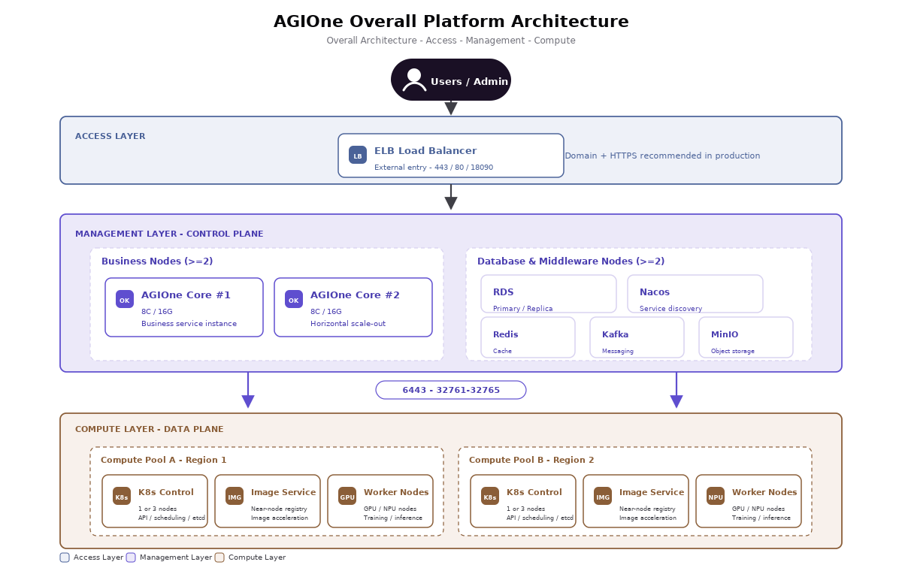

# Overview

:::: info Document Information
Version: v1.0
Updated: 2026-07-13
Functional baseline: User Manual updated on 2026-07-10
::::

## Product Positioning

AGIOne is an enterprise AI compute platform organized around unified compute management, multi-source model management, financial operations, settings, and enterprise governance. It connects compute preparation, model deployment and publishing, model experience and calling, billing, access control, and usage operations.

The platform consists of five product modules: AI Infra On-Prem, AI Infra On-Cloud, Model Services, Billing, and Settings. On-Prem manages local clusters and compute resources; On-Cloud manages accounts, authorization, and deployment resources for supported cloud platforms; Model Services manages model publishing, review, experience, calling, and revenue; Billing manages user billing, customer finance, settlement, reconciliation, revenue, and License status; Settings manages accounts, members, roles, organizations, audit logs, login policies, platform settings, and API rate control. Availability depends on the deployed version, account role, authorization scope, commercial configuration, and prepared resources.

## Product Value

### 1. Plug-and-Play Compute

The platform can manage configured and validated cloud resources together with listed local accelerators from NVIDIA, Huawei Ascend, Enflame, Biren, Hygon, and others. Huawei Ascend accelerator onboarding is an On-Prem compatibility topic and does not imply Huawei Cloud support; Huawei Cloud access is currently temporarily unsupported. Each deployment must still validate the accelerator, driver, runtime, image, inference engine, and model combination.

### 2. Multi-source Model Aggregation

The platform supports publishing single models, BYOK endpoints, and aggregate models. Model providers can create aggregate models from eligible member models and select routing strategies available in the deployed version; end users discover, experience, and call authorized models. Exact API fields, protocols, and model capabilities depend on the target model and product version.

### 3. Enterprise-grade Governance and Control

The platform uses tenants, roles, resource authorization, billing scope, and settings permissions to separate the responsibilities of administrators, operators, model providers, finance operators, security administrators, and end users. Quotas, credits, reviews, call records, financial records, operation logs, and API rate-control rules provide governance entry points; visible menus and data depend on account permission and environment configuration.

### 4. End-to-End Observability

AGIOne provides pages for clusters, nodes, devices, jobs, deployment status, call logs, call analytics, usage, metering, billing records, reconciliation tasks, License status, operation logs, and API rate-control observability. These pages support result validation and troubleshooting; metrics, financial scope, audit scope, and synchronization timing vary by module, role, and product version.

## Target Customers and Representative Scenarios

::: warning Scenario Scope
The table describes target customer needs; it does not mean that every listed solution is delivered as a built-in AGIOne function. RAG and Function Calling are currently planned. Projects involving knowledge bases, retrieval, or tool calling require product-scope confirmation and solution assessment.
:::

| Customer Category | Customer Type | Core Requirements | Representative Scenarios |
| --- | --- | --- | --- |
| Industry                         | Government and Enterprise | Data localization, private deployment, compliance auditing, historical archive governance | Intelligent Q&A for government knowledge bases, policy and regulation retrieval, intelligent review of service application materials, historical archive organization, root-cause analysis for hotline tickets |
| Industry                         | Financial Services | High availability, quota management, traceable operations, sensitive data protection | Intelligent customer service, investment research material analysis, risk assessment assistance, contract and due-diligence document review, analysis of historical transactions and customer service records |
| Industry                         | Manufacturing | Production-line integration, heterogeneous compute scheduling, knowledge retention, production data governance | Industrial quality inspection, predictive equipment maintenance, process knowledge bases, production report analysis, fault-record root-cause analysis, after-sales maintenance knowledge retention |
| Industry                         | Energy and Transportation | Multi-source historical data integration, operational safety, scheduling decision support | Inspection record analysis, equipment O&M knowledge bases, scheduling plan generation, safety incident review, historical operational data summarization |
| Industry                         | Healthcare | Privacy protection, professional knowledge retention, compliant clinical decision support | Medical literature retrieval, assisted analysis of medical records, internal policy Q&A, research material summarization, quality-control document processing |
| Industry                         | Education and Research | Teaching resource retention, research material management, content compliance | Teaching resource knowledge bases, paper and project material retrieval, experiment record summarization, student service Q&A |
| Enterprise                       | Group Enterprise | Cross-department knowledge sharing, permission isolation, unified model governance | Enterprise policy Q&A, business analysis assistants, project material archiving, unified internal and external knowledge retrieval, automated organization of meeting minutes and reports |
| Enterprise                       | Professional Services | Document-intensive processing, knowledge reuse, improved delivery efficiency | Legal contract review, consulting project material analysis, audit working paper organization, bid document generation, case knowledge-base development |
| Enterprise                       | Retail and Services | Customer operations data retention, improved service quality, unified store knowledge | Customer service record analysis, member operations insights, product knowledge bases, store training Q&A, complaint root-cause summarization |
| Security-Sensitive ORG           | Data-Security-Sensitive | Private deployment, data residency within the security domain, audit traceability | Confidential knowledge-base Q&A, intelligent local document processing, unified management of intranet model services, sensitive data access auditing |
| Security-Sensitive ORG | Strict Regulatory Requirements | Compliance records, tiered permissions, controlled model invocation | Model invocation auditing, compliance document checks, assisted generation of regulatory reporting materials, internal risk investigation |

**Representative scenario examples:**

- **Enterprise knowledge-base Q&A requirement**: RAG is currently planned. Survey knowledge sources, permissions, chunking, retrieval, and evaluation requirements without treating it as a current built-in delivery capability.
- **Unified multi-model access and routing**: A model provider publishes single or aggregate models and selects a routing strategy available in the current version.
- **AI application monitoring and operational governance**: Use monitoring, call logs, analytics, quotas, metering, billing, operation logs, and API rate-control pages for runtime checks.
- **Model deployment and publishing**: Follow the On-Prem, On-Cloud, or Model Services manual for resource preparation, deployment, publication, and review.

## Delivery Value

- **Reduces AI platform delivery complexity**: A consistent documentation path connects compute, deployment, publishing, calling, and operations tasks.
- **Supports staged validation from PoC to production**: Survey templates, installation prechecks, operation scenarios, and user manuals help teams confirm prerequisites and acceptance results.
- **Unifies model management and operations entry points**: Teams can review model configuration, reviews, deployment status, call records, usage, revenue, billing status, License status, and audit records from documented pages.
- **Manages resource use within permission boundaries**: Tenants, roles, authorization, quotas, metering, billing scope, and settings permissions define account visibility and usage boundaries.

Current product status requiring special confirmation: **Huawei Cloud access is temporarily unsupported; RAG and Function Calling are planned**. Review the [Support Matrix](../limitations/support-matrix) and [Other Limitations](../limitations/limitations) for project constraints. Start operations from the [Scenario Guide](../../userguide/scenarios) and use the [User Manual](../../usermanual/) for detailed steps.
