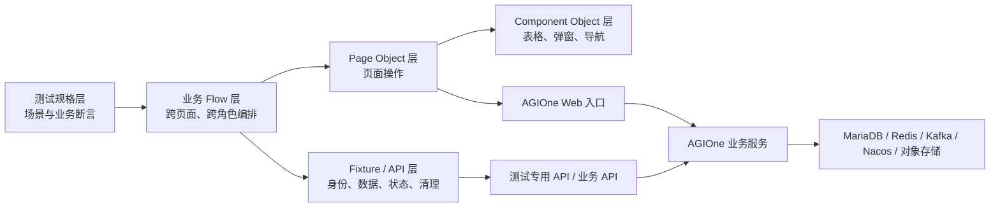
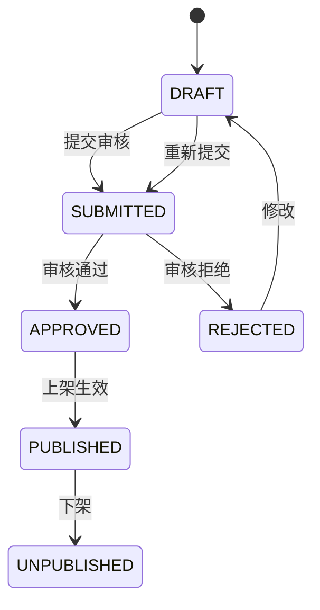

# AGIOne Page Object Model 自动化测试方案

:::: info 文档信息
版本：v1.0
日期：2026-07-20
状态：待项目评审
适用对象：产品、研发、测试、DevOps、安全与运维团队
::::

## 1. 结论摘要

本方案中的 PO 指 **Page Object Model（页面对象模型）**，不是 Product Owner、Purchase Order 或 Provider–Operator。

推荐 AGIOne 采用 **Playwright Test + TypeScript 的分层 PO 自动化架构**：Page Object 和 Component Object 封装页面能力，Flow 层编排跨页面、跨角色业务，Fixture 与 API 层负责身份隔离、测试数据准备、状态查询和数据清理。

不推荐将所有业务步骤都放进 Page Object。AGIOne 同时存在 `admin`、`operator`、`provider`、`enduser` 多种角色，以及发布、审核、调用、用量、收益和结算等长流程。单一 PO 层只能解决定位器复用，不能解决跨角色会话、异步状态、数据污染和并行执行问题。

## 2. 依据与结论标记

本文使用以下标记：

- **事实**：现有项目资料或官方文档能够确认。
- **设计决策**：结合项目事实提出的目标方案。
- **待核验**：当前工作区没有足够资料，实施前需要验证。
- **估算**：按明确前提给出的投入或周期预测，不是项目承诺。

主要依据：

| 依据 | 可确认内容 |
| --- | --- |
| [Playwright Page Object Models](https://playwright.dev/docs/pom) | Page Object 表示 Web 应用的页面或页面区域，通过高层 API、集中定位器和复用代码降低编写与维护成本。 |
| [Playwright Best Practices](https://playwright.dev/docs/best-practices) | 测试应相互隔离；定位器优先使用用户可见属性与明确契约；推荐 TypeScript、Lint 和类型检查。 |
| [产品技术概述](../../zh-CN/product/technical/overview.md) | AGIOne 包含 On-Prem、On-Cloud、Model Services、财务和设置五个产品模块。 |
| [用户、组织与角色设计逻辑](../../zh-CN/product/identity-access-model.md) | 访问范围由组织、用户、成员、项目、角色和授权范围共同决定。 |
| [角色对比总览](../../zh-CN/product/role-comparison.md) | 平台存在 `admin`、`operator`、`provider`、`enduser` 四类主要角色及明确职责边界。 |
| [从发布到调用模型](../../zh-CN/usermanual/model-services/end-to-end/publish-and-call-model/index.md) | 已记录运营准备、提供方发布、运营审核、用户调用、用量与收益查看的端到端流程及 401、429、5xx 排查方向。 |
| [AGIOne 部署需求](../../zh-CN/installation/agione-deployment-requirements.md) | 平台管理侧包含应用入口、MariaDB/RDS、Redis、Nacos、Kafka、对象存储，并与 Kubernetes 算力集群交互。 |

当前工作区未发现正式 E2E 测试工程、`playwright.config`、Page Object、回归用例或应用源码。根目录的 `@playwright/mcp` 依赖和一次性 Playwright 脚本不能作为正式测试框架基线。

## 3. PO 模式定义与边界

### 3.1 定义

Page Object Model 是一种测试代码组织模式。每个 Page Object 表示一个页面或稳定页面区域，将元素定位和页面级交互封装为面向业务的接口；测试用例通过这些接口表达用户场景和预期结果。

示例：测试用例调用 `modelStudio.submitForReview()`，而不是在测试中重复填写选择器、点击按钮和等待提示。

### 3.2 PO 应负责的内容

- 当前页面或页面区域的稳定定位器。
- 页面导航和页面就绪判断。
- 页面内部的输入、选择、提交、筛选和状态读取。
- 页面级错误、提示和结果摘要读取。
- 少量页面不变量检查，例如页面标题、关键区域是否出现。

### 3.3 PO 不应负责的内容

- 跨页面和跨角色业务编排。
- 创建组织、账号、项目、模型和账务前置数据。
- 直接操作数据库、中间件或 Kubernetes。
- CI、报告、重试和环境配置。
- 账号、密码、API Key 和其他密钥管理。
- 复杂业务断言和多个业务结果的组合判定。

业务断言保留在测试规格层；跨页面操作进入 Flow 层；数据创建与清理进入 Fixture/API 层。该边界避免出现依赖过多、难以复用的“巨型页面类”。

## 4. 目标与适用范围

### 4.1 目标

1. 建立可维护、可复用、可独立执行的 Web 自动化测试基线。
2. 覆盖 AGIOne 多角色权限和关键端到端业务闭环。
3. 支持测试数据隔离、并行执行、失败诊断和自动清理。
4. 为 PR 冒烟、每日回归和版本发布门禁提供可观察结果。
5. 降低页面结构变化、角色切换和异步任务对测试稳定性的影响。

### 4.2 首期覆盖范围

按优先级覆盖：

1. 登录、退出、会话过期和四角色菜单权限。
2. 组织、成员、项目、额度、角色和授权范围。
3. Operator 维护元模型、模型来源、模板和标签。
4. Provider 保存模型、提交审核、修改和重新提交。
5. Operator 通过或拒绝模型审核。
6. Enduser 查找、体验和调用已授权模型。
7. 调用日志、用量、收益和审计记录。
8. 财务对账与结算的只读核验。
9. On-Prem 和 On-Cloud 关键资源管理流程。

### 4.3 默认排除范围

- 生产环境写操作。
- 真实付款、退款、调账和资金确认。
- 真实云资源采购、大规模资源创建和集群销毁。
- 真实密钥展示、复制和跨环境传输。
- 依赖不可控第三方 Endpoint 的全量日常回归。
- 性能压测、渗透测试和灾备演练；这些使用独立工具和流程。

排除项需要进入自动化时，必须单独完成安全、费用、环境和回滚评审。

## 5. 前提假设及核验清单

方案估算基于以下假设：

- 存在与生产隔离且数据可清理的测试环境。
- 测试团队可以获得四种角色的最小权限账号。
- 首期覆盖约 25–40 个 P0/P1 场景，先验证 Chromium。
- 有 2 名熟悉 TypeScript 和 Playwright 的测试开发参与。
- 前端允许补充稳定的可访问属性或 `data-testid`。

实施前按下表核验，不以猜测替代：

| 待核验项 | 当前状态 | 核验动作 | 责任方 |
| --- | --- | --- | --- |
| Web 前端源码与正式仓库 | 当前工作区未提供 | 确认仓库、分支、构建命令和最近项目说明 | 研发负责人 |
| 前端框架和路由契约 | 未确认 | 读取应用依赖、路由和公共组件实现 | 前端负责人 |
| 测试环境地址与版本 | 未确认 | 记录 URL、构建号、部署日期和可用窗口 | DevOps |
| 四角色测试账号 | 未确认 | 建立账号—组织—项目—角色授权矩阵 | QA、管理员 |
| 数据准备与清理 API | 未确认 | 盘点业务 API、测试专用 API 和幂等删除能力 | 后端负责人 |
| 真实业务状态枚举 | 未确认 | 从 OpenAPI、后端枚举或数据库迁移中核验 | 后端负责人 |
| CI 平台与 Worker 环境 | 未确认 | 确认执行系统、容器权限、缓存和制品留存 | DevOps |
| 浏览器与语言范围 | 未确认 | 产品确认 Chromium/Firefox/WebKit、移动端和中英文要求 | 产品、QA |
| 高风险操作许可 | 未确认 | 建立允许、禁止、需审批操作清单 | 安全、业务负责人 |
| 报告和 Trace 留存 | 未确认 | 确认保存周期、脱敏规则和访问权限 | 安全、DevOps |

## 6. 业务流程与角色职责

### 6.1 首条自动化业务闭环

首期优先实现“模型发布到调用”闭环：

| 阶段 | 业务角色 | 自动化目标 |
| --- | --- | --- |
| 基础配置 | `operator` | 创建或选择元模型、来源、模板和标签 |
| 模型发布 | `provider` | 保存模型、配置计费和限流、提交审核 |
| 审核处理 | `operator` | 查看详情并执行通过或拒绝 |
| 市场展示 | `enduser` | 在授权范围内查找模型并核对详情 |
| 体验调用 | `enduser` | 使用隔离凭据发起调用并检查结果 |
| 数据核验 | 各授权角色 | 核对调用日志、用量、收益和审计记录 |
| 数据回收 | 测试服务账号 | 按运行批次清理测试对象 |

### 6.2 项目交付职责

| 团队角色 | 主要职责 |
| --- | --- |
| 产品/业务负责人 | 定义 P0 流程、状态语义、允许的测试操作和验收结果 |
| QA 负责人 | 测试策略、覆盖矩阵、发布门禁、失败归因和质量报告 |
| 自动化测试开发 | Page、Component、Flow、Fixture、API Client 和 CI 实现 |
| 前端开发 | 提供稳定的可访问属性或 `data-testid`，修复可测试性问题 |
| 后端开发 | 提供幂等数据准备、状态查询、清理能力和接口契约 |
| DevOps | 测试环境、CI Worker、浏览器镜像、报告与 Trace 制品 |
| 安全/运维 | 测试账号、最小权限、密钥、日志和数据留存策略 |

四种业务角色不得共用同一浏览器会话。每个角色使用独立账号或独立 Browser Context，确保 cookie、localStorage、sessionStorage 和权限范围相互隔离。

## 7. 三种实现路径

### 7.1 路径 A：纯 UI Page Object

所有前置数据、业务操作和清理都通过页面完成，每个页面建立一个 PO。

- **投入估算**：6–9 人周。
- **首期周期估算**：3–5 周。
- **最可能结果**：快速形成冒烟测试，但运行较慢，数据和跨角色流程不稳定。
- **最好结果**：在数据稳定且场景较少时快速交付可用回归集。
- **最坏结果**：前置页面或共享数据失败导致大量场景级联失败。
- **适用场景**：无法使用任何数据 API、首期只需要少量只读冒烟。
- **不适用场景**：多角色审批、异步任务、财务和云资源长流程。

### 7.2 路径 B：分层 PO + API Fixtures

Page/Component 负责 UI，Flow 负责编排，Fixture/API 负责身份、数据、状态和清理。

- **投入估算**：10–14 人周。
- **首期周期估算**：5–7 周。
- **最可能结果**：首期投入略高，但能稳定支持角色切换、并行执行和数据回收。
- **最好结果**：跨模块复用基础组件和 Flow，新增场景只需少量业务代码。
- **最坏结果**：缺少稳定 API 或幂等清理时，数据层退化为 UI 准备。
- **适用场景**：AGIOne 当前多角色、异步审核、调用、用量和财务场景。
- **不适用场景**：团队无法维护 TypeScript 测试代码，且不能提供测试数据接口。

### 7.3 路径 C：状态模型/DSL 测试平台

使用状态机、DSL 或场景模型生成测试，叠加 PO、数据服务和统一管理平台。

- **投入估算**：20–32 人周。
- **首期周期估算**：10–16 周。
- **最可能结果**：早期投入集中在 DSL、状态模型和生成器，业务覆盖推进较慢。
- **最好结果**：多个团队和数百条场景能够共享统一状态与场景模型。
- **最坏结果**：页面、接口和 DSL 三套抽象同时维护，测试平台本身成为负担。
- **适用场景**：已有成熟测试平台团队、稳定接口契约和数百条可复用场景。
- **不适用场景**：自动化基线尚未建立的首期项目。

### 7.4 量化决策

评分范围 1–5，5 为最优。

| 路径 | 交付速度 20% | 稳定性 25% | 维护性 25% | 扩展性 20% | 初期风险 10% | 加权分 |
| --- | ---: | ---: | ---: | ---: | ---: | ---: |
| A | 5 | 2 | 2 | 3 | 3 | 2.90 |
| B | 4 | 5 | 5 | 5 | 4 | **4.70** |
| C | 1 | 4 | 3 | 5 | 1 | 3.05 |

**唯一推荐路径 B。** AGIOne 的主要测试复杂度来自跨角色、跨页面、异步状态和数据边界；只有 Page Object 不足以处理这些问题。

如果实施阶段确认完全无法获得数据准备和清理 API，则短期退化为路径 A，但目录、接口和职责仍按路径 B 设计，待 API 条件具备后替换 Fixture 内部实现。

## 8. 自动化架构与模块划分



建议测试工程独立于根目录浏览器控制依赖：

```text
e2e/
├─ package.json
├─ playwright.config.ts
├─ tsconfig.json
├─ eslint.config.js
├─ tests/
│  ├─ smoke/
│  ├─ permissions/
│  ├─ model-services/
│  ├─ billing/
│  └─ infra/
├─ pages/
│  ├─ settings/
│  ├─ model-services/
│  ├─ billing/
│  └─ infra/
├─ components/
│  ├─ app-nav.ts
│  ├─ data-table.ts
│  ├─ confirmation-dialog.ts
│  ├─ step-form.ts
│  └─ notification.ts
├─ flows/
│  ├─ model-publishing.flow.ts
│  ├─ permission-provisioning.flow.ts
│  └─ billing-reconciliation.flow.ts
├─ fixtures/
│  ├─ auth.fixture.ts
│  ├─ role.fixture.ts
│  └─ test-data.fixture.ts
├─ api/
├─ factories/
├─ assertions/
└─ utils/
```

模块边界：

| 模块 | 职责 | 禁止内容 |
| --- | --- | --- |
| `tests` | 场景、业务输入和业务断言 | 直接选择器、账号密码、数据清理细节 |
| `flows` | 跨页面和跨角色任务编排 | 直接 CSS/XPath、环境密钥 |
| `pages` | 页面定位器和页面内操作 | 跨页面流程、直接数据库操作 |
| `components` | 跨页面复用的导航、表格、弹窗和步骤表单 | 特定业务流程 |
| `fixtures` | Browser Context、角色身份、数据生命周期 | 页面业务断言 |
| `api` | 数据准备、状态查询、清理和可控依赖 | 绕过待验证的 UI 核心动作 |
| `factories` | 唯一测试数据和运行批次标识 | 真实客户数据和密钥 |

## 9. 定位、等待与断言规范

### 9.1 定位器优先级

1. `getByRole` 与稳定可访问名称。
2. `getByLabel`、`getByPlaceholder` 等用户可见契约。
3. 经过评审的 `data-testid`。
4. 稳定业务属性或稳定 URL。
5. 局部、可解释的 CSS 选择器。

默认禁止动态 CSS 类、深层 DOM 链、位置索引和脆弱 XPath。无法形成稳定定位器时，应先修复页面可测试性，而不是继续增加等待或重试。

### 9.2 等待规则

- 使用 Locator 自动等待和 Web-first Assertions。
- 页面跳转等待 URL 或目标页面关键区域。
- 异步业务任务轮询业务状态，而不是固定 `sleep`。
- 每个业务等待必须有明确超时、最后状态和失败上下文。
- 不允许通过提高全局超时掩盖稳定复现的问题。

### 9.3 断言边界

- Page Object 可以断言页面已就绪或操作已进入确定页面状态。
- Flow 可以返回结构化业务结果，但不替测试决定全部预期。
- Test Spec 负责权限、状态、金额、可见范围和跨模块一致性断言。
- UI 与 API 双通道校验仅用于关键状态；不得把所有 UI 场景退化成 API 测试。

## 10. 数据流与状态流转

### 10.1 测试数据流

```text
生成 run_id
→ Fixture 创建组织、成员、项目、模型或其他前置数据
→ 为目标角色加载独立 Browser Context
→ Page/Component 执行用户可见操作
→ Flow 等待业务状态
→ UI 与必要 API 结果交叉核验
→ 按 run_id 清理测试对象
→ 输出 Trace、截图、日志和报告
```

所有测试对象名称包含 `run_id`、Worker 标识和场景标识，避免并行碰撞。测试数据不使用真实客户名称、手机号、邮箱、合同号、银行账号或真实模型密钥。

### 10.2 模型发布逻辑状态



这些是测试设计使用的逻辑状态，来源于现有文档中的保存、提交、通过、拒绝、上架和下架流程。实际后端枚举、审核与上架之间是否存在异步中间状态，需要从应用源码或接口契约核验后映射，不能直接将图中名称写入生产 API 调用。

### 10.3 权限状态

每条权限测试至少表达：

```text
用户身份
+ 组织成员状态
+ 平台角色
+ 项目成员关系
+ 资源授权范围
→ 菜单可见性
→ 数据可见性
→ 按钮可用性
→ 后端接口授权结果
```

只有菜单隐藏不足以证明权限正确。对高风险操作还要验证直接访问路由或接口时后端拒绝未授权请求。

## 11. 异常处理

| 异常 | 自动化处理 | 失败证据 |
| --- | --- | --- |
| 页面元素未出现 | 检查 Locator、页面状态和前置权限；不重复盲点 | 页面 URL、DOM 摘要、截图、Trace |
| 会话失效或 401 | 标记身份/凭据/授权失败，不在 PO 内重新登录掩盖问题 | 角色、账号别名、响应码、request ID |
| 429 | 检查 RPM/TPM、额度、并发和供应方限制 | 请求时间、限流提示、相关配置摘要 |
| 5xx | 标记上游或平台服务异常 | request ID、最后业务状态、Trace |
| 审核/发布超时 | 轮询到业务超时，记录最后状态，不重复提交 | 对象 ID、状态历史、更新时间 |
| 第三方 Endpoint 不稳定 | 日常回归使用 Stub；真实依赖进入独立契约测试 | Stub 版本或外部依赖标识 |
| 清理失败 | 记录对象并触发补偿清理，CI 不静默忽略 | `run_id`、对象类型和对象 ID |
| 页面提示与 API 状态冲突 | 判为一致性缺陷，不以任一侧覆盖另一侧 | UI 提示、API 响应和时间戳 |

重试只允许由 Playwright 对完整测试进行有限重试。禁止在 Page Object 中对失败点击或提交进行无限重试，避免重复创建、重复提交或重复结算。

## 12. 实施步骤与优先级

### 12.1 P0：工程基线，1–2 周

1. 确认正式应用仓库、测试目录和代码所有权。
2. 创建独立 Playwright Test + TypeScript 工程。
3. 固定版本并配置 TypeScript、ESLint、报告和 Trace。
4. 配置环境变量和 CI Secret，不提交本地凭据文件。
5. 建立登录、导航、表格、弹窗和通知基础对象。
6. 建立四角色独立会话和权限冒烟。
7. 建立 `run_id`、数据工厂和补偿清理机制。

### 12.2 P1：核心闭环，3–5 周

1. 实现 Operator 模型基础配置对象和 Flow。
2. 实现 Provider 模型保存、提交和修改流程。
3. 实现 Operator 审核通过、拒绝和意见校验。
4. 实现 Enduser 模型发现、体验和调用。
5. 实现调用日志、用量和收益核验。
6. 接入 PR 冒烟、每日回归和失败报告。

### 12.3 P2：治理与扩展，6–10 周

1. 建立组织、成员、项目、额度和 Key 权限矩阵。
2. 增加财务对账与结算只读流程。
3. 增加 On-Prem/On-Cloud 关键资源管理场景。
4. 增加 Worker 数据隔离、分片和并行执行。
5. 建立 flaky 分类、趋势报告和环境健康门禁。

实施周期从工程启动日起计算；若应用源码、账号、环境或数据 API 不可用，对应里程碑暂停计时并记录阻塞项。

## 13. 测试分层与首期用例矩阵

| 层级 | 测试目标 | 首期建议 |
| --- | --- | --- |
| PR Smoke | 快速发现构建、登录和主链路阻断 | 8–12 条，控制在 10–15 分钟内 |
| Daily Regression | 核心业务和权限回归 | 25–40 条，可并行执行 |
| API/Contract | 数据准备、状态、错误码和第三方协议 | 与核心 E2E 一一建立必要契约 |
| Scheduled Extended | 多浏览器、财务只读、基础设施和异常分支 | 每晚或每周执行 |

首期 P0 场景：

1. 四角色能够登录并看到各自授权入口。
2. 未授权角色不能通过菜单、直接 URL 或接口执行目标操作。
3. Provider 保存模型草稿并提交审核。
4. Operator 审核通过后 Enduser 能看到目标模型。
5. Operator 拒绝后 Provider 能看到明确原因并重新提交。
6. Enduser 调用成功后能够定位调用日志。
7. 401、429、5xx 至少各有一个可控异常场景。
8. 测试运行结束后目标对象被完整清理或进入补偿清单。

## 14. 验收标准

以下为方案建议门槛，项目评审后形成质量门禁：

- P0 核心流程自动化覆盖率达到 100%。
- 四种角色各至少包含一组正向和越权负向测试。
- 同一套测试连续运行 20 次，非产品原因通过率不低于 98%。
- flaky 用例比例低于 2%，每条 flaky 有责任人、原因和处理状态。
- 测试之间无顺序依赖，可独立或并行运行。
- 代码中不存在固定时间等待作为业务同步机制。
- 失败自动保留 Trace、截图、URL、角色别名、`run_id` 和关键请求 ID。
- 测试数据能够按 `run_id` 查询，并由正常或补偿流程回收。
- `tsc --noEmit`、ESLint、测试清单加载和 P0 回归全部通过。
- CI 不使用生产账号、生产密钥或真实财务写操作。
- Page Object 中不存在跨角色业务流程、直接数据库操作或明文凭据。

## 15. 安全、权限、数据与运维风险

| 风险 | 影响 | 控制措施 |
| --- | --- | --- |
| `storageState` 泄露 | 会话被冒用 | 仅保存于 CI 临时目录，禁止提交 Git，任务结束销毁 |
| 测试账号权限过大 | 越权和误操作 | 每个角色最小权限，不用通用管理员账号覆盖全部场景 |
| API Key/Endpoint 泄露 | 外部服务或内部系统暴露 | CI Secret 注入；报告、截图和 Trace 脱敏并限制访问 |
| 测试数据污染 | 回归互相影响 | 独立组织/命名空间、`run_id`、幂等清理和 TTL 回收 |
| 并行覆盖 | 测试随机失败 | Worker 独立账号或独立数据域，禁止共享可变对象 |
| 财务或云资源产生费用 | 资金和资源风险 | 默认只读或 Stub；真实写操作进入人工批准的隔离任务 |
| Kafka/异步延迟 | 测试误报 | 轮询最终状态并记录事件时间、最后状态和超时阶段 |
| 环境漂移 | 结果不可复现 | 固定部署版本、浏览器镜像、种子数据和环境健康检查 |
| PO 过度封装 | 维护成本升高 | 模块职责评审；跨页面流程强制进入 Flow 层 |
| UI 用例失控 | CI 过慢且不稳定 | 规则和错误码下沉 API/组件测试，E2E 保留关键用户旅程 |

任何涉及真实付款、退款、调账、云资源创建、集群删除或生产数据修改的测试，必须在执行前取得明确授权，并具备费用上限、回滚和审计记录。

## 16. 运维与可观察性

每次执行记录：

- 应用版本、提交号、部署环境和浏览器版本。
- 测试套件、角色别名、Worker、`run_id` 和用例标签。
- 开始时间、结束时间、耗时、重试次数和最终状态。
- 失败 URL、截图、Trace、关键请求 ID 和清理状态。

建议报告分为：

- PR 报告：P0 结果和阻断原因。
- 每日报告：模块通过率、flaky、失败归因和未清理对象。
- 版本报告：需求覆盖、权限覆盖、连续稳定性和遗留风险。

测试失败分类统一为：产品缺陷、测试代码缺陷、测试数据问题、环境问题、第三方依赖问题和未知待诊断。不得用统一重试把失败隐藏为通过。

## 17. 短期、中期和长期路线

### 短期：0–2 个月

- 建立工程、四角色会话、基础组件和数据生命周期。
- 完成模型发布—审核—调用 P0 闭环。
- 接入 PR 冒烟和每日回归。

### 中期：2–6 个月

- 接入数据准备和状态查询 API。
- 完善权限矩阵、财务只读和基础设施关键流程。
- 建立分片、趋势分析、flaky 治理和环境健康门禁。

### 长期：6 个月以后

- 建立统一测试数据服务、契约测试和可复用依赖 Stub。
- 根据故障历史动态调整回归优先级。
- 当稳定场景达到数百条、多个团队共同维护后，再评估状态模型、DSL 或统一测试平台。

## 18. 切换条件与停止条件

从路径 B 临时切换到路径 A 的条件：

- 没有任何可用数据准备或清理 API。
- 后端短期无法提供状态查询能力。
- 首期目标被明确限制为少量只读冒烟。

从路径 B 演进到路径 C 的条件：

- 稳定自动化场景达到数百条。
- 至少两个团队持续复用同一套业务状态模型。
- 已有专职团队维护 DSL、生成器和测试平台。
- 页面和接口契约已经稳定且有版本治理。

自动化执行的停止条件：

- 目标环境被识别为生产环境。
- 测试账号权限或环境版本无法确认。
- 清理机制失效且继续执行会扩大数据污染。
- 任务将触发未经批准的付款、调账、资源购买或破坏性操作。

## 19. 预期交付物

实施完成后应交付：

1. 独立 Playwright Test + TypeScript 工程。
2. Page、Component、Flow、Fixture 和 API Client 基础库。
3. 四角色会话与权限测试矩阵。
4. 模型发布—审核—调用首期回归集。
5. 数据工厂、清理和补偿清理机制。
6. PR、每日和版本级 CI 流程与报告。
7. 测试开发规范、运行手册和故障分类说明。
8. 已核验状态枚举、路由、定位器和接口契约清单。

## 20. 最终推荐

采用路径 B：**Playwright Test + TypeScript + Page Object + Component Object + Flow + Fixture/API 数据层**。

该方案在当前阶段比纯 UI PO 更稳定，比状态模型平台更快落地；同时与 AGIOne 已确认的多角色权限、跨模块业务、异步状态和中间件架构相匹配。首期从模型发布—审核—调用闭环开始，先建立可重复的数据和会话隔离，再扩展权限、财务和基础设施场景。
