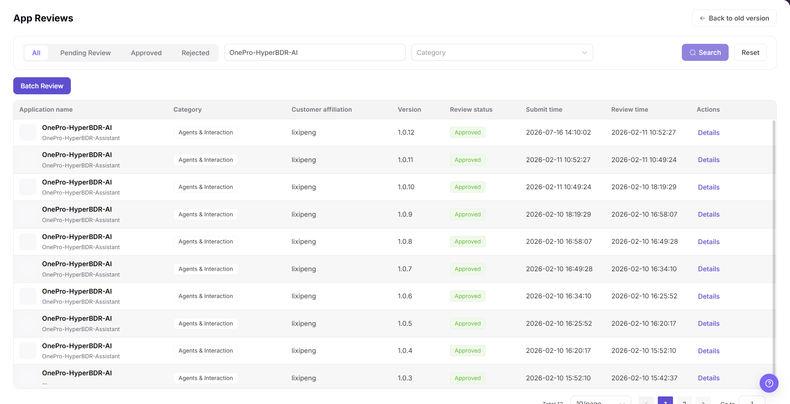

# Publish and Approve Applications

Use this task to review application publishing information, process approval, and validate customer visibility.

## Applicable Roles

- Platform Operators, application publishing administrators, and application reviewers

## Before You Start

- Confirm permission to manage or review application publishing.
- Prepare the application description, bound model, calling entry point, parameter mapping, and customer scope.
- Confirm that the bound model is available and the target customers are authorized.

## Procedure

### 1. Review Application Publishing Information

Open [Applications](../../../usermanual/model-services/operator/publishing/apps/), filter by application name or publication state, and open the details. Review the bound model, calling entry point, parameter mapping, customer scope, and publication description.

### 2. Process Application Approval

Open [Application Reviews](../../../usermanual/model-services/operator/approvals/app-reviews/) and filter by state, application name, applicant, or submission time. Review the description, bound model, entry point, and customer scope, then approve, reject, or request more information and enter specific comments.

### 3. Validate Publication State and Customer Visibility

After approval, return to Applications and confirm the publication state. Then use the target customer's perspective to verify that the application is visible and that its calling entry point is correct. Customers outside the configured scope must not see it.

### 4. Validate a Call and Track Problems

Run one controlled call and confirm the bound model, parameter mapping, and customer quota. If the call fails, correlate the model state, call logs, error code, and quota.

## Completion Checklist

> **Purpose:** These checks confirm that the application approval produced the intended publication boundary and a working customer path. Resolve failed checks before announcing the application as available.

| Check | Pass Criteria |
| --- | --- |
| Publishing information | Application, model, entry point, parameters, and customer scope are correct. |
| Approval record | State, comments, reviewer, and time are complete. |
| Visibility | Intended customers can see the application; other customers cannot. |
| Call validation | The application call succeeds or the failure cause is identified. |

## Troubleshooting

| Symptom | Check First |
| --- | --- |
| Customer cannot see the published application | Publication state, customer scope, bound-model state, and synchronization time |
| Approval cannot be completed | Required materials, calling entry point, model state, and reviewer permission |
| Application remains invisible after approval | Application publication state and customer authorization scope |
| Application call fails | Model state, parameter mapping, customer quota, and call logs |
