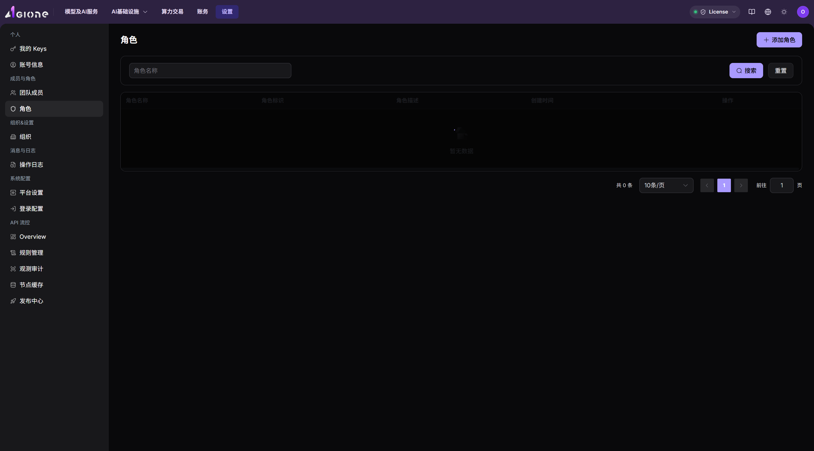

# Scenario Overview - Identity Authorization

This scenario uses organizations, members, and roles to define which menus, actions, and business resources a user may access.

## Applicable Roles

- Administrator and Operator
- Provider and End User used to verify the result

## Goals

- Assign users to the correct organization and role.
- Enforce least privilege for menus, actions, and resources.
- Verify changes through a fresh session and operation logs.

## Scenario Flow

**Main path:** Confirm organization boundary → Define responsibilities → Create or select a role → Assign members → Verify allowed and denied paths → Review operation logs

| Stage | Key Result |
| --- | --- |
| 1. Confirm boundary | Organization, member ownership, and responsibilities are clear |
| 2. Select permissions | Roles, menus, and button permissions match the job |
| 3. Assign access | The target member receives the intended role and scope |
| 4. Verify and audit | Authorized actions work, unauthorized actions are blocked, and changes are traceable |

Representative role screenshot:

## Before You Start

- Define the target user, organization, and job responsibility.
- List required and explicitly forbidden capabilities.
- Prepare a verification account.

## Recommended Reading Order

1. Confirm organization settings and member ownership.
2. Prefer a built-in role; create a least-privilege role only when required.
3. Assign the target member and sign in again.
4. Verify allowed and denied paths and review operation logs.

## Document Index

| Document | Description |
| --- | --- |
| [Identity Authorization Workflow](./authorization-workflow) | Role design, member assignment, access verification, and a role-page screenshot |

## Completion Checklist

> **Purpose:** These are the scenario exit criteria. Use them to decide whether the outcome is observable and reviewable and whether you can continue to the next scenario. They do not repeat the procedure; if any item fails, return to the relevant feature guide and follow its troubleshooting section.

| Check | Pass Criteria |
| --- | --- |
| 1 | The role and scope are saved and take effect after the account signs in again. |
| 2 | The authorized account sees the target menu and completes the intended action. |
| 3 | An unauthorized account cannot see the entry or receives an explicit denial, matching least-privilege design. |
