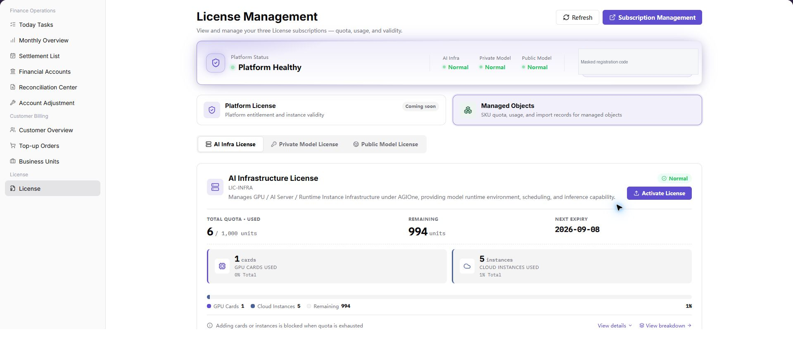
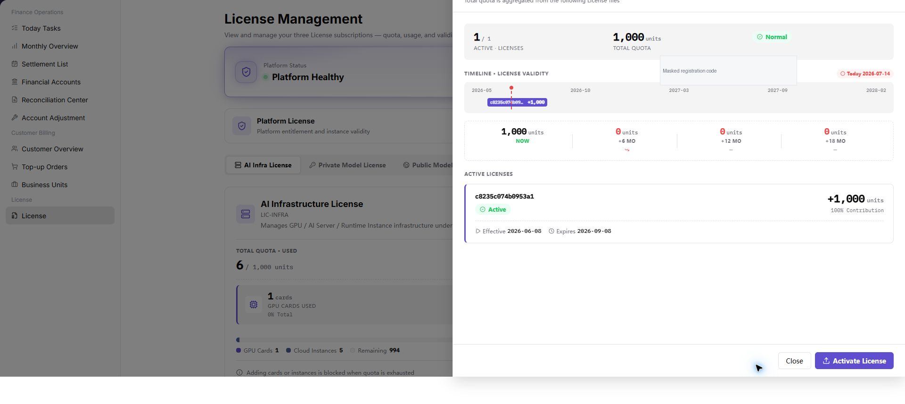

# Review and Maintain the License Lifecycle

Use this task to confirm current License state, complete activation when required, and establish validity and quota checks.

## Applicable Roles

- Platform Operators, License administrators, and resource operators

## Before You Start

1. Confirm the current environment, instance, and target authorization type.
2. Record current state, validity, total, used, and remaining quota.
3. Choose online payment or registration-code/activation-code activation and prepare the required approval.
4. Keep registration codes, activation codes, and payment credentials out of documents, screenshots, and tickets.

## Procedure

### 1. Review Current License State

Open [License Management](../../../usermanual/billing/operator/license/license/) and review current state, validity, total quota, used quota, remaining quota, and managed objects. First confirm that the page belongs to the target environment and instance.

### 2. Choose and Complete Activation

- When online purchasing is available, follow [Online Payment Activation](../../../license/online-payment-activation).
- When an activation code is provided offline or online activation is unavailable, follow [Activation Code Activation](../../../license/activation-code-activation).

Before submission, confirm the environment, instance, registration code, and authorization type again. If activation fails, inspect state and error details before resubmitting any activation material.

### 3. Review Details and Authorization Composition

After activation, refresh License Management and open details and authorization composition. Confirm authorization type, effective time, expiry time, total quota, and resource usage by category.

### 4. Establish Validity and Quota Checks

Periodically review remaining validity, remaining quota, and managed-object changes. Set an internal alert lead time based on resource expansion plans. When capacity may be insufficient, prepare renewal or expansion early and assess impact on existing instances and new workloads.

## Completion Checklist

> **Purpose:** These checks confirm that the License is not only activated, but provides explainable and sustainable capacity in the correct environment.

| Check | Pass Criteria |
| --- | --- |
| Instance match | Environment, instance, registration or activation material, and authorization type match. |
| Valid state | The page shows a valid state and correct validity period. |
| Clear quota | Total, used, remaining, and authorization composition can be explained. |
| Object consistency | Managed objects match actual resources and business plans. |
| Follow-up plan | Owners and dates for expiry, expansion, and insufficient quota are clear. |

## Troubleshooting

| Symptom | Check First |
| --- | --- |
| Activation entry or registration code is missing | Account permission, authorization area, page load, and instance state |
| Activation code is invalid | Match to current registration code, authorization type, validity, and complete copy |
| State does not update after activation | Page cache, synchronization delay, and current authorization area |
| Remaining quota is unexpected | Managed objects, authorization composition, historical usage, and resource synchronization |
| License is expiring or insufficient | Business expansion plan, renewal lead time, affected instances, and approval progress |
