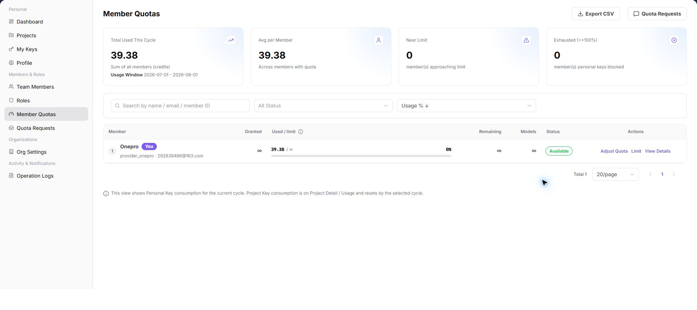
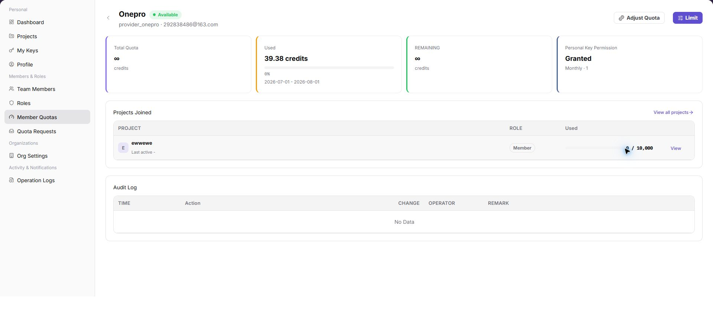

# Request and Allocate Member Quota

Use this task to request quota for a member, adjust the allocation, and set calling limits.

## Applicable Roles

- Provider administrators, Model Providers, and platform users who request quota

## Before You Start

- Identify the target member, required quota, and business reason.
- Confirm that no duplicate request is pending.
- Identify the project budget, key limit, model scope, and intended reset policy.

## Procedure

### 1. Review the Member's Current Quota

Open [Member Quotas](../../../usermanual/settings/user/members-roles/member-quotas/), locate the member, and review authorized quota, used quota, remaining quota, model scope, and status.

### 2. Submit a Quota Request

Open [Quota Requests](../../../usermanual/settings/user/members-roles/quota-requests/), confirm that no duplicate request is pending, then enter the requested amount and business reason and submit.

### 3. Track the Request and Approval Result

Filter request records by status and confirm whether the request is Pending, Approved, Rejected, Cancelled, or Expired. After approval, return to Member Quotas and verify that the amount was applied.

### 4. Adjust Member Quota and Limits

Increase or deduct quota in the member details and enter a reason. Then set the reset cycle, limit, and model allowlist. Before saving, compare the project budget and key limit so that layered restrictions do not conflict.

## Completion Checklist

> **Purpose:** These checks confirm that the request and allocation produced a traceable member-level result. Resolve any mismatch before relying on the new quota.

| Check | Pass Criteria |
| --- | --- |
| Request record | Amount, reason, status, and approval result are complete. |
| Member balance | Authorized, used, and remaining quota are correct after adjustment. |
| Constraint relationship | Member, project, key, and model-allowlist rules are consistent. |
| Actual validation | Calls within quota succeed and over-limit calls are restricted as configured. |

## Troubleshooting

| Symptom | Check First |
| --- | --- |
| A new request cannot be submitted | Existing pending request and whether amount and reason are complete |
| Quota does not change after approval | Request member, synchronization state, and member details |
| Calls fail although member quota remains | Project budget, key limit, model allowlist, and model state |
| Adjustment action is unavailable | Current account role and member-quota management permission |
