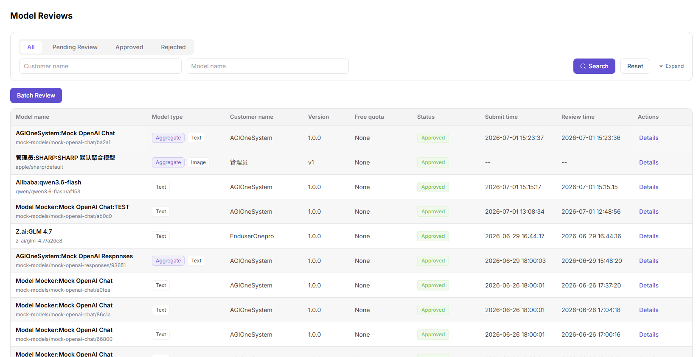

# Model Publishing Approval

This scenario guides operators through reviewing a model publishing request and verifying the decision, publication scope, and resulting visibility.

## Target Outcome

- The reviewer identifies the model, provider, publication area, and version.
- Model information, protocol connectivity, billing, rate limits, and visibility are checked.
- Approval or rejection includes a clear, traceable reason.
- An approved model is visible, testable, or callable within the intended scope.

## Before You Start

1. The account has Model Services model review permission.
2. Publication, billing, rate-limit, and content governance rules are clear.
3. Connectivity testing is complete and review material contains no real credentials.

## Procedure

| Step | Action | Manual | Completion Signal |
| --- | --- | --- | --- |
| 1 | Open `Approvals > Model Reviews` and filter pending requests | [Model Reviews](../../../usermanual/model-services/operator/approvals/model-reviews/) | The target request is pending |
| 2 | Check model, provider, source, and publication area | [Model Reviews](../../../usermanual/model-services/operator/approvals/model-reviews/) | Basic information matches the request |
| 3 | Check protocol test, modalities, tokens, billing, and rate limits | [Publish and Call a Model](../../../usermanual/model-services/end-to-end/publish-and-call-model/) | Critical configuration is complete and compliant |
| 4 | Approve or reject with a specific reason | [Model Reviews](../../../usermanual/model-services/operator/approvals/model-reviews/) | Status and review comment are saved |
| 5 | Check status with the provider account | [My Models](../../../usermanual/model-services/user/studio/my-models/) | The provider sees the result and reason |
| 6 | Verify visibility for an approved public model | [Model Marketplace](../../../usermanual/model-services/user/discover/models/) | Intended users can find the model |

## Completion Checklist

- [ ] Request, version, provider, and publication scope are correct.
- [ ] Protocol, billing, and rate-limit settings have verification evidence.
- [ ] Status, comment, reviewer, and time are traceable.
- [ ] A rejection tells the provider exactly what to change and retest.
- [ ] An approved model is visible only in the intended scope.

## Troubleshooting

| Symptom | Check First |
| --- | --- |
| Request is missing | Status filter, provider, submission time, and permission |
| Approval cannot be submitted | Required settings, protocol test, publication area, and review permission |
| Approved model is not visible | Publication time, model state, publication area, and user visibility |
| Provider cannot act on rejection | Whether the review comment names the field, rule, and validation method |

## Feature Screenshot

