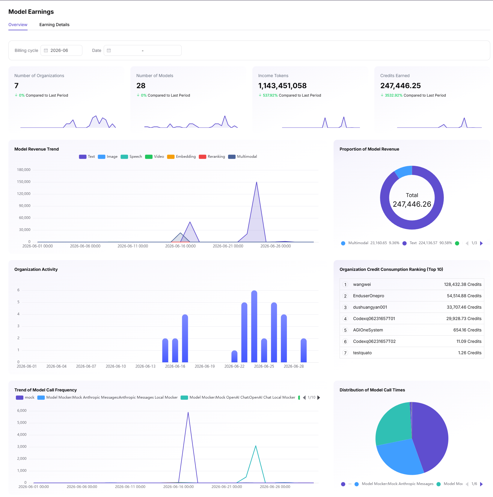

# Model Usage & Revenue

This scenario helps callers reconcile model consumption and providers reconcile customer calls and model revenue using the same time range, model, and billing basis.

## Applicable Roles

- Platform User reviewing personal calls and consumption
- Model Provider reviewing customer usage and revenue
- Platform Operator reconciling platform billing rules

## Target Outcome

- Callers can trace tokens, requests, duration, and consumption from call records.
- Providers can review volume, success rate, and revenue by model and customer.
- Usage, revenue, and logs can validate one another for the same time range.
- An anomaly can be narrowed to a model, caller, billing period, or pricing configuration.

## Before You Start

1. Confirm whether the account is acting as a caller or provider.
2. Identify the model, provider, time range, billing period, and billing unit.
3. Prepare a request time or identifier and keep troubleshooting material redacted.

## Procedure

| Role | Action | Manual | Completion Signal |
| --- | --- | --- | --- |
| Caller | Review personal call overview and logs | [My Calls Overview](../../../usermanual/model-services/user/my-calls/overview/), [Call Logs](../../../usermanual/model-services/user/my-calls/call-logs/) | State, model, and time can be located |
| Caller | Review model usage | [Model Usage](../../../usermanual/model-services/user/usage-revenue/model-usage/) | Tokens, requests, or duration match logs |
| Provider | Review customer overview, logs, and analytics | [Customer Overview](../../../usermanual/model-services/user/customer-calls/overview/), [Customer Call Logs](../../../usermanual/model-services/user/customer-calls/call-logs/), [Customer Analytics](../../../usermanual/model-services/user/customer-calls/call-analytics/) | Customer-level data can be located |
| Provider | Review model revenue | [Model Revenue](../../../usermanual/model-services/user/usage-revenue/model-revenue/) | Revenue maps to valid usage and pricing |
| Both | Compare billing mode and currency | [My Models](../../../usermanual/model-services/user/studio/my-models/), [Currency Settings](../../../usermanual/model-services/operator/settings/currency-settings/) | Unit, price, and period are consistent |

## Reconciliation Order

1. Use call logs to confirm success and actual tokens, requests, or duration.
2. Open **Model Usage** with the same time and model filters and confirm that the usage totals match the call records.

3. Have the provider open **Model Revenue** for the same model and period and trace revenue back to valid usage and effective pricing.

4. If values differ, check billing mode, price, currency, free-call rules, and effective time in the model publishing configuration.

## Completion Checklist

> **Purpose:** These are the exit criteria for the current feature task. Use them to decide whether the result is observable and reviewable and whether you can continue to the next step in the scenario. They do not repeat the procedure; if any item fails, follow the troubleshooting section below.

| Check | Pass Criteria |
| --- | --- |
| 1 | Model, time, and call counts agree between logs and usage. |
| 2 | Billing of failed or canceled calls follows the active rule. |
| 3 | Provider customer data corresponds to caller records. |
| 4 | Revenue can be traced to valid usage and effective pricing. |
| 5 | Reconciliation material contains no full prompts, responses, or keys. |

## Troubleshooting

| Symptom | Check First |
| --- | --- |
| Usage is empty | Time range, model filter, successful calls, and processing delay |
| Usage rises unexpectedly | Call logs, customer or project dimension, retries, and concurrency |
| Revenue is empty | Whether the model has paid calls, pricing, and revenue period |
| Usage and revenue differ | Billing mode, currency, effective price time, and free-call rules |
