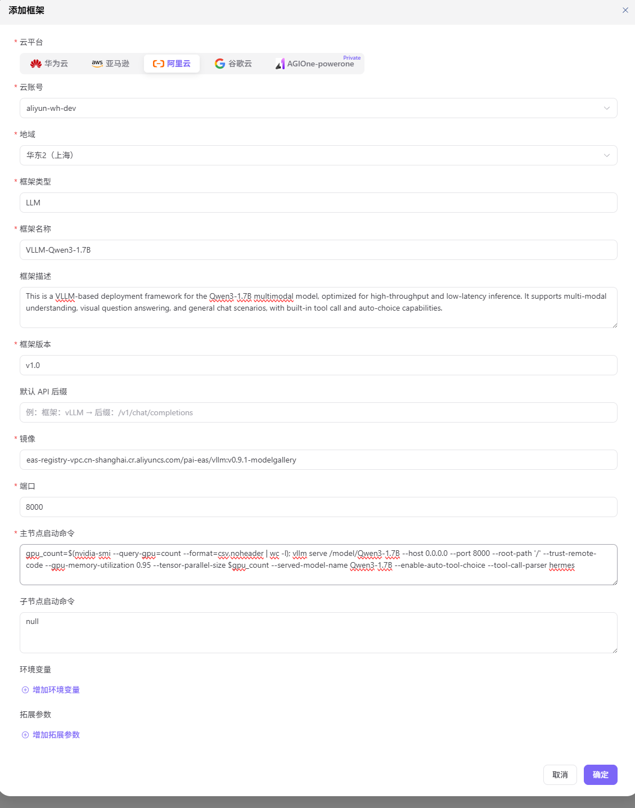

# Inference Frameworks

Combine a runtime image, startup command, service port, and framework type into a cloud deployment runtime.

## Procedure

1. Open `Deployment Assets > Inference Frameworks` and select a runtime image.
2. Configure framework type, startup command, service port, and protocol behavior.
3. Validate command and port behavior in the target environment.
4. Enable the framework and verify that model assets can select it.

See [Inference Frameworks](../../../../usermanual/ai-infra-on-cloud/operator/deploy-assets/frameworks/).

## Completion Checklist

- [ ] Image, framework type, command, and port are compatible.
- [ ] Health and API behavior can be validated.
- [ ] Model asset configuration can select the framework.

## Feature Screenshot

