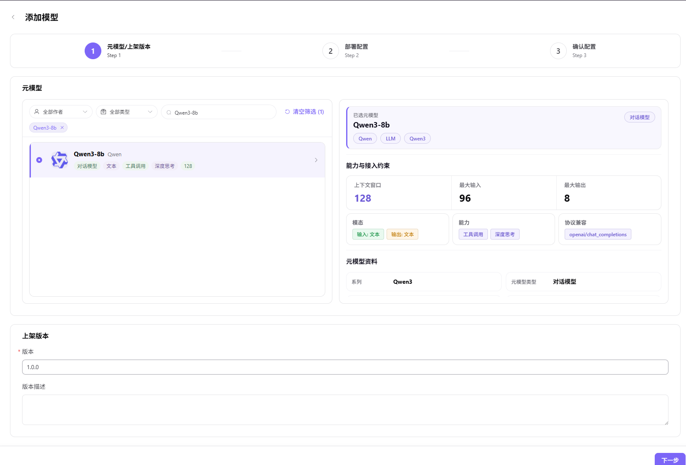
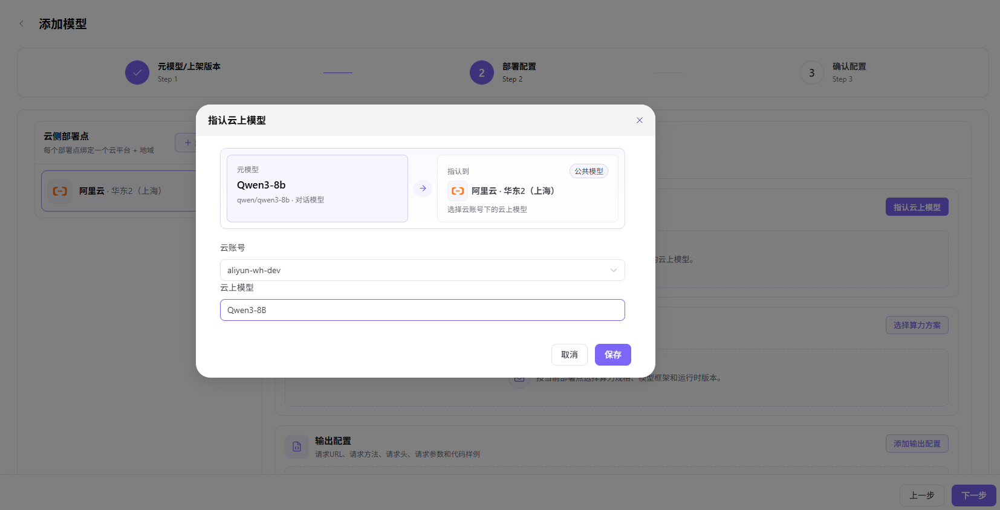
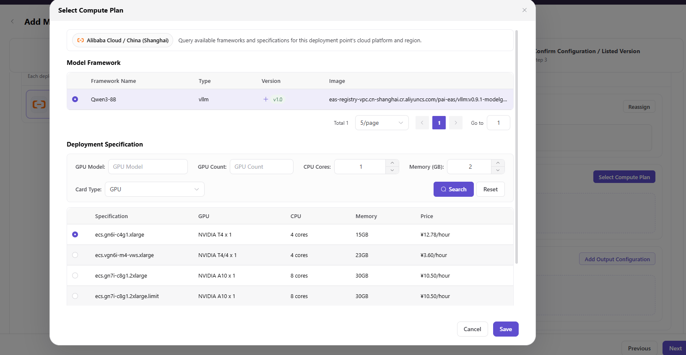

# Cloud Model Assets

This task combines a meta-model, cloud deployment point, cloud model, compute plan, and output protocol into a deployable model asset.

## Target Outcome

Platform Users can select the model in quick deployment and obtain the correct API definition after deployment.

## Applicable Roles

- Platform Operator

## Before You Start

- Meta-model, cloud account, cloud region, runtime image, and inference framework are prepared.
- Cloud-model identifier, compatible compute plan, and output protocol are confirmed.

## Procedure

### Add a Model Asset

1. Go to **Deploy Assets > Model Library**.
2. Select **Add Model** to start the three-step workflow.

3. **Step 1 - Meta-Model and Listed Version**:
   - Filter by author, type, or keyword and select the target meta-model.
   - Review modalities, currently available capability metadata, token limits, compatible protocols, model family, author, subtype, and description.
   - Enter the listed version, such as `1.0.0`, and an optional version description.
   - Select **Next**.

4. **Step 2 - Deployment Configuration**:
   - Add a cloud deployment point that binds one cloud platform and region.

   - Assign the cloud model under the intended cloud account and save it.

   - Select a compatible model framework and compute plan, then save it.

   - Configure request URL placeholders, method, headers, request parameters, output fields, and localized code examples. Use placeholders instead of real credentials.

   - Select **Next**.
5. **Step 3 - Confirm Configuration**: review meta-model information, capability and access constraints, cloud model, compute plan, and output configuration. Select **Submit**, or return to a previous step to correct the configuration.

#### Parameters - Meta-Model and Listed Version (Step 1)

| Field | Type | Example | Description |
| --- | --- | --- | --- |
| Meta-Model | Single select | `Qwen3-8b` with identifier `qwen/qwen3-8b` | Required; canonical base-model definition |
| Listed Version | Text | `1.0.0` | Required; asset version exposed to deployment |
| Version Description | Rich text | - | Optional version-change description |

#### Parameters - Deployment Configuration (Step 2)

| Field | Type | Example | Description |
| --- | --- | --- | --- |
| Cloud Deployment Point | List | `Alibaba Cloud - China East 2` | Required; binds one cloud platform and region |
| Cloud Account | Select | `aliyun-dev` | Required; cloud account used by the deployment |
| Cloud Model | Select | `Qwen3-8B` | Required; cloud model mapped under the account |
| Model Framework | Single select | `Qwen3-8B` / `vllm` / `v1.0` | Required; framework and runtime version |
| Compute Plan | Single select | `NVIDIA T4 x 1` / `4 vCPU` / `15 GB` | Required; accelerator, count, CPU, and memory |
| Request URL | URL | `{request_url}` | Required; generated after deployment |
| Request Method | Select | `POST` | Required; HTTP method |
| Content-Type Header | Text | `application/json` | Required; request content type |
| Authorization Header | Text | `Bearer {api_key}` | Required; placeholder authentication value |
| `max_tokens` | Number | `1024` | Required when used by the selected protocol |
| `messages` | Array | `[{"role":"user","content":"hello"}]` | Required conversation request content |

## Completion Checklist

> **Purpose:** These are the exit criteria for this task. If any check fails, follow the troubleshooting section before continuing.

| Check | Pass Criteria |
| --- | --- |
| 1 | Meta-model, deployment point, cloud model, and compute plan are compatible. |
| 2 | Output protocol and examples contain placeholders rather than real credentials. |
| 3 | Platform Users can see and select the asset in quick deployment. |

## Troubleshooting

| Symptom | Check First |
| --- | --- |
| Deployment point has no model or plan | Cloud-account synchronization, region, model availability, and plan compatibility |
| Platform User cannot see the model asset | Asset state, tenant authorization, business-region authorization, and publication scope |

## User Manual

[Review complete fields, validation rules, and troubleshooting for Model Assets](../../../../usermanual/ai-infra-on-cloud/operator/deploy-assets/models/)
