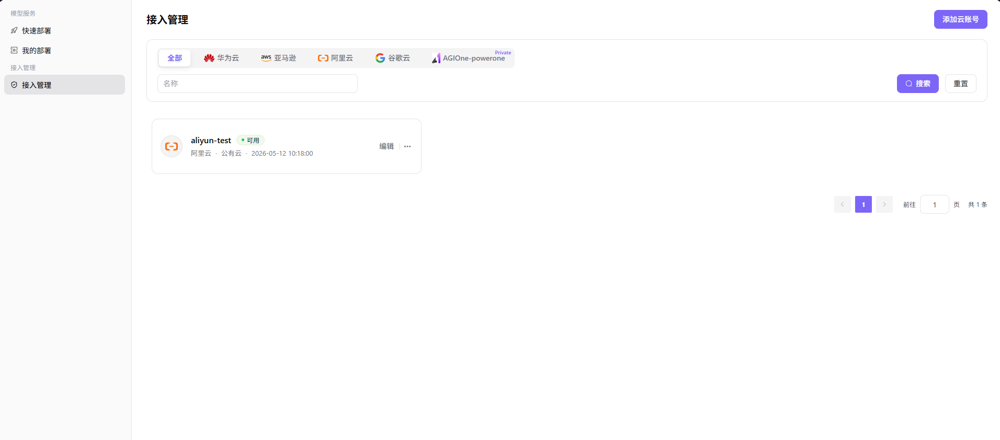

# Add a User Access Account

Add the user's own cloud access account before starting a cloud model deployment.

## Procedure

1. Open `Access Management > Access Accounts` and add an account.
2. Select the authorized cloud platform and enter credentials through the protected form.
3. Validate the account and confirm its status.
4. Verify that quick deployment can select the account and authorized regions.

See [User Access Accounts](../../../../usermanual/ai-infra-on-cloud/user/access-management/access-accounts/).

## Completion Checklist

- [ ] Account validation succeeds.
- [ ] The account is visible only to the intended user or tenant scope.
- [ ] Quick deployment can use the account in an authorized region.

## Feature Screenshot

