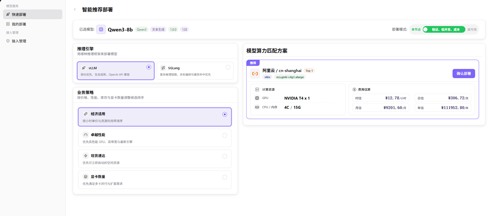

# Quick Deployment

Deploy a cloud model by selecting an authorized account, model, inference engine, strategy, and compute plan.

## Target Outcome

A deployment request is created with an understood resource plan and cost estimate, then appears in My Deployments.

## Applicable Roles

- Platform User

## Before You Start

- Confirm that an authorized access account, region, and deployable model are available.
- Decide whether the workload needs a single-node or high-availability plan and define a cost limit.

## Procedure

### Step 1: Select a Cloud Account and Model

1. From the platform home page, select **Quick Deployment** in the left navigation to open the model catalog.
2. In **Deployable Scope**, select the target cloud and region, such as **Alibaba Cloud - China East 2 (Shanghai)**. The platform filters models for that scope.
3. In **Matching Models**, use the model, series, and scenario selects, the search box, and the sort control to find the target model.
4. Locate the model row, such as **Qwen3-8b**, and select **Deploy Model** to open Step 2.

#### Parameter Reference

| Field | Type | Example | Description |
| --- | --- | --- | --- |
| Current Scope | Label | `Alibaba Cloud / China East 2 (Shanghai)` | Displays the selected cloud-account and region combination |
| Cloud Filter | Select | `All Clouds` | Required; filters deployable scopes by cloud provider |
| Region Filter | Select | `All Regions` | Required; filters deployable scopes by region |
| Cloud Provider | Single-select card | `Alibaba Cloud - China East 2 (Shanghai)` | Required; selects the target cloud account and region |
| Model Filter | Select | `All Models` | Optional; filters by model name |
| Series Filter | Select | `All Series` | Optional; filters by model series |
| Scenario Filter | Select | `All Scenarios` | Optional; filters by application scenario |
| Search | Text | `Qwen3` | Optional; locates a model by keyword |
| Sort | Select | `Default Sort` | Optional; changes model-list ordering |
| Model | Model row | `Qwen3-8b` | Required; select **Deploy Model** to continue |

### Step 2: Review the Recommended Deployment

1. After selecting **Deploy Model**, review the **Recommended Deployment** page.
2. Confirm the selected-model card, including model name, series, capabilities, version, and context. Select **Single Node** or **High Availability** for the deployment mode.
3. Select an inference engine:
   - **vLLM** for throughput, ecosystem maturity, and OpenAI API compatibility.
   - **SGLang** for complex inference chains, multi-turn orchestration, and cache-hit optimization.
4. Select a business strategy:
   - **Cost Effective** prioritizes hourly price and resource utilization.
   - **High Performance** prioritizes high-performance GPUs, bandwidth, and newer engines.
   - **Available Now** prioritizes capacity that can start immediately.
   - **GPU Count** prioritizes multi-card parallelism and scaling requirements.
5. Review the recommended model-compute plan, including provider and region, engine, instance type, GPU, CPU and memory, capacity, and hourly, daily, monthly, and annual estimates.
6. After verifying the engine, strategy, resource plan, and estimated cost, select **Confirm Deployment**. Track the result in **My Deployments**.

#### Parameter Reference

| Field | Type | Example | Description |
| --- | --- | --- | --- |
| Deployment Mode | Single-select tab | `Single Node` / `High Availability` | Required; selects the deployment architecture |
| Inference Engine | Single-select card | `vLLM` | Required; selects the model inference framework |
| Business Strategy | Single-select card | `Cost Effective` | Required; selects the compute filtering and ranking policy |
| Model-Compute Plan | Recommendation card | `Alibaba Cloud / cn-shanghai / vLLM` | Required; calculated from account, region, engine, and strategy |
| GPU | Label | `NVIDIA T4 x 1` | Required; GPU model and count |
| CPU / Memory | Label | `4C / 15G` | Required; CPU and memory allocation |
| Hourly Estimate | Number | `CNY 12.78/hour` | Required; estimated hourly cost |
| Daily Estimate | Number | `CNY 306.72/day` | Required; estimated daily cost |
| Monthly Estimate | Number | `CNY 9201.60/month` | Required; estimated monthly cost |
| Annual Estimate | Number | `CNY 111952.80/year` | Required; estimated annual cost |

## Completion Checklist

> **Purpose:** These are the exit criteria for the current feature task. Use them to decide whether the result is observable and reviewable and whether you can continue to the next step in the scenario. They do not repeat the procedure; if any item fails, follow the troubleshooting section below.

| Check | Pass Criteria |
| --- | --- |
| 1 | Account, region, model, engine, and compute plan are selectable. |
| 2 | The request is submitted with the expected cost and scope. |
| 3 | My Deployments contains the new record. |

## Troubleshooting

| Symptom | Check First |
| --- | --- |
| No model or compute plan can be selected | Account authorization, region, asset compatibility, quota, and current capacity |
| Deployment creation fails | Required fields, cost selection, cloud-account state, and event details |

## User Manual

[Review the complete Quick Deployment steps, validation rules, and common issues](/usermanual/ai-infra-on-cloud/user/model-services/quick-deployment/)
