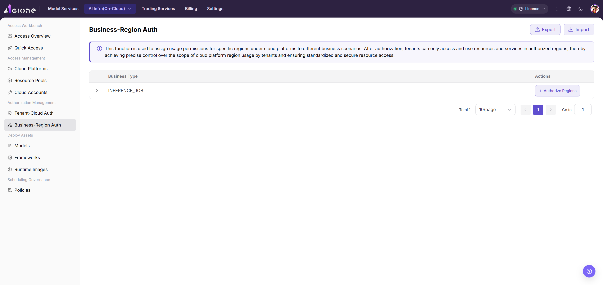

# Authorize Business Types to Regions

Grant each business type access to the cloud regions it may use.

## Target Outcome

Each business type, such as inference deployment, can schedule only to its approved cloud regions.

## Applicable Roles

- Platform Operator

## Before You Start

- Enable the required resource-pool regions first.
- Confirm which business types are allowed in each region.

## Procedure

### Authorize Regions

1. From the platform home page, select **Authorization Management > Business-Region Authorization**.
2. Expand a business type to review cards showing the number of authorized regions for each currently supported cloud platform, such as AWS, Alibaba Cloud, or AGIOne-powerone. Huawei Cloud access is not currently supported.
3. Select **+ Authorize Regions** for the business type to open the authorization dialog.

4. Confirm the current business type shown in the information bar.
5. In the platform-region tree, select only the regions approved for the business. Unselected regions remain unauthorized.
6. Select **Confirm** to save the authorization, or **Cancel** to discard it.

> This authorization assigns regions to a specific business scenario. A tenant can use only regions covered by both tenant-cloud and business-region authorization.

#### Parameter Reference

| Field | Type | Example | Description |
| --- | --- | --- | --- |
| Business Type | Single select | `Inference Deployment` | Required; the business scenario receiving access |
| Cloud Platform | Checkbox | `Alibaba Cloud / AWS` | Required; platform groups in the region tree |
| Region | Checkbox | `China East 2 (Shanghai) / Hong Kong` | Required; approved regions under the selected platforms |

## Completion Checklist

> **Purpose:** These are the exit criteria for the current feature task. Use them to decide whether the result is observable and reviewable and whether you can continue to the next step in the scenario. They do not repeat the procedure; if any item fails, follow the troubleshooting section below.

| Check | Pass Criteria |
| --- | --- |
| 1 | The business type has only the intended regions. |
| 2 | Saved authorization persists after refresh. |
| 3 | User deployment options follow the granted region set. |

## Troubleshooting

| Symptom | Check First |
| --- | --- |
| No region can be selected | Resource-pool enablement and cloud-platform status |
| Deployment shows an unexpected region | Business type, saved region selection, and current tenant authorization |

## User Manual

[Review complete authorization rules and common issues for Business-Region Authorization](/usermanual/ai-infra-on-cloud/operator/auth-management/business-region-auth/)
