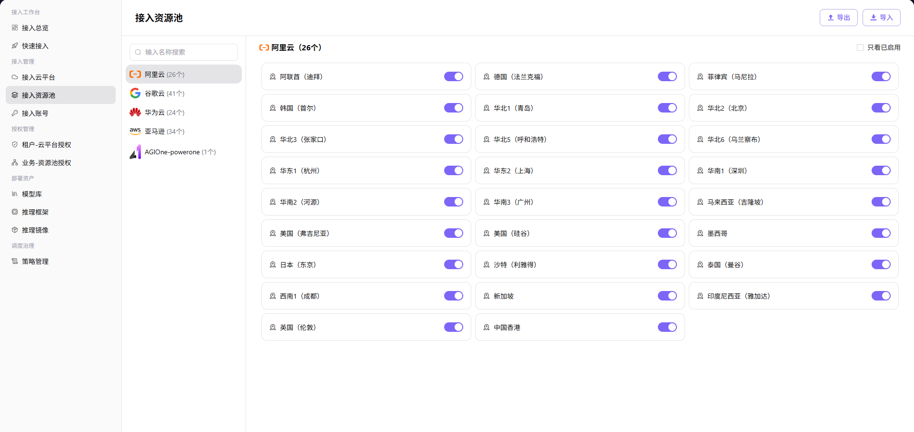

# Enable Cloud Resource Pools

Enable the cloud regions that AGIOne may use and maintain readable localized names.

## Target Outcome

Only approved cloud regions are enabled as resource pools and can be selected by later authorization flows.

## Applicable Roles

- Platform Operator

## Before You Start

- Confirm that the cloud account has synchronized the expected regions.
- Decide which regions are approved for business use and how they should be displayed.

## Procedure

### Enable or Disable Regions

1. From the platform home page, select **Resource Pools**.
2. Search the currently supported cloud providers in the left panel. The list shows how many regions have been synchronized for each provider. Select a target provider, such as Alibaba Cloud or AWS. Huawei Cloud access is not currently supported.
3. Review the region cards for the selected provider.
4. Use the switch on each region card to enable or disable that region for business use.

### Edit the Region Display Name

1. Open **Resource Pools** and select the target cloud provider.
2. Locate the region whose name needs maintenance.
3. Select the edit icon on the region card.
4. Maintain the localized **Display Name** on the English and Simplified Chinese tabs.
5. Select **Confirm** to save the change, or **Cancel** to discard it.

#### Parameter Reference

| Field | Type | Example | Description |
| --- | --- | --- | --- |
| Cloud Provider | Select | `Alibaba Cloud / AWS` | Required; provider whose resource pools are managed |
| Region Switch | Switch | `On / Off` | Enables or disables the selected region |
| Display Name | Localized text | `China (Beijing) / 北京` | Required; maintain English and Simplified Chinese values |

## Completion Checklist

> **Purpose:** These are the exit criteria for the current feature task. Use them to decide whether the result is observable and reviewable and whether you can continue to the next step in the scenario. They do not repeat the procedure; if any item fails, follow the troubleshooting section below.

| Check | Pass Criteria |
| --- | --- |
| 1 | Required regions are enabled and clearly named. |
| 2 | Unapproved regions remain unavailable. |
| 3 | Authorization pages can select the enabled regions. |

## Troubleshooting

| Symptom | Check First |
| --- | --- |
| A region is absent | Account synchronization, cloud permissions, and platform-region support |
| A region cannot be authorized | Region enablement state and saved resource-pool configuration |

## User Manual

[Review complete fields, validation rules, and common issues for Resource Pools](/usermanual/ai-infra-on-cloud/operator/access-management/resource-pools/)
