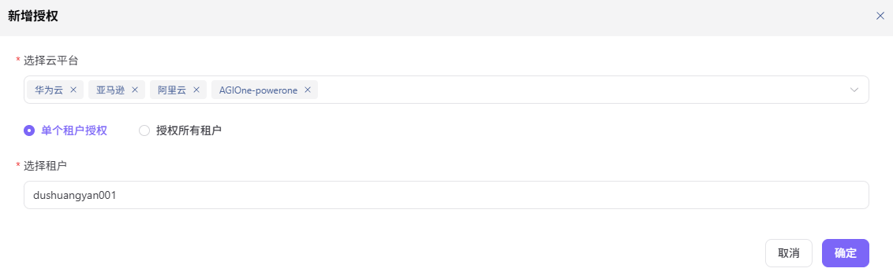

# Authorize Tenants to Cloud Platforms

Grant selected tenants access to a cloud platform after the platform and regions are ready.

## Procedure

1. Open `Authorization Management > Tenant-Cloud Authorization`.
2. Select one tenant or the explicitly approved tenant set.
3. Select the cloud platform and save the grant.
4. Sign in with a tenant user and verify resource visibility.

See [Tenant-Cloud Authorization](../../../../usermanual/ai-infra-on-cloud/operator/auth-management/tenant-cloud-auth/).

## Completion Checklist

- [ ] Only intended tenants receive the cloud grant.
- [ ] A fresh tenant session reflects the authorization.
- [ ] Revoked tenants no longer see the platform.

## Feature Screenshot

