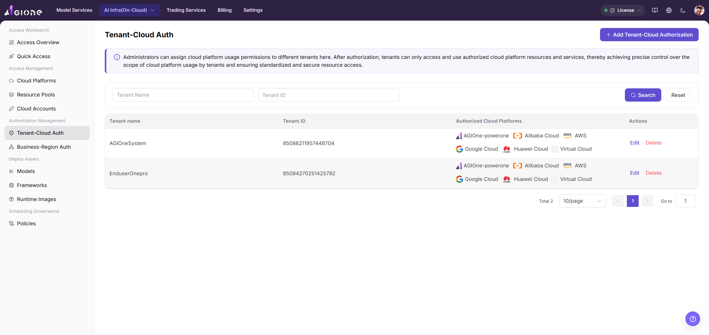

# Authorize Tenants to Cloud Platforms

Grant selected tenants access to a cloud platform after the platform and regions are ready.

## Target Outcome

The intended tenant can see the authorized cloud platform, while unrelated tenants cannot.

## Applicable Roles

- Platform Operator

## Before You Start

- Confirm that the tenant exists and the cloud platform is enabled.
- Decide whether the grant applies to one tenant or all tenants.

## Procedure

### Add Authorization

1. From the platform home page, select **Authorization Management > Tenant-Cloud Authorization**.
2. Select **Add Authorization** in the upper-right corner.

3. Select one or more currently supported cloud platforms, such as Alibaba Cloud, AWS, or AGIOne-powerone. Huawei Cloud access is not currently supported.
4. Select the authorization scope:
   - **Single Tenant** grants access to one named tenant.
   - **All Tenants** grants access to every tenant and does not require a tenant name.
5. Review the configuration and select **Confirm**, or **Cancel** to discard it.

> This authorization controls platform visibility. After it is saved, a tenant can access only the cloud platforms granted to it.

#### Parameter Reference

| Field | Type | Example | Description |
| --- | --- | --- | --- |
| Cloud Platform | Multi-select | `Alibaba Cloud / AWS / AGIOne-powerone` | Required; one or more currently supported platforms |
| Authorization Scope | Single select | `Single Tenant / All Tenants` | Required; determines the authorization target |
| Tenant | Text | `tenant-a` | Required only for Single Tenant authorization |

## Completion Checklist

> **Purpose:** These are the exit criteria for the current feature task. Use them to decide whether the result is observable and reviewable and whether you can continue to the next step in the scenario. They do not repeat the procedure; if any item fails, follow the troubleshooting section below.

| Check | Pass Criteria |
| --- | --- |
| 1 | Only intended tenants receive the cloud grant. |
| 2 | A fresh tenant session reflects the authorization. |
| 3 | Revoked tenants no longer see the platform. |

## Troubleshooting

| Symptom | Check First |
| --- | --- |
| The tenant cannot see the platform | Tenant selection, authorization scope, platform status, and a refreshed user session |
| Too many tenants can see the platform | Whether the grant was accidentally set to all tenants |

## User Manual

[Review complete rules and common issues for Tenant-Cloud Authorization](/usermanual/ai-infra-on-cloud/operator/auth-management/tenant-cloud-auth/)
