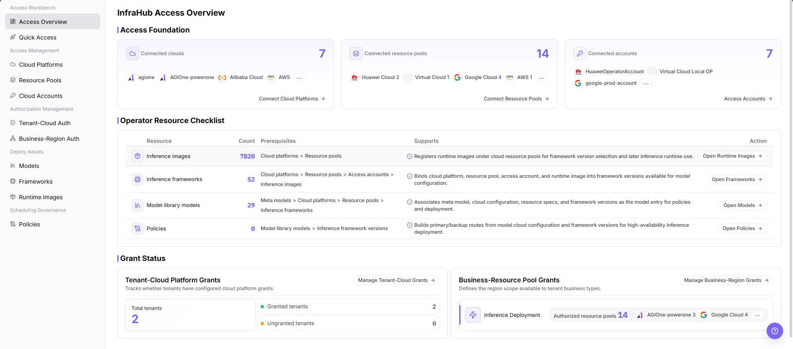

# Use Quick Access and Access Overview

## Target Outcome

Understand the on-cloud access sequence before configuring individual items and confirm the overall state of cloud platforms, accounts, resource pools, and authorization from one view.

## Applicable Roles

- Platform Operator

## Before You Start

- Identify the cloud platform, accounts, regions, business types, and tenants to onboard.
- Prepare minimum-privilege account materials and network connectivity.

## Steps

1. Open [Quick Access](../../../../usermanual/ai-infra-on-cloud/operator/access-workbench/quick-start/) and review the dependency order for platforms, accounts, resource pools, and authorization.

2. Open [Access Overview](../../../../usermanual/ai-infra-on-cloud/operator/access-workbench/access-overview/) and review onboarded platforms, valid accounts, available resource pools, and authorization exceptions.

3. Follow missing-item entries to Cloud Platforms, Cloud Accounts, Resource Pools, Business-Region Authorization, or Tenant-Cloud Authorization.
4. After configuration, refresh Access Overview and confirm that exception counts and target-object states update.

## Completion Checklist

> **Purpose:** These checks confirm that on-cloud access dependencies form a complete path. Individual records may exist while the overall path remains unusable.

| Check | Pass Criteria |
| --- | --- |
| Onboarding order | Dependencies among platform, account, resource pool, and authorization are clear. |
| Global state | The target platform, account, and resource pool are visible in the overview. |
| Authorization loop | Business-region and tenant-cloud authorization have no unexplained gap. |
| Next-step entry | Each missing item opens the corresponding configuration task. |

## Troubleshooting

| Symptom | Check First |
| --- | --- |
| Account or resource pool is abnormal in the overview | Account validation, network, region enablement, and synchronization state |
| Individual page is healthy but overview remains abnormal | Refresh time, object association, and authorization chain |
| User still cannot see cloud resources | Business-region authorization, tenant-cloud authorization, account role, and a fresh session |
