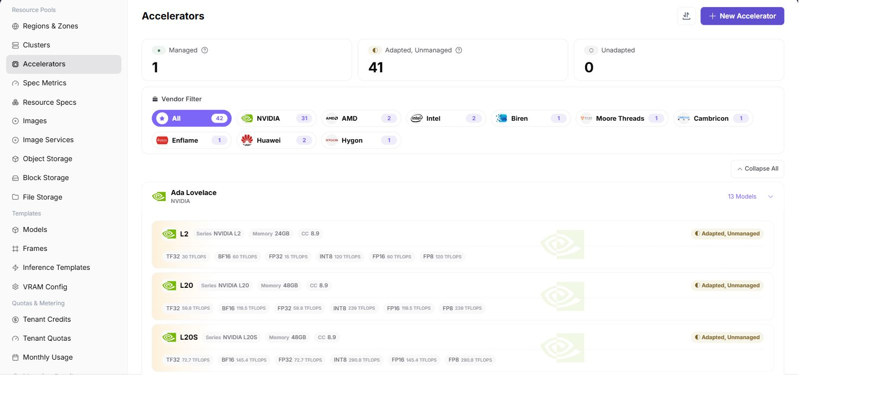

# Maintain Accelerator Models

## Target Outcome

Define the NPU model once with the correct vendor, model identifier, memory, and resource key so specifications and monitoring use the same identity.

## Applicable Roles

- Platform Operator

## Before You Start

- Record the exact model and per-card memory reported by the four physical NPU cards.
- Confirm that no existing entry already represents the same model.

## Entry

- **Role:** Operator
- **Menu:** AI Infra (On-Prem) > Resource Pools > Accelerator Management
- **Route:** `/powerone/resourcepool/accelerators`

## Steps

1. Filter by the target NPU vendor.
2. Find the actual model and verify its family, memory, and adaptation state.
3. If it is missing, create the accelerator and enter the Kubernetes resource name.
4. Associate the model with the metric used by the cluster device plugin.
5. Save and verify the expected managed state.

## Four-NPU Notes

- This page defines the card model, not the installed quantity. The cluster reports the actual card count.
- All four cards of the same model should use the same resource key.
- Memory and model metadata affect flavor and deployment feasibility checks.

## Completion Checklist

> **Purpose:** These are the exit criteria for the current feature task. Use them to decide whether the result is observable and reviewable and whether you can continue to the next step in the scenario. They do not repeat the procedure; if any item fails, follow the troubleshooting section below.

| Check | Pass Criteria |
| --- | --- |
| 1 | The NPU model is visible. |
| 2 | Its adaptation state and metric association are correct. |
| 3 | The resource key matches the cluster. |

## Troubleshooting

| Symptom | Check First |
| --- | --- |
| The model is unavailable in a specification | Accelerator status, model identifier, and vendor mapping |
| Monitoring cannot match the device | Whether the cluster-reported model matches this entry exactly |

## User Manual

[Accelerator Management](/usermanual/ai-infra-on-prem/operator/resource-pools/accelerators/)
