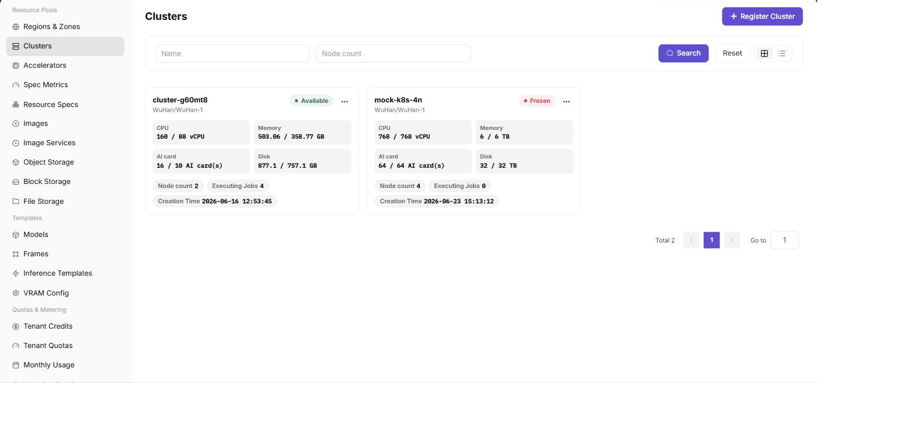

# Onboard the Cluster and Verify Devices

## Entry

- **Role:** Operator
- **Menu:** AI Infra (On-Prem) > Resource Pools > Cluster Management
- **Route:** `/powerone/resourcepool/cluster`

## Steps

1. Confirm that the target region and availability zone exist.
2. Register the cluster with kubeconfig, API server, authentication, and network data.
3. Wait until the cluster becomes available.
4. Open cluster details and verify that all accelerator nodes are Ready.
5. Verify that the reported target NPU count is four, with no missing or duplicate devices.

## Completion Check

- Cluster, node, and device data are visible.
- All four NPU cards are recognized.
- A one-card test workload enters scheduling successfully.

[Cluster Management manual](/usermanual/ai-infra-on-prem/operator/resource-pools/clusters/)
