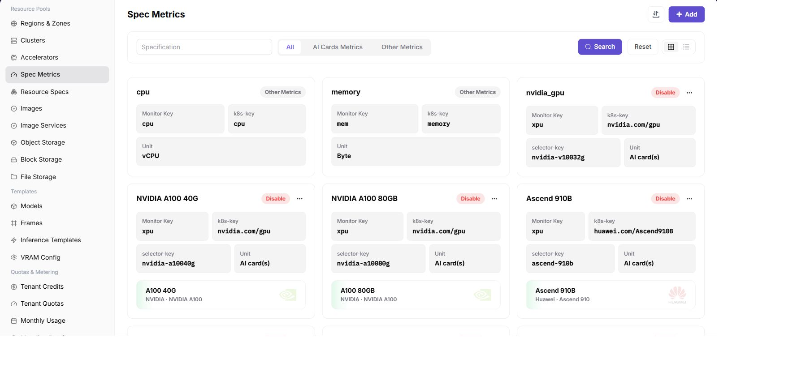

# Configure Metrics and Resource Specifications

## Target Outcome

Users can request clear one-card, two-card, and four-card NPU plans, each mapped to the correct scheduler resource key.

## Applicable Roles

- Platform Operator

## Before You Start

- Confirm the accelerator entry and the resource key reported by the cluster device plug-in.
- Decide which card combinations are supported and how CPU and memory scale with NPU count.

## Entry

- **Role:** Operator
- **Menu:** AI Infra (On-Prem) > Resource Pools > Specification Metrics / Resource Specifications
- **Routes:** `/powerone/resourcepool/flavor/type`, `/powerone/resourcepool/flavor/list`

## Steps

1. In **Specification Metrics**, verify that the NPU metric k8s-key matches the device-plugin resource key and add selector keys when scheduling must target a model or node group.

2. In **Resource Specifications**, create one-card, two-card, and four-card plans.
3. Configure CPU, memory, NPU count, and storage requirements, then associate each plan with the target cluster.

4. Validate the one-card plan with a test workload before testing the two-card and four-card plans.

## Recommended Four-Card Plan

| Flavor | NPU Count | Typical Use |
| --- | ---: | --- |
| `npu-1` | 1 | Functional checks and small-model inference |
| `npu-2` | 2 | Two-card parallel inference |
| `npu-4` | 4 | A workload that exclusively uses all cards |

Do not assume that a single pod can request all four cards when they are distributed across nodes.

## Completion Checklist

> **Purpose:** These are the exit criteria for the current feature task. Use them to decide whether the result is observable and reviewable and whether you can continue to the next step in the scenario. They do not repeat the procedure; if any item fails, follow the troubleshooting section below.

| Check | Pass Criteria |
| --- | --- |
| 1 | All three flavors are selectable. |
| 2 | Resource keys match node reporting. |
| 3 | One-card validation passes before two-card and four-card validation. |

## Troubleshooting

| Symptom | Check First |
| --- | --- |
| A specification is not selectable | Status, tenant quota, cluster association, and region availability |
| A workload remains pending | Resource key, requested card count, free capacity, and node labels |

## User Manual

- [Specification Metrics](/usermanual/ai-infra-on-prem/operator/resource-pools/spec-metrics/)
- [Resource Specifications](/usermanual/ai-infra-on-prem/operator/resource-pools/resource-specs/)
