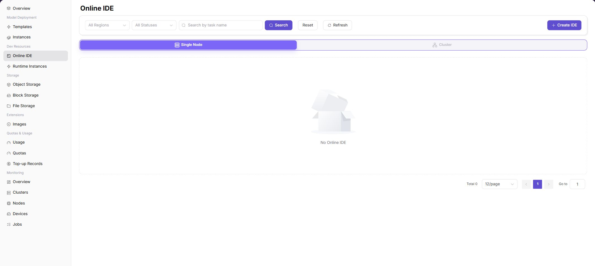

# On-Prem Development, Training & Assets

This scenario guides users through creating an On-Prem development or training environment and preserving code, data, images, models, and outputs as reusable assets.

## Target Outcome

- Users can create development or training environments with an available image, flavor, and storage.
- Code and data reside on persistent storage instead of an ephemeral container filesystem.
- Customized environments can be saved as images and model outputs can be stored in controlled locations.
- Logs, monitoring, and usage remain visible, and idle resources can be released.

## Before You Start

1. The operator has enabled the target region, images, storage, flavors, and tenant quota.
2. Estimate CPU, memory, accelerator, and runtime requirements.
3. Prepare the code repository, data paths, base image, and output directory.
4. Confirm data governance, image provenance, and external network boundaries.

## Procedure

| Step | Action | Manual | Completion Signal |
| --- | --- | --- | --- |
| 1 | Prepare object or file storage | [Object Storage](../../../usermanual/ai-infra-on-prem/user/storage/object-storage/), [File Storage](../../../usermanual/ai-infra-on-prem/user/storage/file-storage/) | Data and output paths are accessible |
| 2 | Prepare or select a runtime image | [Image Service](../../../usermanual/ai-infra-on-prem/user/extensions/images/) | The target region can pull the image |
| 3 | Create an online IDE for development | [Development Environments](../../../usermanual/ai-infra-on-prem/user/development/dev-environments/) | The IDE runs with a mounted workspace |
| 4 | Create a runtime instance for training or batch work | [Runtime Instances](../../../usermanual/ai-infra-on-prem/user/development/model-training/) | The workload runs and emits logs |
| 5 | Preserve images, models, and outputs | [Image Service](../../../usermanual/ai-infra-on-prem/user/extensions/images/), [Object Storage](../../../usermanual/ai-infra-on-prem/user/storage/object-storage/) | Later workloads can reuse the artifacts |
| 6 | Review monitoring and usage, then release idle capacity | [Job Monitoring](../../../usermanual/ai-infra-on-prem/user/monitoring/jobs/), [Resource Usage](../../../usermanual/ai-infra-on-prem/user/quotas-usage/usage/) | Usage is traceable and idle instances are stopped |

## Asset Guidance

| Asset | Recommended Location | Do Not Keep Only In |
| --- | --- | --- |
| Code and configuration | Version control and persistent workspace | Ephemeral container directory |
| Datasets | Object or file storage | Local temporary disk |
| Runtime environment | Versioned image | Manual installation notes |
| Model weights | Controlled object storage or model directory | One instance filesystem |
| Logs and outputs | Persistent output directory | Terminal scrollback |

## Completion Checklist

- [ ] The development or training instance is healthy without repeated errors.
- [ ] Persistent code and data remain available after restart or rebuild.
- [ ] Images, models, and outputs have clear versions and owners.
- [ ] Flavor, runtime, and usage records match expectations.
- [ ] Unused instances and temporary resources are stopped or removed.

## Troubleshooting

| Symptom | Check First |
| --- | --- |
| No image or flavor is available | Region, authorization, image state, cluster association, and quota |
| IDE cannot be opened | Instance state, service port, network entry, and logs |
| Data is missing | Storage component, mount path, permissions, and region |
| Workload remains pending or fails | Capacity, image, command, accelerator, and quota |
| Artifacts disappear | Whether they were written to temporary storage and synchronized before completion |

## Feature Screenshots

