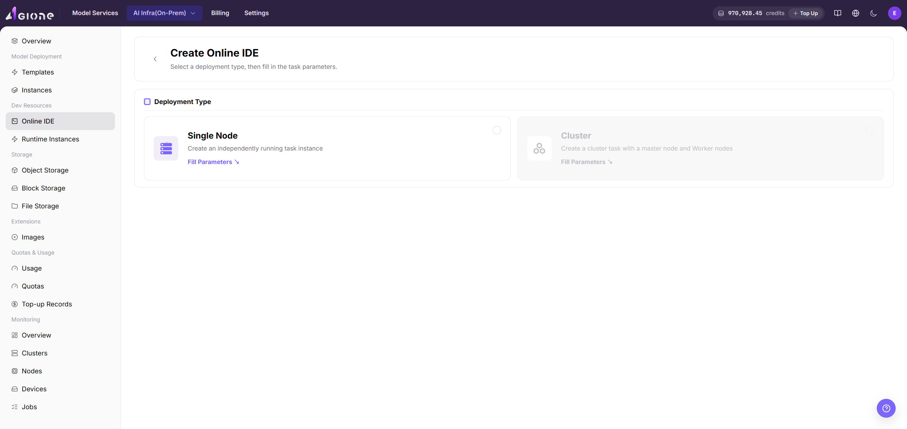
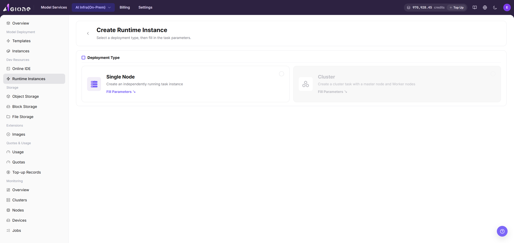

# On-Prem Development, Training & Assets

This scenario guides users through creating an On-Prem development or training environment and preserving code, data, images, models, and outputs as reusable assets.

## Applicable Roles

- Platform User creating development or training workloads
- Platform Operator preparing images, storage, compute, quota, and monitoring

## Target Outcome

- Users can create development or training environments with an available image, flavor, and storage.
- Code and data reside on persistent storage instead of an ephemeral container filesystem.
- Customized environments can be saved as images and model outputs can be stored in controlled locations.
- Logs, monitoring, and usage remain visible, and idle resources can be released.

## Before You Start

1. The operator has enabled the target region, images, storage, flavors, and tenant quota.
2. Estimate CPU, memory, accelerator, and runtime requirements.
3. Prepare the code repository, data paths, base image, and output directory.
4. Confirm data governance, image provenance, and external network boundaries.

## Procedure

1. Prepare object or file storage and confirm that data and output paths are accessible. See [Object Storage](../../../usermanual/ai-infra-on-prem/user/storage/object-storage/) and [File Storage](../../../usermanual/ai-infra-on-prem/user/storage/file-storage/).
2. Prepare or select a versioned runtime image that the target region can pull. See [Image Service](../../../usermanual/ai-infra-on-prem/user/extensions/images/).
3. Open [Development Environments](../../../usermanual/ai-infra-on-prem/user/dev-resources/online-ide/), create an online IDE, select the image and resource specification, mount the persistent workspace, and confirm that the IDE opens normally.

4. Open [Model Training](../../../usermanual/ai-infra-on-prem/user/dev-resources/runtime-instances/), create a training or batch runtime instance, review code, data, output directory, and startup command, and confirm that the workload runs and emits logs.

5. Preserve images, models, and outputs in controlled storage so later workloads can reuse them.
6. Review [Job Monitoring](../../../usermanual/ai-infra-on-prem/user/monitoring/jobs/) and [Resource Usage](../../../usermanual/ai-infra-on-prem/user/quotas-usage/usage/), then stop idle instances.

## Asset Guidance

| Asset | Recommended Location | Do Not Keep Only In |
| --- | --- | --- |
| Code and configuration | Version control and persistent workspace | Ephemeral container directory |
| Datasets | Object or file storage | Local temporary disk |
| Runtime environment | Versioned image | Manual installation notes |
| Model weights | Controlled object storage or model directory | One instance filesystem |
| Logs and outputs | Persistent output directory | Terminal scrollback |

## Completion Checklist

> **Purpose:** These are the exit criteria for the current feature task. Use them to decide whether the result is observable and reviewable and whether you can continue to the next step in the scenario. They do not repeat the procedure; if any item fails, follow the troubleshooting section below.

| Check | Pass Criteria |
| --- | --- |
| 1 | The development or training instance is healthy without repeated errors. |
| 2 | Persistent code and data remain available after restart or rebuild. |
| 3 | Images, models, and outputs have clear versions and owners. |
| 4 | Flavor, runtime, and usage records match expectations. |
| 5 | Unused instances and temporary resources are stopped or removed. |

## Troubleshooting

| Symptom | Check First |
| --- | --- |
| No image or flavor is available | Region, authorization, image state, cluster association, and quota |
| IDE cannot be opened | Instance state, service port, network entry, and logs |
| Data is missing | Storage component, mount path, permissions, and region |
| Workload remains pending or fails | Capacity, image, command, accelerator, and quota |
| Artifacts disappear | Whether they were written to temporary storage and synchronized before completion |
