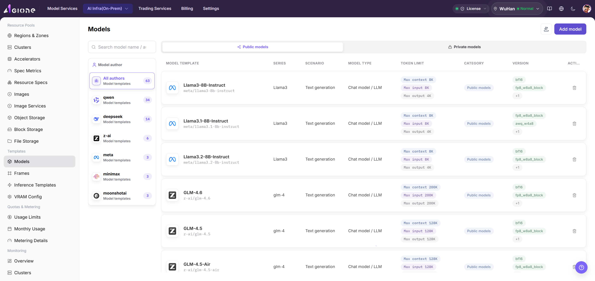
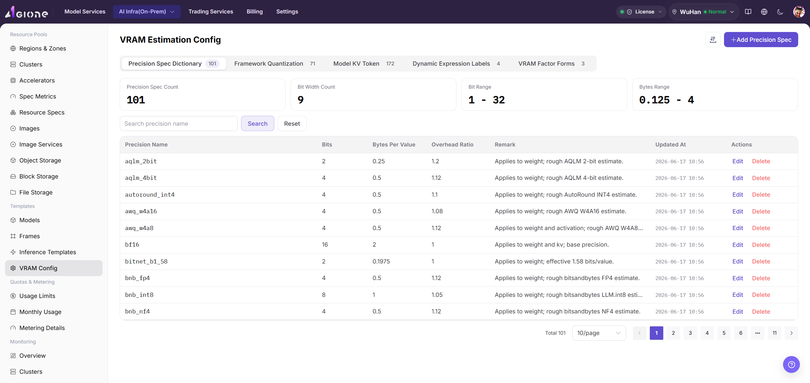

# Build an NPU Inference Template

## Target Outcome

The template exposes a compatible framework, model, runtime configuration, and one-card or four-card NPU plan.

## Applicable Roles

- Platform Operator

## Before You Start

- Prepare the model configuration, framework, image, resource specification, ports, and storage requirements.
- Decide whether four cards form one distributed instance or several smaller instances.

## Entry

- **Role:** Operator
- **Menu:** AI Infra (On-Prem) > Templates > Inference Templates
- **Route:** `/powerone/fast-build-v2/inference-templates`

## Steps

1. Open [Model Configuration](../../../../usermanual/ai-infra-on-prem/operator/templates/model-config/) and confirm that model name, type, storage location, and state are available.

2. Open [Inference Frameworks](../../../../usermanual/ai-infra-on-prem/operator/templates/frameworks/) and confirm that framework version and runtime image support the target NPU.
3. Open [VRAM Estimation](../../../../usermanual/ai-infra-on-prem/operator/templates/vram-config/) and confirm one-card and multi-card memory requirements for the parameter scale, precision, and parallel method.

4. Create a template, enter its purpose, and select the prepared model configuration and inference framework.
5. Select a resource specification with the target NPU model, card count, and memory.
6. Configure the command, environment variables, ports, health check, and model path.
7. Align multi-card parallel parameters with the two-card or four-card specification.
8. Save and validate image, driver, VRAM, and startup parameters through a test deployment.

## Four-NPU Strategy

- Keep separate one-card, two-card, and four-card templates.
- State whether a four-card template requires one node or supports multi-node deployment.
- Validate drivers, runtime, collective communication, and health checks with a small model first.

## Completion Checklist

> **Purpose:** These are the exit criteria for the current feature task. Use them to decide whether the result is observable and reviewable and whether you can continue to the next step in the scenario. They do not repeat the procedure; if any item fails, follow the troubleshooting section below.

| Check | Pass Criteria |
| --- | --- |
| 1 | Model, framework, VRAM estimation, and template records are visible and available. |
| 2 | Its flavor contains the expected NPU model and count. |
| 3 | A test deployment reaches a creating or running state. |

## Troubleshooting

| Symptom | Check First |
| --- | --- |
| Framework or model is unavailable | Status, region, compatibility, and template prerequisites |
| Four-card deployment cannot start | Specification, distributed parameters, free cards, ports, and storage |

## User Manual

[Inference Templates](/usermanual/ai-infra-on-prem/operator/templates/inference-templates/)
