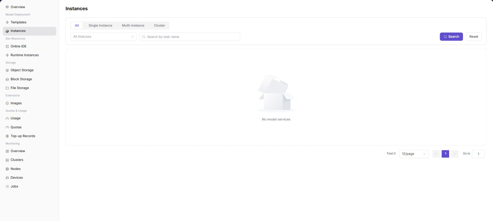

# Deploy and Check a Model

## Target Outcome

The instance reaches Running, events and logs remain clean, and a controlled request validates the selected NPU plan.

## Applicable Roles

- Platform User
- Model Provider
- Platform Operator when infrastructure troubleshooting is required

## Before You Start

- Confirm template availability, tenant quota, storage, and the intended one-card or four-card plan.
- Prepare a harmless test request and record the instance name.

## Entry

- **Role:** Provider / End User
- **Menu:** AI Infra (On-Prem) > Model Deployment > Deployment Templates / Model Instances
- **Instance route:** `/powerone/quickstart/model-service`

## Steps

1. Select a published NPU inference template.
2. Select a one-card, two-card, or four-card flavor and enter instance parameters.
3. Submit and locate the instance on the Model Instances page.
4. If creation stalls, inspect workload events, image pulls, and scheduling results.
5. When running, verify the endpoint, health status, and actual NPU allocation.

## Status Guide

| State | Action |
| --- | --- |
| Creating | Wait for image pull and scheduling; inspect workload events |
| Running | Verify health, endpoint, and device usage |
| Queued | Check quota, flavor, and available NPU count |
| Failed | Check image, command, driver, storage, and multi-card communication |

## Four-NPU Validation Focus

- A four-card instance must actually occupy four cards; do not rely on the template name alone.
- If the four-card specification cannot be scheduled, validate one card first, then two cards, and finally four cards.
- A sufficient cluster-wide card total does not guarantee that one scheduling topology can satisfy a four-card request.

## Completion Checklist

> **Purpose:** These are the exit criteria for the current feature task. Use them to decide whether the result is observable and reviewable and whether you can continue to the next step in the scenario. They do not repeat the procedure; if any item fails, follow the troubleshooting section below.

| Check | Pass Criteria |
| --- | --- |
| 1 | The instance is running. |
| 2 | Device monitoring shows the requested cards assigned to the workload. |
| 3 | A minimal service request succeeds. |

## Troubleshooting

| Symptom | Check First |
| --- | --- |
| Instance remains queued | Tenant quota, free cards, specification, cluster association, and scheduler events |
| Instance runs but calls fail | Logs, model path, ports, protocol, request parameters, and rate limits |

## User Manual

[Model Instances](/usermanual/ai-infra-on-prem/user/model-deployment/instances/)
