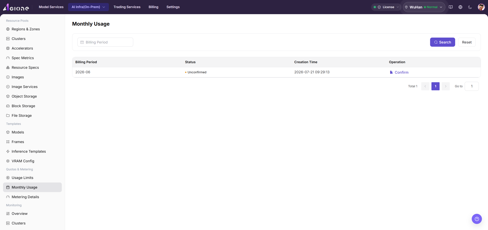
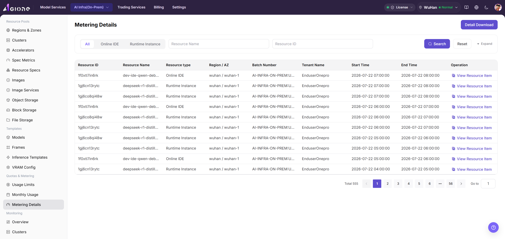

# Reconcile On-Prem Monthly Metering and Details

## Target Outcome

Map tenant credits, monthly usage, and metering details to actual instances or workloads for the same tenant and billing cycle.

## Applicable Roles

- Platform Operator
- Model Provider and Platform User reviewing their own resource consumption

## Before You Start

- Identify the target tenant, billing cycle, instance or workload ID, and metering unit.
- Confirm that monitoring and metering collection is reporting and start and end times are traceable.

## Steps

1. Open the quota, credit, or usage governance page provided by the current UI, and review opening, allocated, used, and remaining amounts where available.

2. Open [Monthly Usage](../../../../usermanual/ai-infra-on-prem/operator/quotas-metering/monthly-usage/), select the same tenant and billing cycle, and review resource type, specification, and summarized usage.

3. Open [Metering Details](../../../../usermanual/ai-infra-on-prem/operator/quotas-metering/metering-details/) and trace totals by instance, workload, and time range.

4. Compare runtime and specification in device, node, and workload monitoring. Confirm that end time, card count, and metering unit agree.

## Completion Checklist

> **Purpose:** These checks explain why credits changed and which workloads form the monthly total. Do not stop after viewing only a summary number.

| Check | Pass Criteria |
| --- | --- |
| Credit changes | Opening, allocation, deductions, and remaining credits can be explained. |
| Monthly total | Tenant, cycle, resource type, and metering unit are consistent. |
| Detail trace | Summarized usage maps to instances or workloads and time ranges. |
| Monitoring match | Card count, runtime, and end time agree with monitoring records. |

## Troubleshooting

| Symptom | Check First |
| --- | --- |
| Monthly usage differs from detail totals | Billing-cycle boundary, time zone, aggregation delay, and metering unit |
| Usage continues after the instance stops | Workload end time, residual instance, and state synchronization |
| Credits remain but workload creation fails | Tenant quota, specification capacity, template, and free cluster resources |
