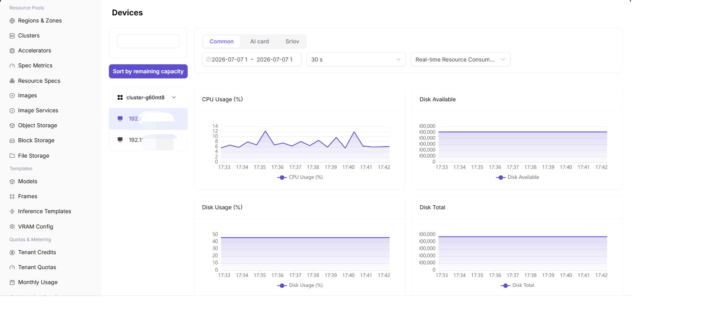
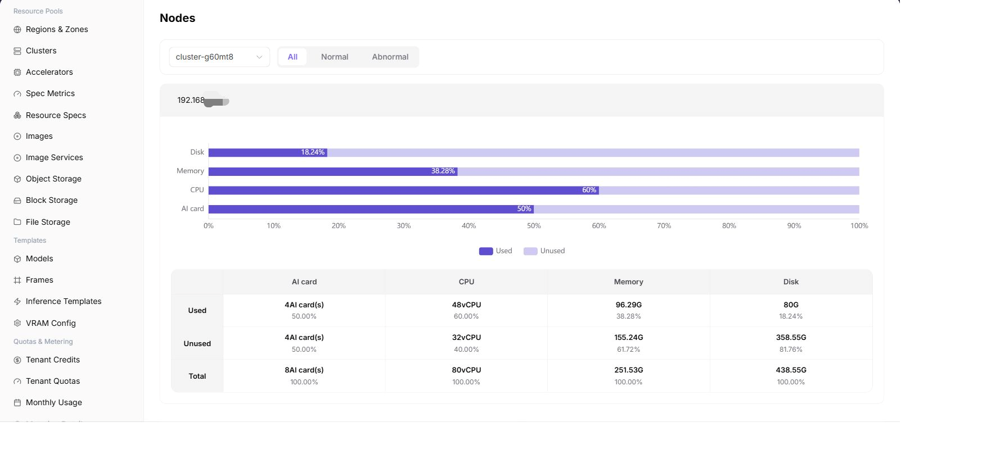

# Monitor Devices, Nodes, and Workloads

## Target Outcome

All four NPU cards have traceable health and utilization, and each abnormal signal can be linked to a node and workload.

## Applicable Roles

- Platform Operator
- Platform User reviewing authorized workload monitoring

## Before You Start

- Record the cluster, node, device, and workload names used during onboarding and deployment.
- Use one common time range for device, node, and workload comparisons.

## Entry

- **Role:** Operator
- **Menu:** AI Infra (On-Prem) > Monitoring > Device / Node / Workload Monitoring
- **Routes:** `/powerone/monitor/device`, `/powerone/monitor/node`, `/powerone/monitor/work`

## Steps

1. In **Device Monitoring**, verify that all four NPU cards are visible and compare utilization, memory, temperature, and health for each card.

2. In **Node Monitoring**, verify that accelerator nodes are Ready and not resource constrained.

3. In **Workload Monitoring**, locate the deployment or training job using each card.

4. Correlate an abnormal device with its node and workload before choosing a hardware, driver, quota, or application fix.

## Four-NPU Inspection Table

| Check | Expected Result |
| --- | --- |
| Device count | All four cards are visible |
| Health state | No offline card, missing card, or persistent alert |
| Device usage | Matches the card count requested by running workloads |
| Node state | Ready, with metrics updating continuously |
| Workload state | No abnormal queueing or repeated failure |

## Completion Checklist

> **Purpose:** These are the exit criteria for the current feature task. Use them to decide whether the result is observable and reviewable and whether you can continue to the next step in the scenario. They do not repeat the procedure; if any item fails, follow the troubleshooting section below.

| Check | Pass Criteria |
| --- | --- |
| 1 | Every device maps to a node and occupying workload. |
| 2 | Requested card count, device usage, and tenant quota agree. |
| 3 | A single unhealthy card can be isolated without treating the entire cluster as unavailable. |

## Troubleshooting

| Symptom | Check First |
| --- | --- |
| Device metrics are empty | Monitoring agent, device plug-in, time range, cluster state, and device mapping |
| A card is idle while jobs wait | Requested specification, scheduler events, node labels, quota, and card health |

## User Manual

- [Device Monitoring](/usermanual/ai-infra-on-prem/operator/monitoring/devices/)
- [Node Monitoring](/usermanual/ai-infra-on-prem/operator/monitoring/nodes/)
- [Workload Monitoring](/usermanual/ai-infra-on-prem/operator/monitoring/jobs/)
