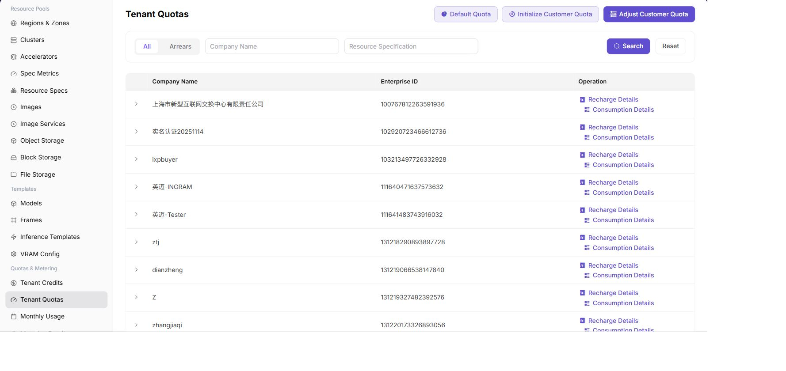

# Configure Tenant NPU Quota

## Target Outcome

The tenant can request approved NPU plans without reserving more than its share of the four-card pool.

## Applicable Roles

- Platform Operator

## Before You Start

- Confirm total four-card capacity, current allocations, and whether quota is counted by card or specification.
- Define the tenant's maximum concurrent one-card, two-card, and four-card workloads.

## Entry

- **Role:** Operator
- **Menu:** AI Infra (On-Prem) > Quotas & Metering > Tenant Quotas
- **Route:** `/powerone/quota-metric/tenant`

## Steps

1. Locate the tenant.
2. Review the NPU quota and current usage.
3. Set the limit to at least four when one workload must use all four cards.
4. Save and verify that the four-card flavor is selectable for the user.
5. Submit a test workload and verify that quota usage changes.

## Quota Strategy

- With only four physical cards, avoid granting multiple tenants a simultaneous guaranteed four-card allocation.
- A four-card flavor and a tenant limit of four are separate requirements; both must pass.
- Reserve operational capacity when the cards should not be occupied permanently.

## Completion Checklist

> **Purpose:** These are the exit criteria for the current feature task. Use them to decide whether the result is observable and reviewable and whether you can continue to the next step in the scenario. They do not repeat the procedure; if any item fails, follow the troubleshooting section below.

| Check | Pass Criteria |
| --- | --- |
| 1 | Tenant quota is updated. |
| 2 | Authorized NPU flavors are selectable. |
| 3 | Insufficient quota produces a clear result instead of unexplained queuing. |

## Troubleshooting

| Symptom | Check First |
| --- | --- |
| Quota looks sufficient but creation fails | Specification availability, tenant credits, capacity, and current workloads |
| Quota does not recover after release | Instance final state, metering delay, and stale allocation |

## User Manual

For operator-side verification, use [Metering Details](../../../../usermanual/ai-infra-on-prem/operator/quotas-metering/metering-details/) and [Monthly Usage](../../../../usermanual/ai-infra-on-prem/operator/quotas-metering/monthly-usage/).
