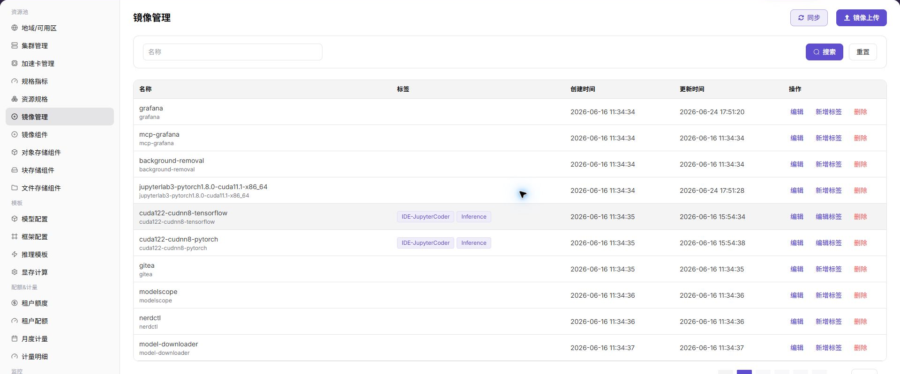
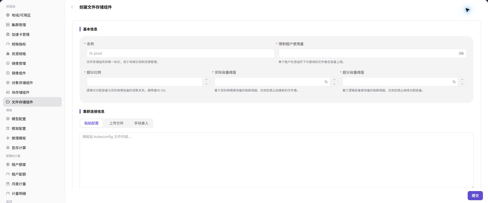

# Configure On-Prem Runtime Images and Storage

Use this task to prepare runtime images and storage for an onboarded local cluster.

## Applicable Roles

- Platform Operators, on-prem compute administrators, and storage administrators

## Before You Start

1. Confirm that the target region and cluster are onboarded and nodes are healthy.
2. Confirm that cluster nodes can reach the image registry and storage services.
3. Prepare minimum-privilege registry and storage credentials and the certificate policy.
4. Define the test workload, image version, capacity, and access requirements.

## Procedure

### 1. Register and Validate the Image Service

Open [Image Services](../../../usermanual/ai-infra-on-prem/operator/resource-pools/image-services/), enter the registry endpoint, authentication information, and associated region. After registration, review service and synchronization state. A registry that opens in a browser may still be unreachable from cluster nodes.

### 2. Synchronize or Upload Runtime Images

Open [Image Management](../../../usermanual/ai-infra-on-prem/operator/resource-pools/images/) and synchronize the registry or upload an image record. Use stable labels that identify framework, version, hardware environment, and purpose. Do not rely only on `latest` in production.

### 3. Select Storage for the Workload

- Register [Block Storage](../../../usermanual/ai-infra-on-prem/operator/resource-pools/block-storage/) for independent persistent volumes.
- Register [File Storage](../../../usermanual/ai-infra-on-prem/operator/resource-pools/file-storage/) when multiple workloads share a directory.
- Register [Object Storage](../../../usermanual/ai-infra-on-prem/operator/resource-pools/object-storage/) for datasets, model packages, or output objects.

Enter connection information, capacity, access policy, and associated region, then return to the list and confirm the state.

### 4. Bind the Region and Run a Combined Validation

Confirm that image and storage components are associated with the target region or cluster. Create a minimal test workload and validate image pull, startup, volume mounting, or object access. After it ends, confirm data-retention and resource-reclaim behavior.

## Completion Checklist

> **Purpose:** These checks confirm that the current foundation supports a real workload. Do not create IDE, training, or inference instances at scale while any check fails.

| Check | Pass Criteria |
| --- | --- |
| Image registry | Cluster nodes can reach it and authentication and synchronization are healthy. |
| Runtime image | A test instance can pull the explicit target version. |
| Storage capability | Target storage can be created, mounted, read/written, or accessed and reclaimed as configured. |
| Region binding | Images and storage are available in the correct region, cluster, and tenant scope. |
| Operations ownership | Owners for capacity, backup, deletion, and credential rotation are clear. |

## Troubleshooting

| Symptom | Check First |
| --- | --- |
| Instance reports an image-pull failure | Full image path, tag, registry authentication, certificate, and node network |
| Image exists in the platform but users cannot select it | Synchronization, region binding, tenant permission, and label state |
| Volume cannot be created or mounted | CSI/storage driver, access mode, capacity, network, and authentication |
| Object or shared directory cannot be accessed | Endpoint, path or bucket, access policy, and tenant isolation |
