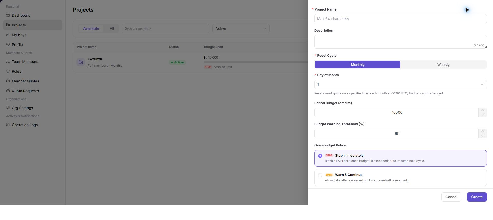
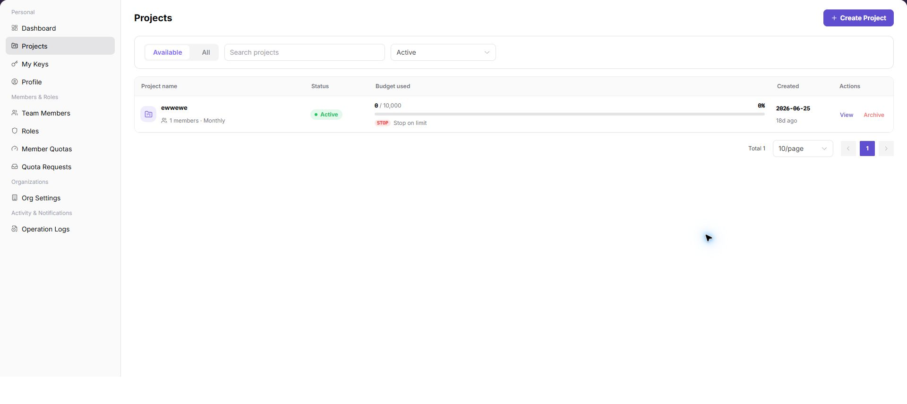

# Configure Projects, Keys, and Budgets

Use this task to create a project with a budget, model scope, and independent calling credential.

## Applicable Roles

- Model Providers, platform users, and provider administrators

## Before You Start

- Confirm permission to create projects and keys in the target organization.
- Identify the project owner, members, budget cycle, model scope, and over-budget policy.
- Decide whether the workload needs a Model API Key or System API AK/SK pair.

## Procedure

### 1. Create a Project

Open [Projects](../../../usermanual/settings/user/personal/projects/), select Create Project, and enter the name, description, reset cycle, cycle budget, alert threshold, over-budget policy, and model allowlist.

### 2. Review Project Details

Open the project from the list and review Overview, Members, Usage, API Keys, Activity, and Settings. Confirm that project state and budget rules were saved.

### 3. Create a Purpose-Specific Key

Open [My Keys](../../../usermanual/settings/user/personal/my-keys/), choose Model API Keys or System API AK/SK Pairs, and enter a name, purpose, and expiration time. Use separate keys for production, testing, and temporary work.

### 4. Set Key Limits and Validate

Set the reset cycle, cycle limit, alert threshold, and limit-reached policy in line with the project budget. Run a controlled request to verify that the model allowlist, project budget, and key limit all apply.

## Completion Checklist

> **Purpose:** These checks confirm that the project and its credentials are ready for controlled use. Resolve failed checks before distributing the key.

| Check | Pass Criteria |
| --- | --- |
| Project rules | Budget, alert, over-budget policy, and model allowlist are saved. |
| Key boundary | Purpose, validity period, limit, and owner are clear. |
| Call validation | Allowed models work; disallowed or over-limit requests are restricted as configured. |
| Audit records | Project and key changes can be located in activity or operation logs. |

## Troubleshooting

| Symptom | Check First |
| --- | --- |
| Calls stop after the project reaches its budget | Used budget, over-budget policy, and reset cycle |
| Key call fails | Key state, expiration, project budget, member quota, and model allowlist |
| Project or key is not visible | Account role, organization membership, and menu permission |
| Workload fails after key rotation | Caller configuration update and whether the old key was disabled too early |
