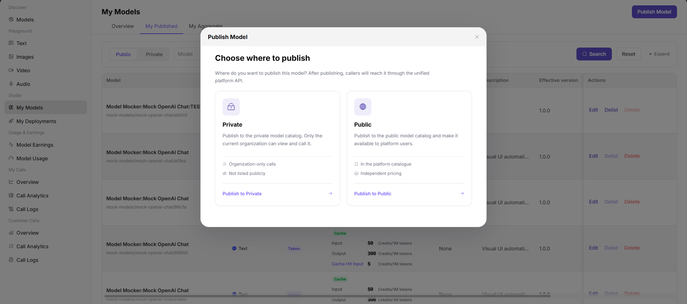
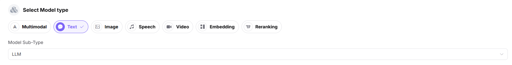
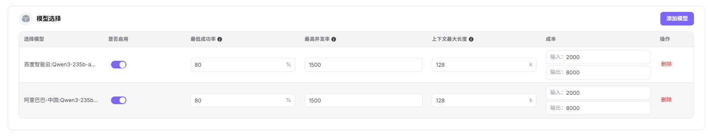

# Publish an Aggregation Model

## Applicable Roles

- Model Provider

## Before You Start

- Prepare at least two healthy published member models with compatible protocols and modalities.
- Decide whether the aggregation objective is cost, success rate, load distribution, or high availability.
- Compare member billing, context, concurrency, and region differences.

## Procedure

1. From the platform home page, select **My Models** in the left navigation.
2. Open the **My Aggregations** tab. Use **Public Models / Private Models** to switch between publication areas.
3. Select **Create Aggregation Model** in the upper-right corner.
4. Select a publication area:
   - **Publish to Private Area** makes the aggregation visible only within the team or tenant and does not list it in the public catalog.
   - **Publish to Public Area** lists the aggregation in the public catalog for all tenants and allows independent pricing and rate limits.
5. Select **Publish to Public Area** to open Step 1.

### Step 1: Basic Information

- Select the **Model Type**, such as Multimodal, Chat, Image, Speech, Video, Embedding, or Rerank.
- Select the **Model Subtype**, such as LLM.

- Under **Model Selection**, select **Add Model**:
  - Filter the model-name and model-identifier list on the left.
  - Review provider instances on the right, including publication date, context, input and output price, throughput, success rate, weekly calls, weekly tokens, maximum output, region, and capabilities.
  - Select one or more compatible provider instances and select **Confirm**.

- Configure each member model:
  - **Enabled** controls whether the member participates in routing.
  - **Minimum Success Rate**, such as 80%.
  - **Maximum Concurrency**, such as 1500.
  - **Maximum Context Length**, such as 128K.
  - Input-token and output-token **Cost**.
  - **Delete** removes the member.

- Complete the aggregation's basic information:
  - Enter a **Custom Identifier**, such as `Qwen3-235b-a22b-instruct-2507`.
  - Select a **Matching Policy**: Cost First, Success Rate First, Balanced Cost and Experience, Random, or Round Robin.
  - Select tags, such as Text Generation.
  - Enter a description.

- Select **Publish Immediately** or **Scheduled Publication**.

- Select **Next** to open Step 2.

### Step 2: Billing Configuration

- Select **Free** or **Paid** billing.
- For paid billing, select Uniform Billing, Input/Output Billing, or Tiered Billing.
- Configure prices in Credits per 1M tokens:
  - **Original Input Price** is the input reference price shown for comparison.
  - **Input Sale Price** is the actual settlement price for model input.
  - **Original Output Price** is the output reference price shown for comparison.
  - **Output Sale Price** is the actual settlement price for model output.

- Select **Save Only** or **Submit for Review**.

#### Parameter Reference - Aggregation Model

| Field | Type | Example | Description |
| --- | --- | --- | --- |
| Model Type | Single select | `Chat / Image` | Required; aggregation model function |
| Model Subtype | Select | `LLM` | Required; specific model subtype |
| Member Models | List selection | `Multiple provider instances` | Required; select at least two published models |
| Enabled | Switch | `On / Off` | Required; controls whether the member receives traffic |
| Minimum Success Rate | Percentage | `80%` | Required; members below the threshold are excluded |
| Maximum Concurrency | Number | `1500` | Required; maximum concurrent requests for the member |
| Maximum Context Length | Number | `128K` | Required; member context limit |
| Input Token Cost | Number | `2000` | Required; cost per million input tokens |
| Output Token Cost | Number | `8000` | Required; cost per million output tokens |
| Custom Identifier | Text | `Qwen3-235b-a22b-instruct-2507` | Required; public aggregation identifier |
| Matching Policy | Single select | `Cost First / Success Rate First / Balanced / Random / Round Robin` | Required; request-routing policy |
| Tags | Select | `Text Generation` | Optional; aggregation tags |
| Description | Text | `Aggregation model...` | Optional; aggregation description |
| Publication Method | Single select | `Immediate / Scheduled` | Required; publication time |
| Billing Method | Single select | `Free / Paid` | Required; whether calls are billed |
| Billing Mode | Single select | `Uniform / Input-Output / Tiered` | Required for paid models |
| Original Input Price | Number | `40.00 Credits/1M tokens` | Optional; input reference price |
| Input Sale Price | Number | `20.00 Credits/1M tokens` | Required; actual input settlement price |
| Original Output Price | Number | `160.00 Credits/1M tokens` | Optional; output reference price |
| Output Sale Price | Number | `80.00 Credits/1M tokens` | Required; actual output settlement price |

## Completion Checklist

> **Purpose:** These are the exit criteria for the current feature task. Use them to decide whether the result is observable and reviewable and whether you can continue to the next step in the scenario. They do not repeat the procedure; if any item fails, follow the troubleshooting section below.

| Check | Pass Criteria |
| --- | --- |
| 1 | The aggregation contains at least two enabled member models. |
| 2 | The matching policy fits the business objective and member thresholds and costs are complete. |
| 3 | Publication or review status is correct. |
| 4 | A controlled request succeeds through the aggregation endpoint. |
| 5 | Remaining members accept traffic when one member is disabled. |

## Troubleshooting

| Symptom | Check First |
| --- | --- |
| No member model can be selected | Publication state, modality, protocol, and visibility |
| Submission fails | Member count, required fields, billing, and publication area |
| Requests always select one member | Matching policy, enabled state, success-rate threshold, and cost |
| Aggregation calls fail | Member health, protocol compatibility, rate limits, and timeout |

## User Manual

- [Publish and Call a Model](../../../usermanual/model-services/end-to-end/publish-and-call-model/)
- [My Models](../../../usermanual/model-services/user/studio/my-models/)
