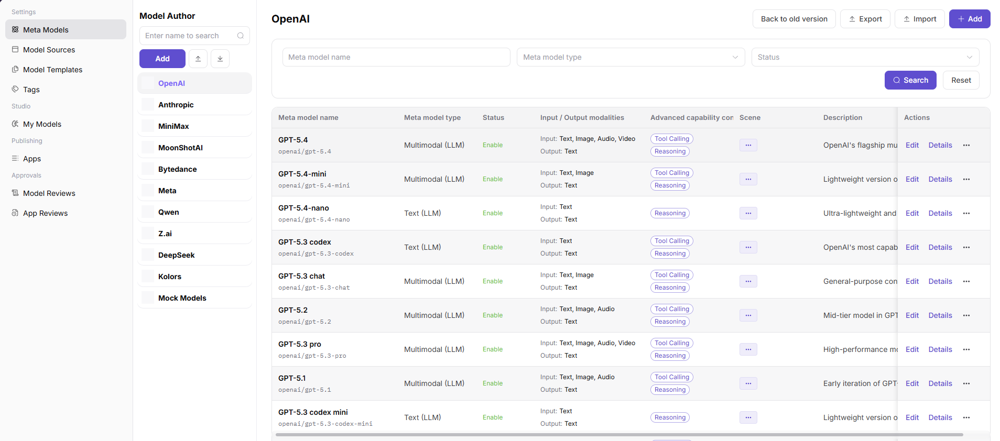
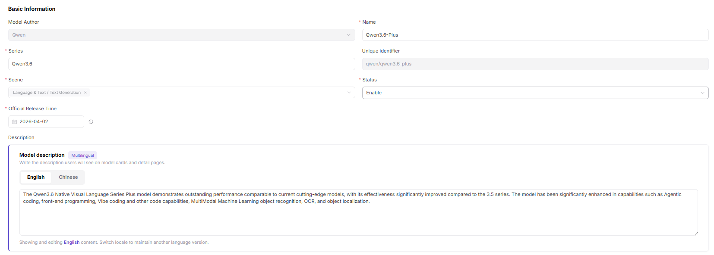
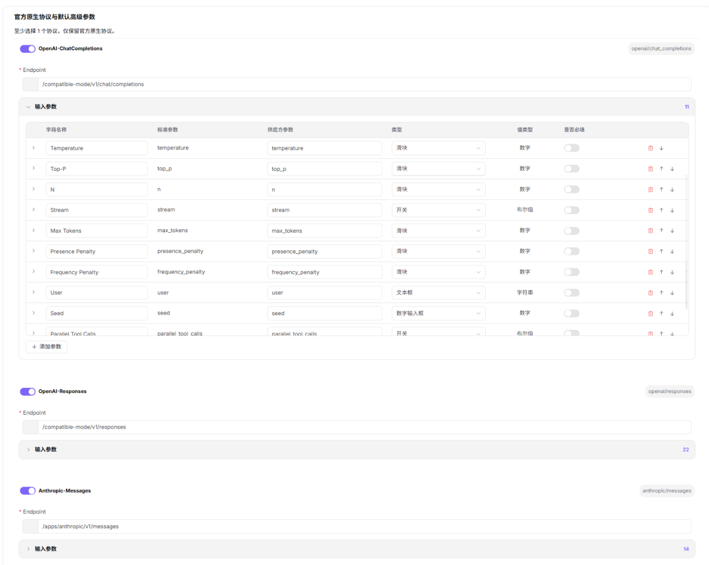
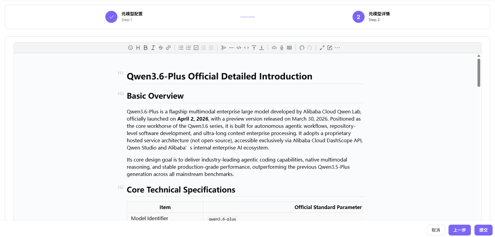

# Meta-Models

Meta-models define reusable model identity and capability metadata before providers publish concrete services.

## Target Outcome

The canonical model identity, modalities, capabilities, token limits, and supported protocols are reusable by templates and model publication.

## Applicable Roles

- Platform Operator

## Before You Start

- Confirm the model author, unique identifier, type, modalities, capabilities, and official limits.
- Use authoritative model documentation as the source for protocol and token values.

## Procedure

1. Open **Settings > Meta-Models** and review the list to avoid creating a duplicate model identity.

2. Create or select the official model author before defining the model family.

3. Enter the canonical name, unique identifier, family, and other basic information.

4. Select the model type and only the variants supported by authoritative model documentation.

5. Define the supported input and output modalities.

6. Enable only advanced capabilities that have been confirmed for this model family.

7. Enter context, input, and output token limits from the authoritative specification.

8. Configure each supported official native protocol and its parameter definitions.

9. Review the meta-model details, save, and confirm that model templates can select it.

See [Meta-Models in the User Manual](../../../../usermanual/model-services/operator/settings/meta-models/).

## Completion Checklist

> **Purpose:** These are the exit criteria for the current feature task. Use them to decide whether the result is observable and reviewable and whether you can continue to the next step in the scenario. They do not repeat the procedure; if any item fails, follow the troubleshooting section below.

| Check | Pass Criteria |
| --- | --- |
| 1 | Author, model family, and variants use stable naming. |
| 2 | Modalities, token limits, capabilities, and protocols match the real model. |
| 3 | Providers and templates can select the meta-model. |

## Troubleshooting

| Symptom | Check First |
| --- | --- |
| Providers cannot select the meta-model | Status, author association, unique identifier, and template linkage |
| Calls exceed limits unexpectedly | Context, input, output, modality, and protocol limits |
