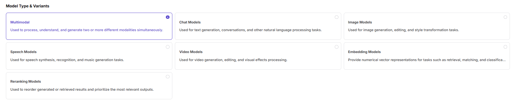

# Meta-Models

## Target Outcome

Model identity, modalities, capabilities, token limits, and protocols are maintained consistently for reuse by templates and model publication.

## Applicable Roles

- Platform Operator

## Before You Start

- Confirm the model author, unique identifier, type, modalities, capabilities, and official limits.
- Use authoritative provider documentation as the source for protocol and token values.

## Procedure

1. From the platform home page, select **Meta-Models** in the left navigation.
2. Select **Add** above the model-author list.

3. Configure the model author:
   - Enter a stable **Unique Identifier**, such as `qwen`.
   - Maintain English and Chinese **Display Names**, such as Qwen and 通义千问.
   - Upload the application icon.
4. Review the information and select **Confirm**, or **Cancel** to discard it.

### Parameter Reference - Model Author

| Field | Type | Example | Description |
| --- | --- | --- | --- |
| Unique Identifier | Text | `qwen` | Required; stable author identifier |
| Display Name | Localized text | `Qwen / 通义千问` | Required; maintain English and Chinese values |
| Application Icon | Image | `Qwen brand icon` | Required; author icon |

### Add a Meta-Model

1. Select the target author and select **+ Add** in the meta-model list.
2. Complete the basic information:
   - Select the model author.
   - Enter the model name and series.
   - Enter the unique identifier, such as `qwen/qwen3.6-plus`.
   - Select the application scenario.
   - Select Enabled or Disabled.
   - Enter the official release date.
   - Maintain the English and Chinese model descriptions in the localized rich-text editor.

1. Under **Model Type and Subtype**, select every type supported by the model: Multimodal, Chat, Image, Speech, Video, Embedding, or Rerank.

1. Under **Input / Output Modalities**, select the verified Text, Image, Audio, and Video inputs and outputs.

1. Under **Advanced Capabilities**, enable Thinking Mode only when the model has been verified to support it. Function Calling and Tool Support remain planned capabilities and must not be configured as currently available features.

1. Enter maximum context, maximum input, and maximum output values under **Token Limits**.

1. Under **Official Native Protocols and Default Parameters**, enable supported protocols such as OpenAI Chat Completions, OpenAI Responses, or Anthropic Messages. Enter each endpoint and configure inputs such as Temperature, Top-P, N, Stream, Max Tokens, Presence Penalty, Frequency Penalty, User, and Seed.

1. Select **Next**.
2. Enter complete model details in the rich-text editor.

3. Review the configuration and select **Submit**.

### Parameter Reference - Meta-Model

| Field | Type | Example | Description |
| --- | --- | --- | --- |
| Model Author | Select | `Qwen` | Required; model author |
| Name | Text | `Qwen3.6-Plus` | Required; meta-model name |
| Series | Text | `Qwen3.6` | Required; model series |
| Unique Identifier | Text | `qwen/qwen3.6-plus` | Required; stable system identifier |
| Scenario | Select | `Language and Text / Text Generation` | Required; application scenario |
| Status | Select | `Enabled / Disabled` | Required; model availability |
| Official Release Date | Date | `2026-04-02` | Required; provider release date |
| Localized Description | Localized rich text | `English and Chinese descriptions` | Required; localized introduction |
| Model Type | Multi-select | `Multimodal / Chat / Image / Speech / Video / Embedding / Rerank` | Required; verified model types |
| Input Modalities | Multi-select | `Text / Image / Audio / Video` | Required; accepted input types |
| Output Modalities | Multi-select | `Text / Image / Audio / Video` | Required; result types |
| Function / Tool Support | Planned state | `Planned` | Not available as a current configuration |
| Thinking Mode | Switch | `On / Off` | Optional; enable only when verified |
| Maximum Context | Number | `1024K` | Required; context-token limit |
| Maximum Input | Number | `991K` | Required; input-token limit |
| Maximum Output | Number | `64K` | Required; output-token limit |
| OpenAI Chat Completions | Switch and protocol ID | `openai/chat_completions` | Required when supported; configure endpoint and inputs |
| OpenAI Responses | Switch and protocol ID | `openai/responses` | Required when supported; configure endpoint and inputs |
| Anthropic Messages | Switch and protocol ID | `anthropic/messages` | Required when supported; configure endpoint and inputs |
| Endpoint | URL | `/compatible-mode/v1/chat/completions` | Required; protocol endpoint path |
| Input Parameters | Parameter list | `Temperature / Top-P / N / Stream / Max Tokens / Presence Penalty / Frequency Penalty / User / Seed` | Optional; protocol inputs and required-state settings |
| Meta-Model Details | Rich text | `Features and parameter description` | Required; complete model description |

## Completion Checklist

> **Purpose:** These are the exit criteria for the current feature task. Use them to decide whether the result is observable and reviewable and whether you can continue to the next step in the scenario. They do not repeat the procedure; if any item fails, follow the troubleshooting section below.

| Check | Pass Criteria |
| --- | --- |
| 1 | Unique identifier, modalities, capabilities, and token limits are accurate. |
| 2 | At least one supported protocol and its parameters are complete. |
| 3 | Model templates can select the meta-model. |

## Troubleshooting

| Symptom | Check First |
| --- | --- |
| The meta-model is unavailable during publication | Status, author association, unique identifier, and template linkage |
| Calls exceed token limits | Context, input, output, modality, and protocol limits |

## User Manual

[Review complete fields and common issues for Meta-Models](/usermanual/model-services/operator/settings/meta-models/)
