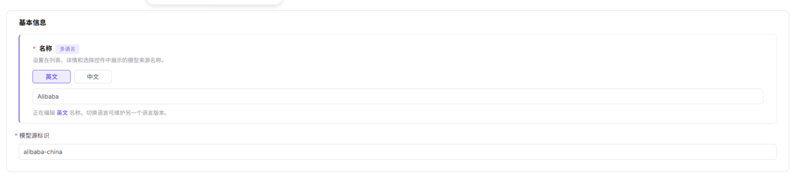

# Model Sources

Model sources define the provider endpoint and regional connection information used when providers publish model services.

## Target Outcome

Provider endpoints, regions, documentation links, and authentication-header templates are reusable without storing a real API key.

## Applicable Roles

- Platform Operator

## Before You Start

- Confirm the provider base URL, supported regions, key-acquisition page, and API documentation.
- Define authentication headers with placeholders instead of real credentials.

## Procedure

1. Open **Settings > Model Sources**, review existing records, and create the provider source only if it does not already exist.

2. Enter the source name, unique identifier, provider documentation links, and other basic information.

3. Add each supported region and its reachable base URL.

4. Define required request-header names with placeholders rather than real credentials, save, and confirm that templates can select the source.

See [Model Sources in the User Manual](../../../../usermanual/model-services/operator/settings/model-source/).

## Completion Checklist

> **Purpose:** These are the exit criteria for the current feature task. Use them to decide whether the result is observable and reviewable and whether you can continue to the next step in the scenario. They do not repeat the procedure; if any item fails, follow the troubleshooting section below.

| Check | Pass Criteria |
| --- | --- |
| 1 | Source name and regional endpoints are correct. |
| 2 | Required headers and authentication type are documented without real secrets. |
| 3 | The source is selectable and connectivity testing can run. |

## Troubleshooting

| Symptom | Check First |
| --- | --- |
| Connectivity testing fails | Base URL, region, network route, header template, and provider state |
| Templates cannot use the source | Source status, unique identifier, region, and provider mapping |
