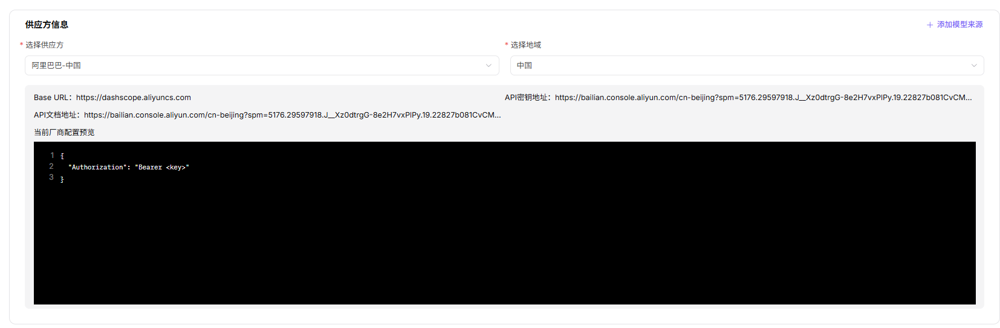
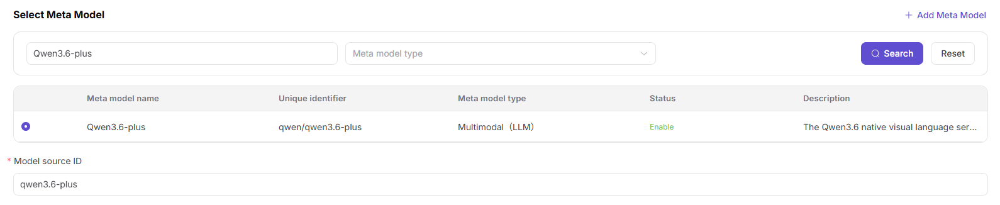
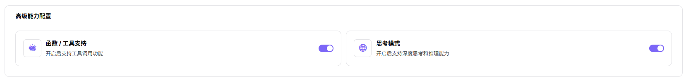
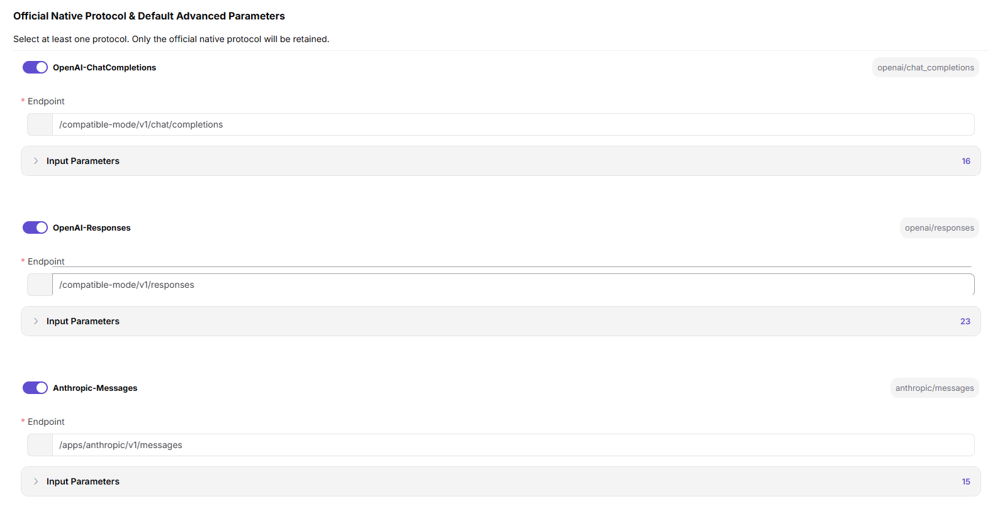
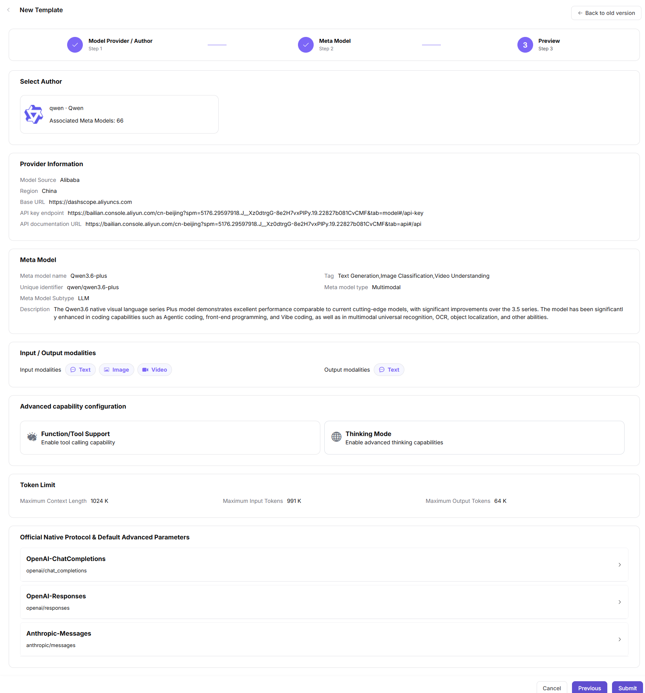

# Model Templates

## Target Outcome

A model source and meta-model are combined into a reusable publication template with accurate modalities, limits, protocols, and default parameters.

## Applicable Roles

- Platform Operator

## Before You Start

- Prepare the model author, model source, region, and meta-model.
- Confirm the provider model ID, capabilities, token limits, protocol endpoint, and defaults.

## Procedure

1. From the platform home page, select **Model Templates** in the left navigation.
2. Select **Add** in the upper-right corner.

3. Under **Step 1: Provider and Author**:
   - Select an author card, or select **+ Add Author** to create one.

   - Select the required provider and region.
   - Review the current provider configuration, including Base URL, API-key URL, API-documentation URL, and request-header template.
   - Select **+ Add Model Source** when a required source is missing.

   - Select **Next**.
4. Under **Step 2: Meta-Model**:
   - Search by meta-model name or unique identifier and filter by type.
   - Select the prepared meta-model, or select **+ Add Meta-Model**.
   - Enter the exact upstream **Model Source ID**, such as `qwen3.6-plus`.

   - Select verified input and output modalities.

   - Enable Thinking Mode only when the model has been verified to support it. Function Calling and Tool Support remain planned capabilities and must not be configured as currently available features.

   - Enter maximum context, maximum input, and maximum output values.

   - Select at least one supported protocol, enter its endpoint, and configure default inputs.

   - Select **Next**.
1. Under **Step 3: Preview**, review the author, provider, region, meta-model, modalities, advanced capabilities, token limits, and protocol defaults. Select **Submit**, or return to a previous step to correct the configuration.

### Parameter Reference - Basic Associations (Step 1)

| Field | Type | Example | Description |
| --- | --- | --- | --- |
| Model Author | Card selection | `qwen / Qwen` | Required; template author |
| Provider | Select | `Alibaba - China` | Required; upstream model provider |
| Region | Select | `China` | Required; provider region |
| Base URL Preview | URL | `https://dashscope.aliyuncs.com` | Read-only; model-service base URL |
| API Key URL Preview | URL | `https://bailian.console.aliyun.com/...` | Read-only; official API-key page |
| API Documentation Preview | URL | `https://bailian.console.aliyun.com/...` | Read-only; official API documentation |
| Request Header Preview | JSON | `{ "Authorization": "Bearer <key>" }` | Read-only; placeholder header template |

### Parameter Reference - Meta-Model Configuration (Step 2)

| Field | Type | Example | Description |
| --- | --- | --- | --- |
| Meta-Model | Single select | `Qwen3.6-plus` | Required; meta-model used by the template |
| Model Source ID | Text | `qwen3.6-plus` | Required; exact upstream model identifier |
| Input Modalities | Multi-select | `Text / Image / Video` | Required; accepted input types |
| Output Modalities | Multi-select | `Text` | Required; result types |
| Function / Tool Support | Planned state | `Planned` | Not available as a current configuration |
| Thinking Mode | Switch | `On / Off` | Optional; enable only when verified |
| Maximum Context | Number | `1024K` | Required; context-token limit |
| Maximum Input | Number | `991K` | Required; input-token limit |
| Maximum Output | Number | `64K` | Required; output-token limit |
| OpenAI Chat Completions | Switch and protocol ID | `openai/chat_completions` | Required when supported |
| OpenAI Responses | Switch and protocol ID | `openai/responses` | Required when supported |
| Anthropic Messages | Switch and protocol ID | `anthropic/messages` | Required when supported |
| Endpoint | URL | `/compatible-mode/v1/chat/completions` | Required; protocol endpoint path |
| Input Parameters | Parameter list | `Temperature / Top-P / N / Stream / Max Tokens / Presence Penalty / Frequency Penalty / User / Seed` | Optional; protocol inputs and required-state settings |

## Completion Checklist

> **Purpose:** These are the exit criteria for the current feature task. Use them to decide whether the result is observable and reviewable and whether you can continue to the next step in the scenario. They do not repeat the procedure; if any item fails, follow the troubleshooting section below.

| Check | Pass Criteria |
| --- | --- |
| 1 | Author, source, region, and meta-model associations are correct. |
| 2 | Modalities, token limits, protocols, and defaults match provider documentation. |
| 3 | Model Providers can select the template during publication. |

## Troubleshooting

| Symptom | Check First |
| --- | --- |
| The template is absent during publication | Template status, source region, meta-model, and provider association |
| Template defaults are incorrect | Model ID, modalities, token limits, endpoint, and protocol parameters |

## User Manual

[Review complete fields and common issues for Model Templates](/usermanual/model-services/operator/settings/model-templates/)
