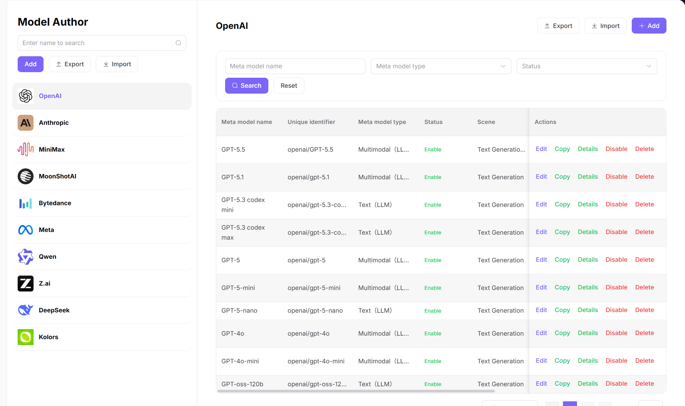
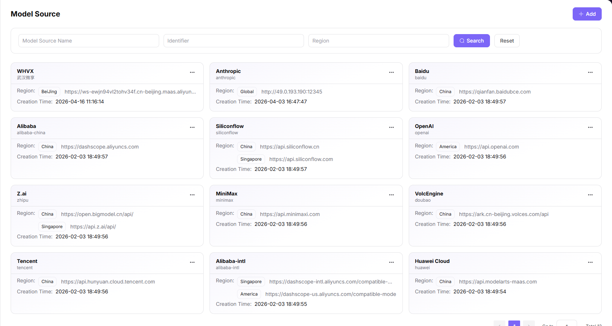
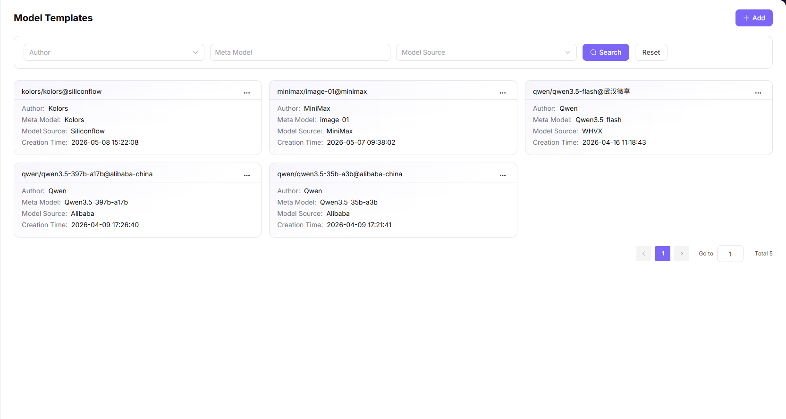
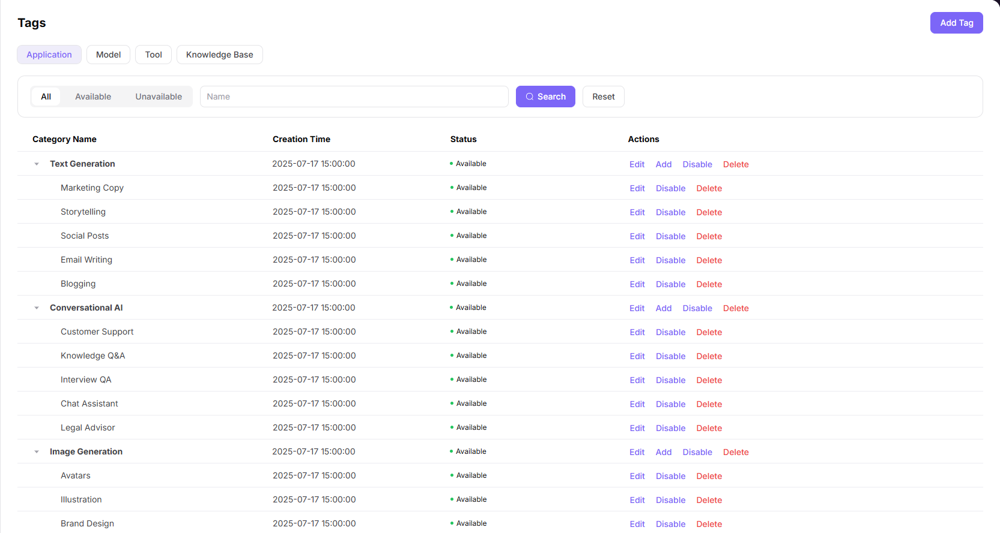
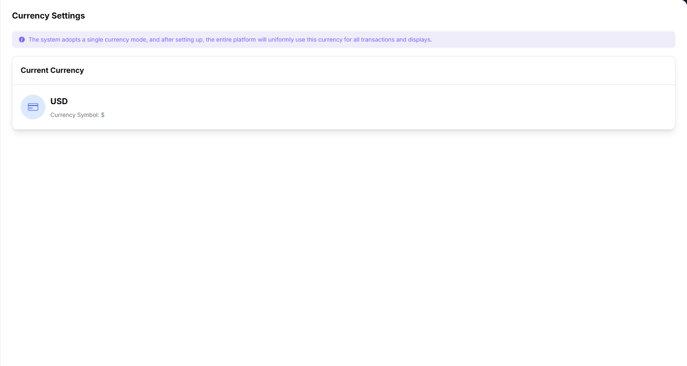
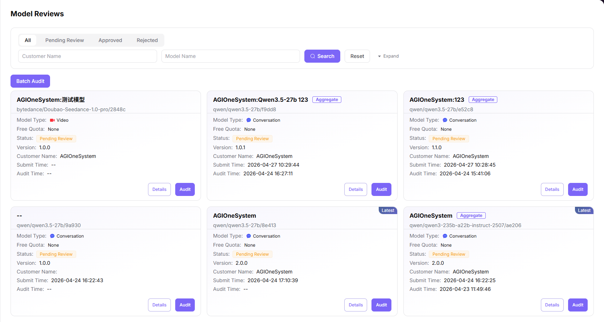

# Model Publishing: Preconfiguration Guide

This guide explains the preconfiguration that an Operator needs to complete in **Model Services** before a Provider publishes a public model.

Before you begin, sign in to AGIOne with an Operator account, open **"Model Services"**, and confirm that **"Settings"** and **"Approvals"** are available in the left-side menu.

## 1. Add Meta-models

1. In the left-side menu, go to **"Settings > Meta-models"**.
2. Click **"Add"** above the model author list on the left.
3. Fill in the model author's **Unique Identifier**, for example `qwen`.
4. Configure the model author's English and Chinese display names.
5. Upload the model author icon.
6. Click **"Confirm"** to save the model author.
7. Select the model author you just created in the model author list.
8. Click **"+ Add"** on the right-side meta-model list.
9. Fill in the meta-model name and series.
10. Select the model scenario.
11. Set the status to **Enabled**.
12. Fill in the official release date.
13. Select the model type.
    - Select according to the model's actual capability, such as Chat Model, Image Model, or Multimodal Model.
14. Configure input / output modalities.
    - Multiple selections are supported.
    - Select according to the interaction media supported by the model, such as Text, Image, Audio, or Video.
15. Enable advanced capabilities according to the model capability.
    - Enable only capabilities actually supported by the model, such as Function Calling, Tool Support, or Thinking Mode.
    - Do not enable capabilities that the model does not support.
16. Set Token Limits.
    - Fill in Max Context, Max Input, and Max Output according to the model's official capability.
    - Avoid values that exceed the model capability, otherwise the Provider may fail model testing during publishing.
17. Select the official native protocol.
    - Multiple selections are supported.
    - Select protocols compatible with the model service, such as `OpenAI-ChatCompletions` or `OpenAI-Responses`.
18. Fill in the meta-model details.
19. Click **"Submit"** to save the meta-model.

Meta-models provide the base data for templates and model publishing. After a meta-model is disabled, models published based on it cannot provide services externally.

## 2. Add Model Source

1. In the left-side menu, go to **"Settings > Model Source"**.
2. Click **"Add"** at the top right of the page.
3. Fill in the model source's English and Chinese names.
4. Fill in the Model Source Identifier, for example `alibaba-china`.
    - It is used to distinguish different model sources.
    - Keep it stable after saving to avoid affecting later template associations.
5. Add region information.
    - If one model source has multiple regional nodes, add multiple regions.
    - The Provider needs to select the actual invocation region when publishing a model.
6. Fill in the region identifier and region name.
7. Fill in **BASE URL**.
    - Fill in the base API address of the model service.
    - Do not fill in a specific model path or a single endpoint path.
8. Fill in the API Key Address.
    - Fill in the official page where Providers can obtain API keys.
9. Fill in the API Documentation Address.
    - Fill in the model service documentation address for later protocol, Endpoint, and parameter checks.
10. Configure the request header authentication field, for example `Authorization`.
11. Configure the authentication value template, for example `Bearer <key>`.
    - Use only a template or placeholder.
    - Do not enter a real API Key.
12. Click **"Confirm"** to save the model source.

Do not enter or expose a real API Key here. Public documentation should only keep placeholders. Real keys should be entered by the Provider during model publishing or protocol testing according to permission control.

## 3. Add Templates

1. In the left-side menu, go to **"Settings > Model Templates"**.
2. Click **"Add"** at the top right of the page.
3. Select the model author.
    - Select an author already created in **"Settings > Meta-models"**.
4. Select the model source.
    - Select a source already created in **"Settings > Model Source"**.
5. Select the region under the model source.
    - Select a region already created in **"Settings > Model Source"**.
6. Click **"Next"**.
7. Select the meta-model.
    - Select an enabled meta-model.
8. Fill in the Model Source ID.
    - Fill in the real model identifier from the source platform, such as the model id in the provider documentation or console.
9. Configure input / output modalities.
    - Multiple selections are supported.
    - Keep them consistent with the meta-model configuration.
10. Enable advanced capabilities as needed.
    - Keep them consistent with the meta-model and the actual source service capability.
11. Set Token Limits.
    - Keep them consistent with the meta-model and the actual source service capability.
12. Select the official native protocol.
    - Multiple selections are supported.
    - Keep it consistent with the meta-model configuration and the protocols supported by the source service.
13. Click **"Next"**.
14. Review the model author, model source, region, meta-model, Model Source ID, modalities, Token Limits, and protocol.
15. Click **"Submit"** to save the template.

Templates connect the model author, model source, region, meta-model, Model Source ID, and protocol capabilities. If a template is missing or incomplete, the Provider may not be able to select the target configuration during publishing, or protocol testing may fail.

## 4. Add Model Tags

1. In the left-side menu, go to **"Settings > Tags"**.
2. Select the model-related tag type.
    - Do not create model tags under App, Tool, or Knowledge Base tag types.
3. To add a new tag, click **"Add Tag"**.
4. Fill in the tag code, for example `text_generation`.
    - It is not recommended to modify it after saving.
    - Use a stable and readable English code.
5. Configure English and Chinese names.
    - Maintain both English and Chinese names to avoid incomplete display in multilingual environments.
6. Configure remarks.
7. Click **"Confirm"** to save.
8. Confirm that the tag is available in the tag list.
9. If the tag already exists but is disabled, click **"Enable"**.
10. If hierarchical display is needed, add child tags under the first-level tag.
    - If hierarchy is not needed, keep only the first-level tag.

Tags are used for model marketplace classification and display. Prepare commonly used tags before public model publishing to avoid unclear classification or missing tag-based filtering after the model is listed.

## 5. Confirm Currency Settings

1. In the left-side menu, go to **"Settings > Currency Settings"**.
2. Check the current platform-wide currency.
    - The current currency is used for platform-wide transaction and fee display.
3. If the public model is paid, confirm that the currency matches the operating pricing policy.
4. If the currency needs to be changed, click the current currency card.
5. Select the target currency in the dialog.
    - Changing currency affects the platform fee display.
    - Confirm the impact on pricing, user-facing display, and historical record display before switching.
6. Confirm and save.

Currency settings affect platform-wide transaction and fee display. It is not recommended to change them casually after online transactions already exist.

## 6. Review Model Publishing Requests

1. After the Provider publishes a model and submits it for review, go to **"Approvals > Model Reviews"** in the left-side menu.
2. Find the model pending review in the model review list.
    - Filter by Pending, Approved, or Rejected status.
    - Prioritize models pending review.
3. If you need to narrow the scope, filter by model type.
    - You can filter by Chat Model, Image Model, Video Model, Multimodal Model, and other model types.
4. Click **"Details"** to view model information, configuration, and test status.
5. Check model name, model type, version, customer, tags, billing configuration, and rate limit configuration.
6. Confirm that protocol testing has passed.
7. Click **"Review"**.
8. If the information is correct, approve the request.
    - Approve only when model information, protocol testing, billing, rate limits, and tags all meet requirements.
9. If information is incomplete, protocol testing is abnormal, or the configuration does not meet platform requirements, reject the request.
    - Rejection applies to missing information, failed protocol testing, non-compliant configuration, or display risks.
10. When rejecting, provide a reason so the Provider can revise and resubmit.

Only after the model review is approved can the public model become externally visible or available.

## 7. Pre-publishing Checklist

Before the Provider submits a public model, the Operator should confirm at least the following:

1. **Meta-model is enabled**: model author, meta-model, modalities, Token Limits, and official native protocol are configured.
2. **Model source is available**: source identifier, region, BASE URL, API documentation address, and authentication request headers are configured.
3. **Template is complete**: template is associated with model author, model source, region, meta-model, Model Source ID, and protocol.
4. **Tags are available**: tags needed for model marketplace display are created and enabled.
5. **Currency is confirmed**: the currency used by paid models matches the operating pricing policy.
6. **Review entry is available**: the Operator can view and process model publishing requests in **"Approvals > Model Reviews"**.

## 8. Remember These Points

1. Do not write API Keys, AK/SK, cookies, real request header values, or account passwords in public documentation.
2. Model source, meta-model, and template must match each other; otherwise, the Provider may lack options during publishing or fail protocol testing.
3. Public models become externally visible after publishing, so verify name, tags, billing, rate limits, and protocol test results before approval.
4. This guide applies only to Model Services model publishing preconfiguration.
