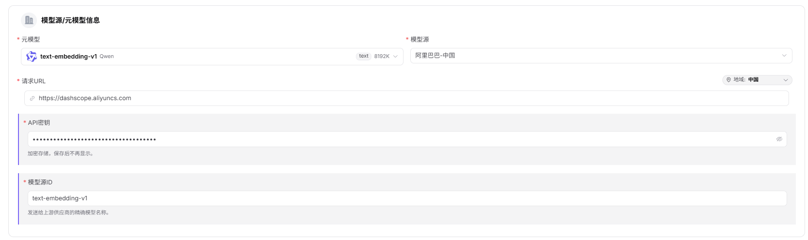
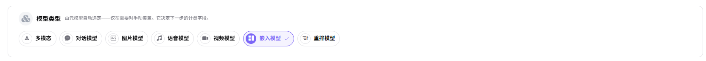
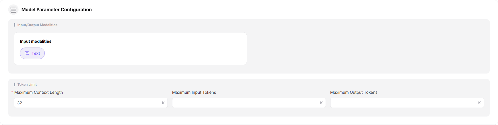
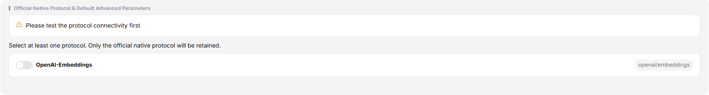
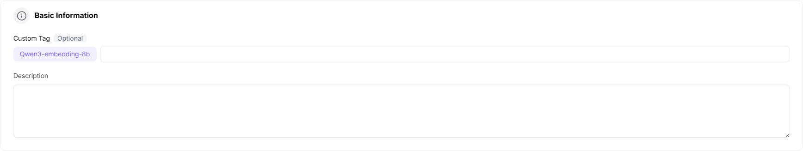
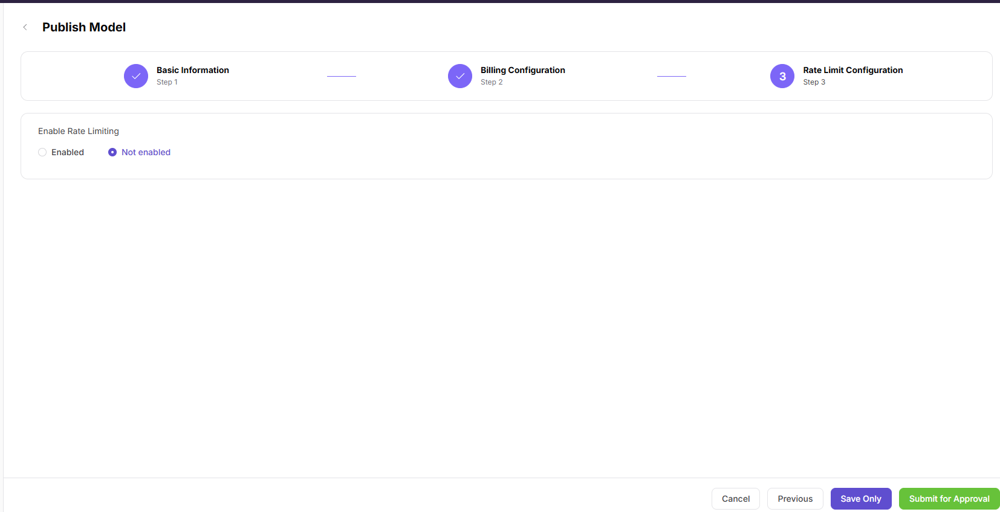

# Publish a Model (Embedding)

## Target Outcome

The embedding model passes protocol testing, is published to the intended scope, and returns vectors with the expected dimensions.

## Applicable Roles

- Model Provider

## Before You Start

- Prepare the model source, model identifier, API credential, and embedding endpoint.
- Confirm the input format, vector dimensions, billing unit, and rate-limit policy.

## Procedure

1. From the platform home page, select **My Models** in the left navigation.
2. Open **My Publications**. Use **Public Models / Private Models** to switch publication areas, or open **Overview** and **My Aggregations** when needed.
3. Select **Publish Model** in the upper-right corner.
4. Select a publication area:
   - **Publish to Private Area** makes the model visible only within the team or tenant and keeps it out of the public catalog.
   - **Publish to Public Area** lists the model in the public catalog for all tenants and allows independent pricing and rate limits.
5. Select **Publish to Public Area** to open Step 1.

### Step 1: Basic Information

- Under **Model Source / Meta-Model Information**:
  - Select a meta-model, such as `text-embedding-v1`.
  - Select a model source, such as Alibaba - China.
  - Enter the request URL, such as `https://dashscope.aliyuncs.com`.
  - Enter the API key in the protected field, such as `sk-***`.
  - Enter the exact upstream **Model Source ID**, such as `text-embedding-v1`.

- Confirm that **Model Type** is **Embedding Model**.

- Under **Request Headers**, keep the default `Authorization: Bearer <key>` template and add only headers required by the upstream service.

- Under **Model Parameters**:
  - Set the input modality to Text.
  - Embedding models have no output-modality option because the output is a vector.
  - Set maximum context and maximum input, such as 8192K. Leave maximum output empty when the embedding service does not use output tokens.

- Under **Supported Protocols and Default Parameters**, select `OpenAI-Embeddings`, run the connectivity test, enter the endpoint, and configure inputs such as Encoding Format and Input. Embedding models use synchronous calls with a fixed response structure and therefore have no callback or result-parsing section.

- Enter the public **Custom Identifier** and description.

- Select **Publish Immediately** or **Scheduled Publication**.

- Select **Next** to open Step 2.

### Step 2: Billing Configuration

- Select **Token Billing** or **Free**.
- For token billing:
  - Enable **Show Price Comparison** when a reference price should be displayed.
  - Enter the input sale price and optional original price. Embedding models do not use output-price, cache, or tier configuration.
  - Optionally configure a free quota, eligible-user count, and total amount.

- Select **Next** to open Step 3.

### Step 3: Rate-Limit Configuration

- Select **Enable Rate Limiting** or **Disabled**.
- Configure default limits:
  - **RPM**: requests per minute, or Unlimited.
  - **TPM**: tokens per minute, or Unlimited.

- Select **Save Only** or **Submit for Review**.

#### Parameter Reference - Embedding Model

| Field | Type | Example | Description |
| --- | --- | --- | --- |
| Meta-Model | Select | `text-embedding-v1` | Required; base meta-model |
| Model Source | Select | `Alibaba - China` | Required; upstream model provider |
| Request URL | URL | `https://dashscope.aliyuncs.com` | Required; model-service base URL |
| API Key | Password | `sk-***` | Required; protected upstream credential |
| Model Source ID | Text | `text-embedding-v1` | Required; exact upstream model name |
| Model Type | Single select | `Embedding Model` | Required; no subtype |
| Request Headers | Key-value pairs | `Authorization: Bearer <key>` | Optional; authentication and custom headers |
| Input Modality | Multi-select | `Text` | Required; accepted input type |
| Output Modality | Not applicable | None | Embedding output is a vector |
| Maximum Context | Number | `8192K` | Required; context-token limit |
| Maximum Input | Number | `8192K` | Required; input-token limit |
| Maximum Output | Number | Empty | Embedding models do not use output-token limits |
| Supported Protocol | Multi-select | `OpenAI-Embeddings` | Required; test connectivity before continuing |
| Endpoint | URL | `https://dashscope.aliyuncs.com/compatible-mode/v1/embeddings` | Required; protocol endpoint |
| Input Parameters | Parameter list | `Encoding Format / Input` | Optional; protocol inputs and required-state settings |
| Custom Identifier | Text | `text-embedding-v1` | Required; model identifier shown to users |
| Description | Text | `Text embedding...` | Optional; model description |
| Publication Method | Single select | `Immediate / Scheduled` | Required; publication time |
| Billing Method | Single select | `Token Billing / Free` | Required; billing method |
| Show Price Comparison | Switch | `On / Off` | Optional; displays an original reference price |
| Input Sale Price | Number | `7 Credits/1M tokens` | Required for paid models |
| Original Price | Number | `14 Credits/1M tokens` | Optional; input reference price |
| Free Quota | Switch | `On / Off` | Optional; configures free usage quota |
| Rate Limiting | Single select | `Enabled / Disabled` | Optional; controls invocation limits |
| RPM | Number / Unlimited | `2 requests/minute` | Optional; request limit per minute |
| TPM | Number / Unlimited | `100 tokens/minute` | Optional; token limit per minute |

## Completion Checklist

> **Purpose:** These are the exit criteria for the current feature task. Use them to decide whether the result is observable and reviewable and whether you can continue to the next step in the scenario. They do not repeat the procedure; if any item fails, follow the troubleshooting section below.

| Check | Pass Criteria |
| --- | --- |
| 1 | Protocol connectivity passes and the model source and identifier are accurate. |
| 2 | Publication or review status is correct. |
| 3 | A controlled call returns vectors with the expected dimensions and the call log is traceable. |

## Troubleshooting

| Symptom | Check First |
| --- | --- |
| Protocol test fails | Endpoint, credential, model identifier, request body, and source network access |
| Vector response is invalid | Input format, dimensions, response mapping, and selected protocol |

## User Manual

[Review complete My Models fields and publication-result validation](/usermanual/model-services/user/studio/my-models/)
