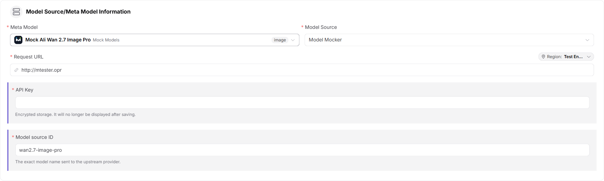
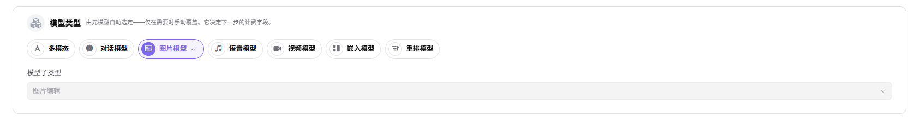
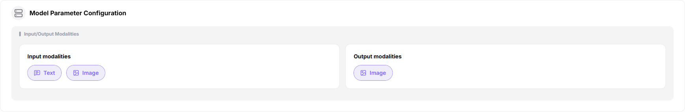
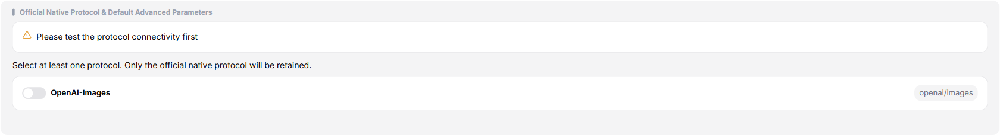
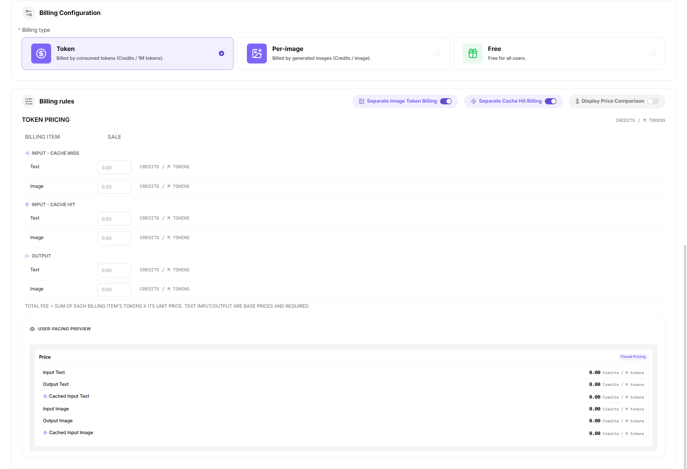

# Publish a Model (Image)

## Target Outcome

The image model passes protocol testing, is published to the intended scope, and returns an accessible image result or URL.

## Applicable Roles

- Model Provider

## Before You Start

- Prepare the model source, identifier, API credential, image endpoint, and a non-sensitive test prompt.
- Confirm supported size, format, image count, synchronous or asynchronous behavior, billing, and limits.

## Procedure

1. From the platform home page, select **My Models** in the left navigation.
2. Open **My Publications**. Use **Public Models / Private Models** to switch publication areas, or open **Overview** and **My Aggregations** when needed.
3. Select **Publish Model** in the upper-right corner.
4. Select a publication area:
   - **Publish to Private Area** makes the model visible only within the team or tenant and keeps it out of the public catalog.
   - **Publish to Public Area** lists the model in the public catalog for all tenants and allows independent pricing and rate limits.
5. Select **Publish to Public Area** to open Step 1.

### Step 1: Basic Information

- Under **Model Source / Meta-Model Information**:
  - Select a meta-model, such as `qwen-image-2.0`.
  - Select a model source, such as Alibaba - China.
  - Enter the request URL, such as `https://dashscope.aliyuncs.com`.
  - Enter the API key in the protected field, such as `sk-***`.
  - Enter the exact upstream **Model Source ID**, such as `qwen-image-2.0`.

- Confirm **Image Model** and select the correct subtype, such as Image Editing.

- Under **Request Headers**, keep the default `Authorization: Bearer <key>` template and add only headers required by the upstream service.

- Under **Model Parameters**, select supported input modalities such as Text and Image and set the output modality to Image.

- Under **Supported Protocols and Default Parameters**:
  - Select `OpenAI-Images`, run the connectivity test, and enter the endpoint.
  - Configure inputs such as Prompt, Image, Mask, N, Size, Response Format, User, Negative Prompt, Prompt Extend, and Watermark.
  - Select **Synchronous** or **Asynchronous** invocation.
  - Configure result parsing with Result Path, URL Extract Field, and Base64 Extract Field.

- Enter the public **Custom Identifier** and description.

- Select **Publish Immediately** or **Scheduled Publication**.

- Select **Next** to open Step 2.

### Step 2: Billing Configuration

- Select **Token Billing**, **Per-Image Billing**, or **Free**.
- For paid billing:
  - Enable **Show Price Comparison** when a reference price should be displayed.
  - Optionally enable tier configuration for context-based pricing.
  - Enable the image-count dimension and use `n` as the recognition field when billing per image.
  - Enter the sale price and optional original price.
  - Optionally configure a free quota, eligible-user count, and total amount.

- Select **Next** to open Step 3.

### Step 3: Rate-Limit Configuration

- Select **Enable Rate Limiting** or **Disabled**.
- Configure default RPM and TPM values, or set either limit to Unlimited.

- Select **Save Only** or **Submit for Review**.

#### Parameter Reference - Image Model

| Field | Type | Example | Description |
| --- | --- | --- | --- |
| Meta-Model | Select | `qwen-image-2.0` | Required; base meta-model |
| Model Source | Select | `Alibaba - China` | Required; upstream model provider |
| Request URL | URL | `https://dashscope.aliyuncs.com` | Required; model-service base URL |
| API Key | Password | `sk-***` | Required; protected upstream credential |
| Model Source ID | Text | `qwen-image-2.0` | Required; exact upstream model name |
| Model Type | Single select | `Image Model` | Required; model function |
| Model Subtype | Select | `Image Editing` | Required; image-model subtype |
| Request Headers | Key-value pairs | `Authorization: Bearer <key>` | Optional; authentication and custom headers |
| Input Modalities | Multi-select | `Text / Image` | Required; accepted input types |
| Output Modality | Multi-select | `Image` | Required; result type |
| Supported Protocol | Multi-select | `OpenAI-Images` | Required; test connectivity before continuing |
| Endpoint | URL | `https://dashscope.aliyuncs.com/api/v1/services/aigc/multimodal-generation/generation` | Required; protocol endpoint |
| Input Parameters | Parameter list | `Prompt / Image / Mask / N / Size / Response Format / User / Negative Prompt / Prompt Extend / Watermark` | Optional; protocol inputs and required-state settings |
| Invocation Method | Single select | `Synchronous / Asynchronous` | Required; invocation behavior |
| Result Path | Text | `output.choices[0].message.content[0].image` | Optional; path to the result payload |
| URL Extract Field | Text | `url or image_url` | Optional; field containing the result URL |
| Base64 Extract Field | Text | `b64_json` | Optional; field containing Base64 image data |
| Custom Identifier | Text | `qwen-image-2.0` | Required; model identifier shown to users |
| Description | Text | `Image generation...` | Optional; model description |
| Publication Method | Single select | `Immediate / Scheduled` | Required; publication time |
| Billing Method | Single select | `Token / Per Image / Free` | Required; billing method |
| Show Price Comparison | Switch | `On / Off` | Optional; displays an original reference price |
| Tier Configuration | Switch | `On / Off` | Optional; context-based pricing tiers |
| Image Count | Switch | `On / Off` | Optional; bills by generated-image count using `n` |
| Sale Price | Number | `2 Credits/image` | Required for paid models |
| Original Price | Number | `4 Credits/image` | Optional; reference price |
| Free Quota | Switch | `On / Off` | Optional; configures free usage quota |
| Rate Limiting | Single select | `Enabled / Disabled` | Optional; controls invocation limits |
| RPM | Number / Unlimited | `2 requests/minute` | Optional; request limit per minute |
| TPM | Number / Unlimited | `100 tokens/minute` | Optional; token limit per minute |

## Completion Checklist

> **Purpose:** These are the exit criteria for the current feature task. Use them to decide whether the result is observable and reviewable and whether you can continue to the next step in the scenario. They do not repeat the procedure; if any item fails, follow the troubleshooting section below.

| Check | Pass Criteria |
| --- | --- |
| 1 | Protocol connectivity passes and the model source and identifier are accurate. |
| 2 | Publication or review status is correct. |
| 3 | A controlled call returns an accessible image result and the call log is traceable. |

## Troubleshooting

| Symptom | Check First |
| --- | --- |
| Protocol test fails | Endpoint, credential, model identifier, request parameters, and source network access |
| The image cannot be opened | Response mapping, result URL lifetime, format, callback, and content policy |

## User Manual

[Review complete My Models fields and publication-result validation](/usermanual/model-services/user/studio/my-models/)
