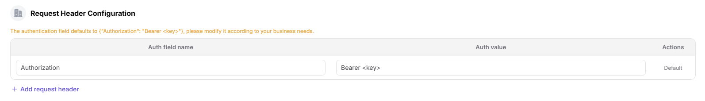
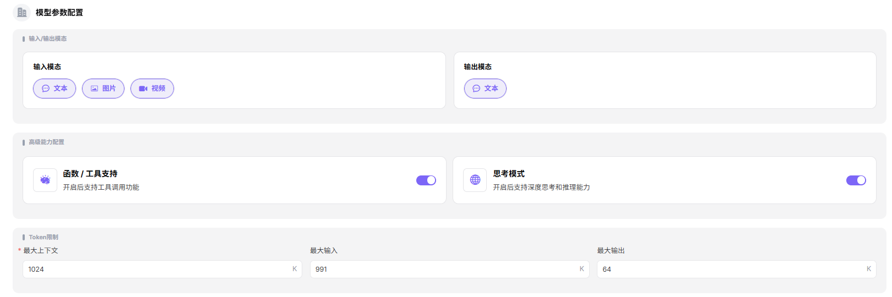
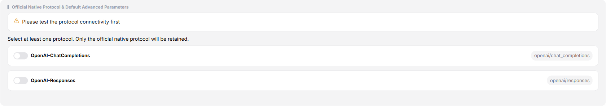
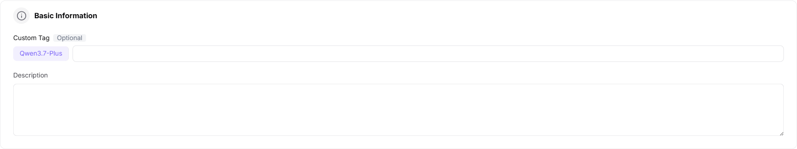
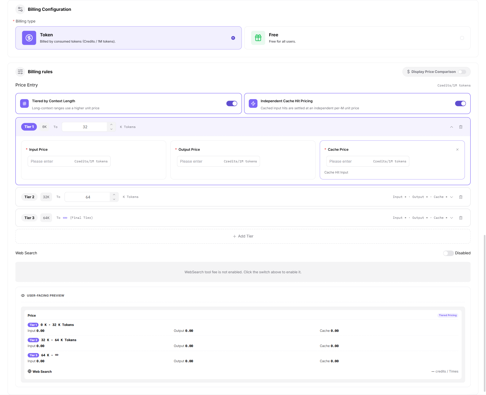

# Publish a Model (Multimodal)

## Target Outcome

The model processes every declared input modality, passes protocol testing, and is published with accurate capability labels.

## Applicable Roles

- Model Provider

## Before You Start

- Prepare the model source, identifier, API credential, endpoint, and non-sensitive text-plus-media samples.
- Confirm supported input combinations, size limits, protocol, billing, and rate limits.

## Procedure

1. From the platform home page, select **My Models** in the left navigation.
2. Open **My Publications**. Use **Public Models / Private Models** to switch publication areas, or open **Overview** and **My Aggregations** when needed.
3. Select **Publish Model** in the upper-right corner.
4. Select a publication area:
   - **Publish to Private Area** makes the model visible only within the team or tenant and keeps it out of the public catalog.
   - **Publish to Public Area** lists the model in the public catalog for all tenants and allows independent pricing and rate limits.
5. Select **Publish to Public Area** to open Step 1.

### Step 1: Basic Information

- Under **Model Source / Meta-Model Information**:
  - Select a meta-model, such as `Qwen3.6-plus`.
  - Select a model source, such as Alibaba - China.
  - Enter the request URL, such as `https://dashscope.aliyuncs.com`.
  - Enter the API key in the protected field, such as `sk-***`.
  - Enter the exact upstream **Model Source ID**, such as `qwen3.6-plus`.

- Confirm the model type, such as **Chat Model** for a multimodal conversation model.

- Under **Request Headers**, keep the default `Authorization: Bearer <key>` template and add only headers required by the upstream service.

- Under **Model Parameters**:
  - Select the verified input modalities, such as Text, Image, and Video.
  - Select the verified output modality, such as Text.
  - Enable Thinking Mode only when the model has been tested to support it. Function Calling and Tool Support remain planned capabilities and must not be configured as currently available features.
  - Set maximum context, input, and output tokens according to the upstream specification.

- Under **Supported Protocols and Default Parameters**, select one or more tested protocols, such as OpenAI Chat Completions, OpenAI Responses, or Anthropic Messages. Run connectivity testing before continuing, then enter the endpoint and configure parameters such as Temperature, Top-P, N, Stream, Max Tokens, Presence Penalty, Frequency Penalty, User, and Seed.

- Enter the public **Custom Identifier** and a description of the capabilities actually tested.

- Select **Publish Immediately** or **Scheduled Publication**.

- Select **Next** to open Step 2.

### Step 2: Billing Configuration

- Select **Token Billing** or **Free**.
- For token billing:
  - Enable **Show Price Comparison** when a reference price should be displayed.
  - Optionally enable context-length tiers.
  - Optionally enable independent cache-hit pricing.
  - Enter input, output, and cache-hit sale prices and optional original prices for each tier.
  - Optionally configure WebSearch charges and a free quota.

- Select **Next** to open Step 3.

### Step 3: Rate-Limit Configuration

- Select **Enable Rate Limiting** or **Disabled**.
- Configure default RPM and TPM values, or set either limit to Unlimited.

- Select **Save Only** or **Submit for Review**.

#### Parameter Reference - Multimodal Model

| Field | Type | Example | Description |
| --- | --- | --- | --- |
| Meta-Model | Select | `Qwen3.6-plus` | Required; base meta-model |
| Model Source | Select | `Alibaba - China` | Required; upstream model provider |
| Request URL | URL | `https://dashscope.aliyuncs.com` | Required; model-service base URL |
| API Key | Password | `sk-***` | Required; protected upstream credential |
| Model Source ID | Text | `qwen3.6-plus` | Required; exact upstream model name |
| Model Type | Single select | `Chat Model` | Required; model function |
| Request Headers | Key-value pairs | `Authorization: Bearer <key>` | Optional; authentication and custom headers |
| Input Modalities | Multi-select | `Text / Image / Video` | Required; accepted input types |
| Output Modalities | Multi-select | `Text` | Required; result types |
| Advanced Capabilities | Switch | `Thinking Mode` | Optional; enable only verified capabilities. Function Calling and Tool Support are planned. |
| Maximum Context | Number | `1024K` | Required; context-token limit |
| Maximum Input | Number | `991K` | Required; input-token limit |
| Maximum Output | Number | `64K` | Required; output-token limit |
| Supported Protocols | Multi-select | `OpenAI-ChatCompletions / OpenAI-Responses / Anthropic-Messages` | Required; test connectivity before continuing |
| Endpoint | URL | `https://dashscope.aliyuncs.com/compatible-mode/v1/chat/completions` | Required; protocol endpoint |
| Input Parameters | Parameter list | `Temperature / Top-P / N / Stream / Max Tokens / Presence Penalty / Frequency Penalty / User / Seed` | Optional; protocol inputs and required-state settings |
| Custom Identifier | Text | `Qwen3.6-plus` | Required; model identifier shown to users |
| Description | Text | `Native multimodal model...` | Optional; model description |
| Publication Method | Single select | `Immediate / Scheduled` | Required; publication time |
| Billing Method | Single select | `Token Billing / Free` | Required; billing method |
| Context-Length Tiers | Switch | `On / Off` | Optional; uses different prices for long contexts |
| Cache-Hit Pricing | Switch | `On / Off` | Optional; prices cache-hit input independently |
| Tier Prices | Group | `0K-256K and 256K+` | Required when tiers are enabled; input, output, and cache prices |
| WebSearch | Switch | `On / Off` | Optional; enables WebSearch tool charges |
| Free Quota | Switch | `On / Off` | Optional; configures free usage quota |
| Rate Limiting | Single select | `Enabled / Disabled` | Optional; controls invocation limits |
| RPM | Number / Unlimited | `2 requests/minute` | Optional; request limit per minute |
| TPM | Number / Unlimited | `100 tokens/minute` | Optional; token limit per minute |

## Completion Checklist

> **Purpose:** These are the exit criteria for the current feature task. Use them to decide whether the result is observable and reviewable and whether you can continue to the next step in the scenario. They do not repeat the procedure; if any item fails, follow the troubleshooting section below.

| Check | Pass Criteria |
| --- | --- |
| 1 | Every declared input modality passes a controlled test. |
| 2 | Publication or review status is correct and capability labels match tested behavior. |
| 3 | Invocation results and call logs are traceable. |

## Troubleshooting

| Symptom | Check First |
| --- | --- |
| Text works but media fails | Media URL accessibility, MIME type, size limit, and request structure |
| Capability labels are inaccurate | Declared modalities, tested combinations, model version, and marketplace description |

## User Manual

[Review complete My Models fields and publication-result validation](/usermanual/model-services/user/studio/my-models/)
