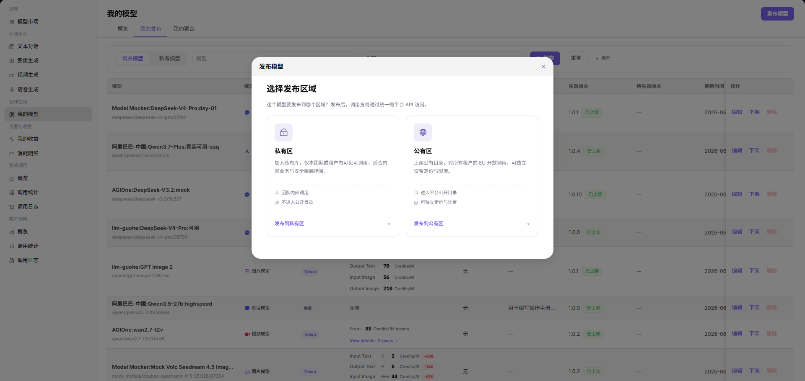

# Publish a Multimodal Conversation Model

Use the common [public model publishing flow](../provider-quick-guide), then apply these multimodal checks.

## Key Configuration

1. Select the supported input modalities, such as text, image, or video, and the expected output modality.
2. Select only protocols that can carry the configured modalities.
3. Test representative payloads for every advertised modality.
4. Configure context, token limits, tools, reasoning, and optional web search.
5. Configure billing for tokens, cache hits, and optional tool usage.

See [My Models](../../../../usermanual/model-services/user/studio/my-models/) for the maintained field reference.

## Completion Checklist

- [ ] Every advertised modality passes a controlled protocol test.
- [ ] Unsupported modality combinations are not exposed.
- [ ] Billing and limits cover multimodal input size and output behavior.
- [ ] The published model works in the corresponding Playground.

## Feature Screenshot

