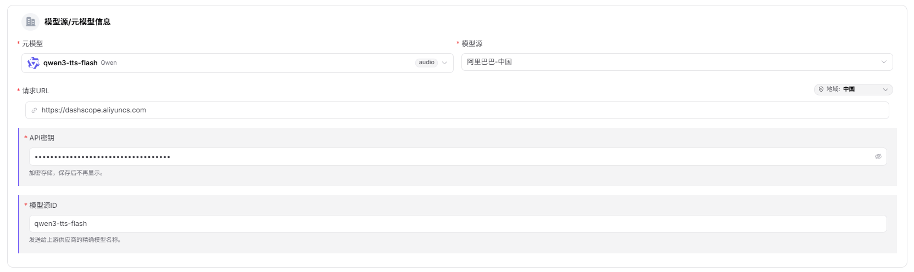
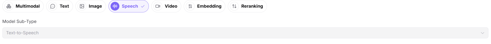
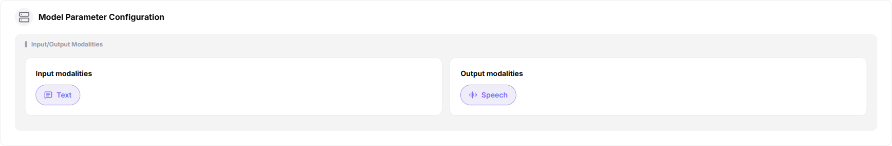
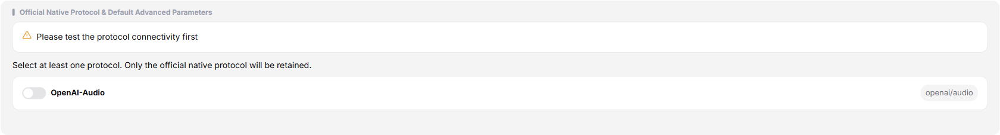
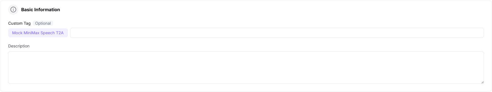
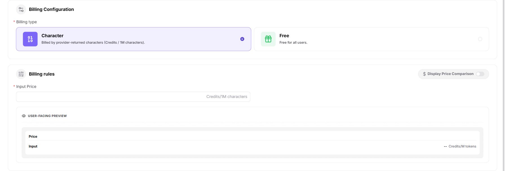

# Publish a Model (Speech)

## Target Outcome

The speech model passes protocol testing, is published to the intended scope, and returns a playable or decodable audio result.

## Applicable Roles

- Model Provider

## Before You Start

- Prepare the model source, identifier, API credential, endpoint, and a non-sensitive audio or text sample.
- Confirm language, voice, format, sample rate, synchronous or asynchronous behavior, billing, and limits.

## Procedure

1. From the platform home page, select **My Models** in the left navigation.
2. Open **My Publications**. Use **Public Models / Private Models** to switch publication areas, or open **Overview** and **My Aggregations** when needed.
3. Select **Publish Model** in the upper-right corner.
4. Select a publication area:
   - **Publish to Private Area** makes the model visible only within the team or tenant and keeps it out of the public catalog.
   - **Publish to Public Area** lists the model in the public catalog for all tenants and allows independent pricing and rate limits.
5. Select **Publish to Public Area** to open Step 1.

### Step 1: Basic Information

- Under **Model Source / Meta-Model Information**:
  - Select a meta-model, such as `qwen3-tts-flash`.
  - Select a model source, such as Alibaba - China.
  - Enter the request URL, such as `https://dashscope.aliyuncs.com`.
  - Enter the API key in the protected field, such as `sk-***`.
  - Enter the exact upstream **Model Source ID**, such as `qwen3-tts-flash`.

- Confirm **Speech Model** and select the correct subtype, such as Text to Speech.

- Under **Request Headers**, keep the default `Authorization: Bearer <key>` template and add only headers required by the upstream service.

- Under **Model Parameters**, set the input modality to Text and the output modality to Audio.

- Under **Supported Protocols and Default Parameters**:
  - Select `OpenAI-Audio`, run the connectivity test, and enter the endpoint.
  - Configure inputs such as Text, Voice, Language, Audio Format, Sample Rate, Volume, Speech Rate, Pitch, and Seed.
  - Select **Synchronous** or **Asynchronous** invocation.
  - Configure result parsing with Result Path, URL Extract Field, and Base64 Extract Field.

- Enter the public **Custom Identifier** and description.

- Select **Publish Immediately** or **Scheduled Publication**.

- Select **Next** to open Step 2.

### Step 2: Billing Configuration

- Select **Character Billing** or **Free**.
- For character billing:
  - Enable **Show Price Comparison** when a reference price should be displayed.
  - Enter the input sale price and optional original price in Credits per 1M characters.
  - Optionally configure a free quota, eligible-user count, and total amount.

- Select **Next** to open Step 3.

### Step 3: Rate-Limit Configuration

- Select **Enable Rate Limiting** or **Disabled**.
- Configure default RPM and TPM values, or set either limit to Unlimited.

- Select **Save Only** or **Submit for Review**.

#### Parameter Reference - Speech Model

| Field | Type | Example | Description |
| --- | --- | --- | --- |
| Meta-Model | Select | `qwen3-tts-flash` | Required; base meta-model |
| Model Source | Select | `Alibaba - China` | Required; upstream model provider |
| Request URL | URL | `https://dashscope.aliyuncs.com` | Required; model-service base URL |
| API Key | Password | `sk-***` | Required; protected upstream credential |
| Model Source ID | Text | `qwen3-tts-flash` | Required; exact upstream model name |
| Model Type | Single select | `Speech Model` | Required; model function |
| Model Subtype | Select | `Text to Speech` | Required; speech-model subtype |
| Request Headers | Key-value pairs | `Authorization: Bearer <key>` | Optional; authentication and custom headers |
| Input Modality | Multi-select | `Text` | Required; accepted input type |
| Output Modality | Multi-select | `Audio` | Required; result type |
| Supported Protocol | Multi-select | `OpenAI-Audio` | Required; test connectivity before continuing |
| Endpoint | URL | `https://dashscope.aliyuncs.com/api/v1/services/audio/tts/SpeechSynthesizer` | Required; protocol endpoint |
| Input Parameters | Parameter list | `Text / Voice / Language / Audio Format / Sample Rate / Volume / Speech Rate / Pitch / Seed` | Optional; protocol inputs and required-state settings |
| Invocation Method | Single select | `Synchronous / Asynchronous` | Required; invocation behavior |
| Result Path | Text | `data.audio or response.output.results` | Optional; path to the result payload |
| URL Extract Field | Text | `url or audio_url` | Optional; field containing the result URL |
| Base64 Extract Field | Text | `b64_audio` | Optional; field containing Base64 audio data |
| Custom Identifier | Text | `qwen3-tts-flash` | Required; model identifier shown to users |
| Description | Text | `Text to speech...` | Optional; model description |
| Publication Method | Single select | `Immediate / Scheduled` | Required; publication time |
| Billing Method | Single select | `Per Character / Free` | Required; billing method |
| Show Price Comparison | Switch | `On / Off` | Optional; displays an original reference price |
| Input Sale Price | Number | `8 Credits/1M characters` | Required for paid models |
| Original Price | Number | `16 Credits/1M characters` | Optional; character reference price |
| Free Quota | Switch | `On / Off` | Optional; configures free usage quota |
| Rate Limiting | Single select | `Enabled / Disabled` | Optional; controls invocation limits |
| RPM | Number / Unlimited | `2 requests/minute` | Optional; request limit per minute |
| TPM | Number / Unlimited | `100 tokens/minute` | Optional; token limit per minute |

## Completion Checklist

> **Purpose:** These are the exit criteria for the current feature task. Use them to decide whether the result is observable and reviewable and whether you can continue to the next step in the scenario. They do not repeat the procedure; if any item fails, follow the troubleshooting section below.

| Check | Pass Criteria |
| --- | --- |
| 1 | Protocol connectivity passes and language, voice, and format settings are accurate. |
| 2 | Publication or review status is correct. |
| 3 | A controlled call returns playable audio and the call log is traceable. |

## Troubleshooting

| Symptom | Check First |
| --- | --- |
| Protocol test fails | Endpoint, credential, model identifier, audio encoding, and request body |
| Audio cannot be played | Response mapping, Content-Type, sample rate, format, and result URL |

## User Manual

[Review complete My Models fields and publication-result validation](/usermanual/model-services/user/studio/my-models/)
