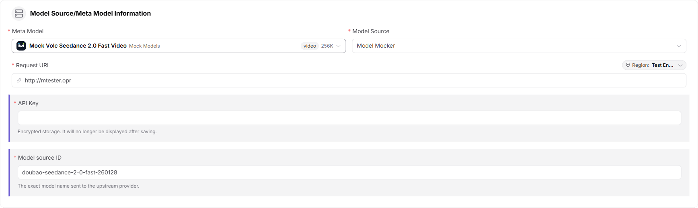
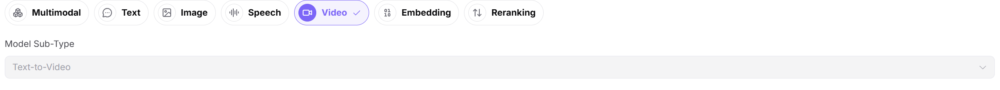
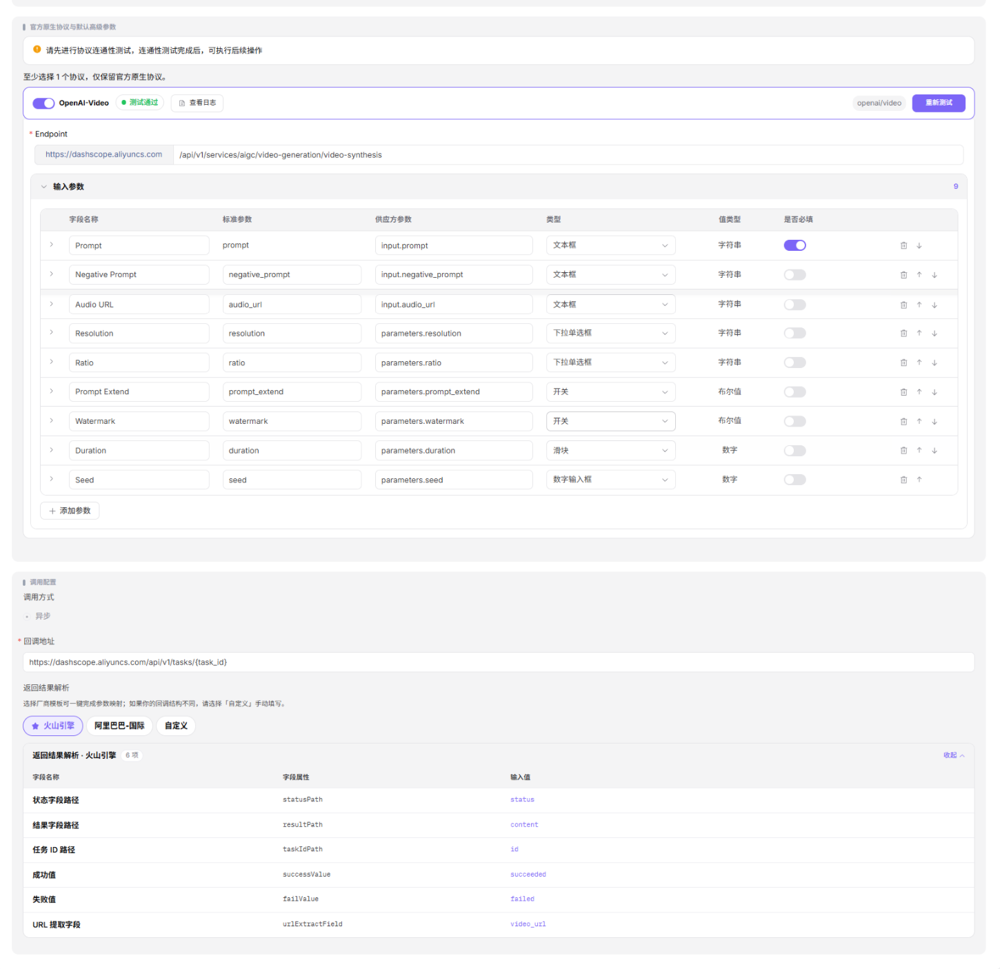
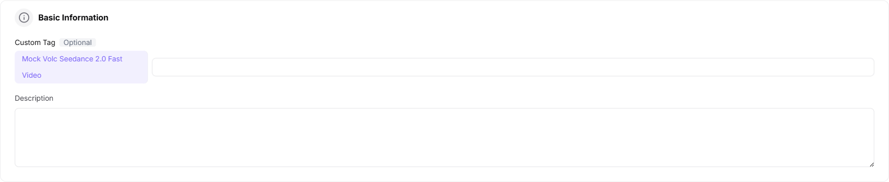
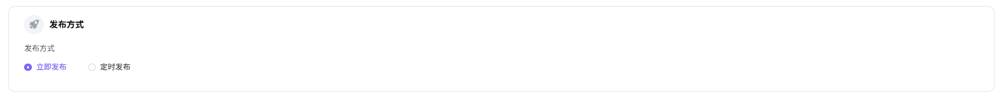
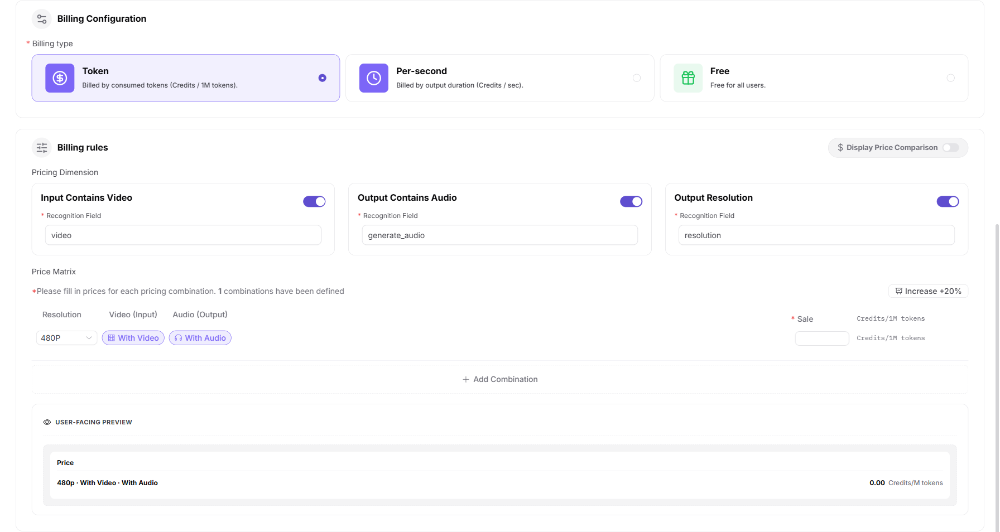

# Publish a Model (Video)

## Target Outcome

The video model creates an asynchronous task, reports progress correctly, and returns a playable result after publication.

## Applicable Roles

- Model Provider

## Before You Start

- Prepare the model source, identifier, API credential, task endpoint, status endpoint or callback, and a harmless test prompt.
- Confirm duration, resolution, polling behavior, result lifetime, billing, timeout, and rate limits.

## Procedure

1. From the platform home page, select **My Models** in the left navigation.
2. Open **My Publications**. Use **Public Models / Private Models** to switch publication areas, or open **Overview** and **My Aggregations** when needed.
3. Select **Publish Model** in the upper-right corner.
4. Select a publication area:
   - **Publish to Private Area** makes the model visible only within the team or tenant and keeps it out of the public catalog.
   - **Publish to Public Area** lists the model in the public catalog for all tenants and allows independent pricing and rate limits.
5. Select **Publish to Public Area** to open Step 1.

### Step 1: Basic Information

- Under **Model Source / Meta-Model Information**:
  - Select a meta-model, such as `wan2.7-t2v`.
  - Select a model source, such as Alibaba - China.
  - Enter the request URL, such as `https://dashscope.aliyuncs.com`.
  - Enter the API key in the protected field, such as `sk-***`.
  - Enter the exact upstream **Model Source ID**, such as `wan2.7-t2v`.

- Confirm **Video Model** and select the correct subtype, such as Text to Video.

- Under **Request Headers**, keep the default `Authorization: Bearer <key>` template and add only headers required by the upstream service.

- Under **Model Parameters**, select verified input modalities such as Text and Audio and set the output modality to Video.

- Under **Supported Protocols and Default Parameters**:
  - Select `OpenAI-Video`, run the connectivity test, and enter the endpoint.
  - Configure inputs such as Prompt, Negative Prompt, Audio URL, Resolution, Ratio, Prompt Extend, Watermark, Duration, and Seed.
  - Select **Asynchronous** invocation.
  - Enter the task-status endpoint or callback, such as `https://dashscope.aliyuncs.com/api/v1/tasks/{task_id}`. Use a provider template or select Custom for manual mapping.
  - Configure Status Path, Result Path, Task ID Path, Success Value, Failure Value, and URL Extract Field.

- Enter the public **Custom Identifier** and description.

- Select **Publish Immediately** or **Scheduled Publication**.

- Select **Next** to open Step 2.

### Step 2: Billing Configuration

- Select **Token Billing**, **Duration Billing**, or **Free**.
- For paid billing:
  - Enable **Show Price Comparison** when a reference price should be displayed.
  - Optionally distinguish whether the input contains video.
  - Optionally distinguish whether the output contains audio.
  - Optionally enable output-resolution pricing using `resolution` as the recognition field.
  - Add every required combination to the price matrix and enter a price in Credits per second for each resolution and feature combination.
  - Optionally configure a free quota, eligible-user count, and total amount.

- Select **Next** to open Step 3.

### Step 3: Rate-Limit Configuration

- Select **Enable Rate Limiting** or **Disabled**.
- Configure default RPM and TPM values, or set either limit to Unlimited.

- Select **Save Only** or **Submit for Review**.

#### Parameter Reference - Video Model

| Field | Type | Example | Description |
| --- | --- | --- | --- |
| Meta-Model | Select | `wan2.7-t2v` | Required; base meta-model |
| Model Source | Select | `Alibaba - China` | Required; upstream model provider |
| Request URL | URL | `https://dashscope.aliyuncs.com` | Required; model-service base URL |
| API Key | Password | `sk-***` | Required; protected upstream credential |
| Model Source ID | Text | `wan2.7-t2v` | Required; exact upstream model name |
| Model Type | Single select | `Video Model` | Required; model function |
| Model Subtype | Select | `Text to Video` | Required; video-model subtype |
| Request Headers | Key-value pairs | `Authorization: Bearer <key>` | Optional; authentication and custom headers |
| Input Modalities | Multi-select | `Text / Audio` | Required; accepted input types |
| Output Modality | Multi-select | `Video` | Required; result type |
| Supported Protocol | Multi-select | `OpenAI-Video` | Required; test connectivity before continuing |
| Endpoint | URL | `https://dashscope.aliyuncs.com/api/v1/services/aigc/video-generation/video-synthesis` | Required; protocol endpoint |
| Input Parameters | Parameter list | `Prompt / Negative Prompt / Audio URL / Resolution / Ratio / Prompt Extend / Watermark / Duration / Seed` | Optional; protocol inputs and required-state settings |
| Invocation Method | Single select | `Asynchronous` | Required; video generation is normally asynchronous |
| Task Status URL | URL | `https://dashscope.aliyuncs.com/api/v1/tasks/{task_id}` | Required; status-query or callback URL |
| Provider Template | Single select | `Volcengine / Alibaba International / Custom` | Required; fills provider mappings or allows custom values |
| Status Path | Text | `status` | Optional; field containing task status |
| Result Path | Text | `content` | Optional; field containing the result payload |
| Task ID Path | Text | `id` | Optional; field containing the task identifier |
| Success Value | Text | `succeeded` | Optional; value representing success |
| Failure Value | Text | `failed` | Optional; value representing failure |
| URL Extract Field | Text | `video_url` | Optional; field containing the result URL |
| Custom Identifier | Text | `wan2.7-t2v` | Required; model identifier shown to users |
| Description | Text | `Text to video...` | Optional; model description |
| Publication Method | Single select | `Immediate / Scheduled` | Required; publication time |
| Billing Method | Single select | `Token / Duration / Free` | Required; billing method |
| Input Contains Video | Switch | `On / Off` | Optional; differentiates prices by video input |
| Output Contains Audio | Switch | `On / Off` | Optional; differentiates prices by audio output |
| Output Resolution | Switch | `On / Off` | Optional; differentiates prices using `resolution` |
| Price Matrix | Group | `480P: 6 Credits/second; 720P: 10 Credits/second` | Required; price for each configured combination |
| Free Quota | Switch | `On / Off` | Optional; configures free usage quota |
| Rate Limiting | Single select | `Enabled / Disabled` | Optional; controls invocation limits |
| RPM | Number / Unlimited | `2 requests/minute` | Optional; request limit per minute |
| TPM | Number / Unlimited | `100 tokens/minute` | Optional; token limit per minute |

## Completion Checklist

> **Purpose:** These are the exit criteria for the current feature task. Use them to decide whether the result is observable and reviewable and whether you can continue to the next step in the scenario. They do not repeat the procedure; if any item fails, follow the troubleshooting section below.

| Check | Pass Criteria |
| --- | --- |
| 1 | Task creation, status query or callback, and result parsing all pass testing. |
| 2 | Publication or review status is correct. |
| 3 | A controlled call returns a playable video and the call log is traceable. |

## Troubleshooting

| Symptom | Check First |
| --- | --- |
| A task is created but never completes | Status endpoint, task-ID mapping, polling interval, callback, and timeout |
| The result URL is unavailable | Response mapping, URL lifetime, storage permission, and content policy |

## User Manual

[Review complete My Models fields and publication-result validation](/usermanual/model-services/user/studio/my-models/)
